## 1 Introduction

## 1.1 Introduction to Operating Systems

An operating system (OS) is software that manages computer hardware and provides an environment for application programs to run. It acts as an intermediary between the user and the computer hardware. The two primary goals of an OS are convenience (making the computer easy to use) and throughput (maximizing the amount of useful work performed per unit time).

An OS performs two essentially unrelated functions: providing application programmers a clean abstract set of resources instead of the messy hardware ones, and managing these hardware resources. Examples include Windows, Linux, macOS, Android, iOS, and Unix.

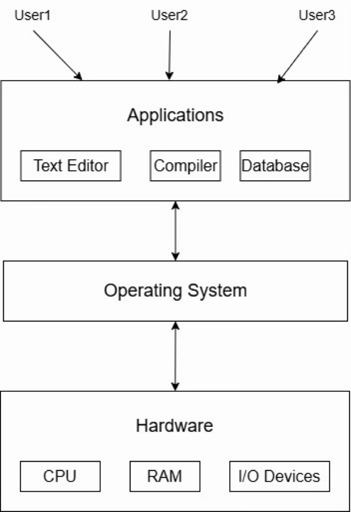

---

## 1.2 OS as an Extended Machine and Resource Manager

> **How does an operating system provide abstraction to user level application from underlying hardware? Explain. [4 marks] (2082 Bhadra)**
> **How does an operating system act as Extended machine? Explain. [4 marks] (Model Question)**

### OS as an Extended Machine (Abstraction Provider)

The OS hides the messy details of hardware and presents clean, elegant, consistent abstractions to work with. Instead of dealing with raw hardware (e.g., disk sectors, memory addresses, CPU registers), programs interact with high-level abstractions:

1. **Processes:** Running programs with their own execution context, so that each program appears to have the CPU to itself.
2. **Address Spaces:** Virtual memory for each process, giving each program the illusion of having its own private, contiguous memory.
3. **Files:** Logical organization of data instead of raw disk sectors, allowing programs to read/write named data without knowing the underlying storage technology.

For example, when a user program reads a file, it simply calls `read(fd, &buffer, nbytes)`. The OS translates this into the complex sequence of disk controller commands, DMA setup, and interrupt handling needed to actually retrieve the data. The program never sees this complexity.

### OS as a Resource Manager

The OS provides orderly and controlled allocation of processors, memories, and I/O devices among various competing programs. It handles:

1. **Time multiplexing:** Multiple programs take turns using a resource. Examples include CPU scheduling (each process gets time slices) and printer queues (print jobs are processed in order).
2. **Space multiplexing:** A resource is divided among multiple programs simultaneously. Examples include memory partitioning (each process gets a portion of RAM) and disk space allocation.

The OS manages conflicting requests for resources and keeps track of resource usage. The kernel runs in kernel mode (supervisor mode) with complete hardware access, while user programs run in user mode with restricted instruction access. Instructions that affect machine control or I/O are forbidden to user-mode programs.

---

## 1.3 History of Operating System

### First Generation (1945–55): Vacuum Tubes

No operating systems existed. A single programmer designed, built, programmed, operated, and maintained each machine. Programming was done in absolute machine language using plugboards. Programmers physically wired the program into the computer using cables and switches. Programs were simple numerical calculations such as tables of sines, cosines, and logarithms.

### Second Generation (1955–65): Transistors and Batch Systems

Clear separation between designers, builders, operators, and programmers emerged. Batch processing was introduced: jobs were collected on magnetic tape or punch cards and processed sequentially. Inexpensive computers (IBM 1401) handled I/O, while expensive ones (IBM 7094) did computation. Control cards (`$JOB`, `$FORTRAN`, `$LOAD`, `$RUN`, `$END`) were forerunners of modern command interpreters. Operating systems of this era included FMS and IBSYS.

### Third Generation (1965–80): ICs and Multiprogramming

Introduction of Integrated Circuits (ICs) provided major price/performance advantages. IBM System/360 was a family of software-compatible machines with different performance levels, and its OS/360 had to work on all models. This resulted in an enormous, complex system with thousands of bugs.

1. **Multiprogramming:** Memory was partitioned into sections with a different job in each partition. While one job waits for I/O, another can use the CPU, greatly improving CPU utilization.
2. **Spooling (Simultaneous Peripheral Operations On-Line):** Jobs were read from cards onto disk and loaded into memory when a partition becomes available.
3. **Timesharing:** Many users share one computer interactively. The CPU gives each user "time slices," making it feel like each user has their own computer. Notable systems include CTSS (Compatible Time Sharing System) and MULTICS, which later led to the development of UNIX.

### Fourth Generation (1980–Present): Personal Computers

LSI (Large-Scale Integration) circuits made personal computers affordable for individual ownership.

1. **CP/M:** One of the first popular disk-based operating systems, created by Gary Kildall for Intel 8080. Dominated the microcomputer market for about 5 years.
2. **MS-DOS:** Microsoft bought rights to QDOS from Seattle Computer Products, improved it, and it became MS-DOS. It became dominant through IBM's bundling strategy.
3. **GUI Development:** Doug Engelbart invented the GUI concept with windows, icons, menus, and mouse at Stanford in the 1960s. Steve Jobs saw the GUI at Xerox PARC and led to the Apple Macintosh. Microsoft developed Windows, initially as a graphical shell on top of MS-DOS.

### Fifth Generation (1990–Present): Mobile Computers

The first real smartphone appeared in the mid-1990s (Nokia N9000). Symbian OS was initially dominant but later declined. Android (Linux-based, released 2008) became the dominant mobile OS, with Apple's iOS in second place. Android's open-source nature was a key advantage.

---

## 1.4 Types of Operating System

**Mainframe OS:** Designed for large-scale, high-capacity computers used by major organizations. These systems handle massive I/O operations and support batch processing, transaction processing, and timesharing for hundreds of simultaneous users. Examples: IBM z/OS, OS/390.

**Server OS:** Runs on servers and provides services to multiple clients over a network, such as file sharing, web hosting, print services, and database management. Built for stability, security, and handling heavy concurrent network traffic. Examples: Windows Server, Linux (Ubuntu Server, Red Hat), FreeBSD.

**Personal Computer OS:** Designed for general-purpose use on desktops and laptops. Focuses on providing a user-friendly graphical interface and supporting a wide range of applications for individual users. Examples: Windows 10/11, macOS, Linux (Ubuntu, Fedora).

**Smartphone and Handheld OS:** Specialized for mobile devices, balancing rich functionality with power efficiency, limited hardware resources, and touch-based user interfaces. Examples: Android, iOS.

**IoT and Embedded OS:** Lightweight operating systems designed for devices with specific, dedicated functions. IoT OS focuses on connectivity and data exchange between interconnected devices. Embedded OS controls specific hardware within a larger machine (e.g., appliances, automotive systems). They are small in footprint, fast, reliable, and usually do not allow user-installed applications. Examples: FreeRTOS, Contiki, VxWorks, Embedded Linux.

**Real-Time OS (RTOS):** Designed for systems with strict time constraints where processing must complete within a specific deadline.

- **Hard Real-Time:** Missing a deadline is catastrophic (e.g., airbag systems, missile guidance, pacemakers).
- **Soft Real-Time:** Deadlines are important but occasional misses are tolerable (e.g., multimedia streaming, video conferencing).

**Smart Card OS:** The most constrained type, running on tiny chips embedded in smart cards (credit cards, SIM cards, security badges). They have extremely limited memory (a few kilobytes) and processing power, focusing on security and simple data transactions. Some support multiple Java applets running concurrently. Examples: MULTOS, Java Card OS.

---

## 1.5 Operating System Components

**1. Kernel:** The innermost core of the OS that runs in privileged (kernel) space, giving it direct, unrestricted access to hardware. Unlike other OS components, it does not just coordinate; it controls the CPU, RAM, and devices at the lowest level. It exposes this power to programs through system calls. Core responsibilities include process scheduling, memory allocation, device driver management, and security/access control.

**2. Shell:** Acts as a command interpreter. It is the interface between the user and the kernel. It receives commands from the user, translates them into a form the kernel can understand, and forwards the request for execution. In Windows, the command prompt (cmd) uses the Windows API (DLL functions), which internally invokes system calls.

**3. Utilities:** Utilities are ready-made programs that help you do useful tasks on the computer. They are NOT part of the core OS logic (like scheduling or memory management), but they are important tools that come with the OS. Provide useful functionality such as file management tools (copy, move, delete), text editors, compilers, and system monitoring tools. They use system calls to interact with the kernel.

**4. Applications:** User-level programs that perform specific tasks (web browsers, word processors, media players). Applications interact with the OS through system calls or higher-level APIs provided by the OS.

---

## 1.6 Types of OS Kernel

### Monolithic Kernel

All core functions (process management, memory management, file systems, device drivers) reside inside one large kernel running as a single executable in kernel mode. Components can call each other directly, making the system fast. However, the structure is hard to manage, and a failure in any part of the kernel can crash the entire system. Examples: Linux, traditional Unix.

### Layered Kernel

The OS is organized into layers, from hardware at the bottom to the user interface at the top. Each layer depends only on the layer directly below it. This structure makes debugging easier because problems can be traced to a specific layer, but it increases overhead since data must pass through multiple layers. Privilege decreases from inner (low) layers to outer (high) layers. Example: THE operating system (by Dijkstra).

### Microkernel

Only the essential functions (IPC, basic scheduling, low-level memory management) remain inside the kernel. Most services (file systems, device drivers, networking) run in user space. Failures in one service do not crash the whole system, and it is easier to add, remove, or modify services. Communication happens through message passing, which creates overhead and makes microkernels slower than monolithic ones. Examples: MINIX 3, QNX, L4.

### Nanokernel

An ultra-minimalist kernel that provides only the most fundamental hardware abstraction, which includes interrupt handling, basic hardware access and context switching. Almost all OS services (including memory management and scheduling) are delegated to user-space processes. The extremely small footprint makes it ideal for resource-constrained and real-time environments. Examples: EROS, KeyKOS.

### Hybrid Kernel

Combines the speed of a monolithic kernel with the modularity of a microkernel. Many services (device drivers, file systems) run in kernel space for performance, but the system is designed with a modular, layered structure for better organization and flexibility. Examples: Windows NT (all modern Windows), macOS (XNU kernel, which combines Mach microkernel with BSD components).

### Exokernel

Provides applications direct access to hardware resources. The kernel only handles protection and resource allocation. It ensures applications use only the resources assigned to them. No abstractions (files, processes, sockets) are enforced by the kernel; applications define their own abstractions tailored to their needs (e.g., a streaming app can create a video-optimized file structure). This minimizes overhead. Examples: MIT Exokernel, Nemesis.

---

## 1.7 System Calls, Shell Commands, Shell Programming

### System Calls

A system call is how a user program requests a service from the OS kernel. It provides the essential interface between a process and the operating system. System calls are needed because user-mode programs cannot directly execute privileged instructions. They must request the kernel (running in kernel mode) to perform operations on their behalf.

**Services provided by system calls:**

- Process creation and management
- Main memory management
- File access, directory and file system management
- Device handling (I/O)
- Protection
- Communication (inter-process communication)

**Example of `read(fd, &buffer, nbytes)`:**

- `fd`: File descriptor. It is an integer ID representing the specific file to read from (previously opened).
- `&buffer`: Memory address (pointer) where the data read from disk should be stored.
- `nbytes`: Number of bytes the program wants to read.
- The call returns the number of bytes actually read, which may be smaller than `nbytes` if end-of-file is encountered.

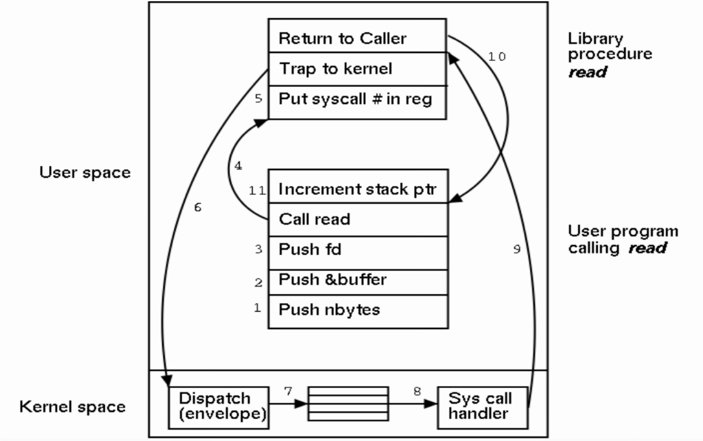

**System Call Mechanism (Steps):**

1. Push parameters onto the stack.
2. Call the library procedure (e.g., `read()`).
3. Library puts the system call number in a CPU register.
4. Execute the TRAP instruction (switches from user mode to kernel mode).
5. Kernel dispatches to the appropriate system call handler using the call number.
6. Handler executes the requested operation.
7. Control returns to the library procedure (switches back to user mode).
8. Library returns to the user program.
9. Clean up the stack.

### Shell Commands

Shell commands are tools used to interact with the OS via the command-line interface. They are either built into the shell (builtins like `cd`, `echo`) or exist as standalone executable programs.

Common categories:

1. **File/Directory Management:** `ls` (list), `cd` (change directory), `pwd` (print working directory), `mkdir`, `rm`, `cp`, `mv`
2. **Text/Data Processing:** `cat` (display file), `grep` (search patterns), `sort`, `awk`
3. **Process Management:** `ps` (list processes), `top` (monitor), `kill` (terminate)
4. **Permissions:** `chmod` (change file permissions), `chown` (change ownership)

### Shell Programming

Shell programming (scripting) involves writing a sequence of shell commands in a file (a shell script) to automate tasks. Shell scripts support variables, control structures (if-else, loops), functions, and I/O redirection.

**Types of shells:**

| Shell | Full Name          | Key Characteristics                                                                    |
| ----- | ------------------ | -------------------------------------------------------------------------------------- |
| sh    | Bourne Shell       | Original Unix shell; compact, fast, portable; lacks interactive features               |
| bash  | Bourne-Again Shell | Default on most Linux; superset of sh; adds command-line editing, job control, history |
| csh   | C Shell            | Syntax similar to C language; introduced command history and aliases                   |
| ksh   | Korn Shell         | Combines features of sh and csh; powerful scripting and interactive use                |
| zsh   | Z Shell            | Highly customizable; advanced tab completion, plugins, themes; default on macOS        |

---

## 1.8 POSIX Standard

POSIX (Portable Operating System Interface) is a family of standards specified by the IEEE (IEEE Std 1003) to maintain compatibility between operating systems. Its primary purpose is to ensure application portability, allowing software written for one POSIX-compliant OS to be ported to another with little or no modification.

**POSIX defines:**

1. **System Interfaces (API):** Standard C library functions for process management, file I/O, threading (pthreads), and signal handling.
2. **Command-Line Shell:** A standard shell environment for command execution and scripting.
3. **Utilities:** A set of common command-line tools (`ls`, `cd`, `echo`, `grep`, etc.) that behave the same on any compliant system.
4. **Environment Variables:** Standardized ways for programs to access environment configuration.

Linux, macOS, and BSD variants are highly POSIX-compliant. POSIX compliance is especially important for server infrastructure, embedded systems, and cross-platform software development where portability across different hardware and OS platforms is essential.

---

## 1.9 Bootloader, MBR/GPT, UEFI and Legacy Boot

> **Explain the difference between MBR and GPT Partitions. [2 marks] (2082 Bhadra)**
> **Define Bootloader. Explain any 2 types of boot mechanism. [4 marks] (Model Question)**

### Bootloader

A bootloader is a small program responsible for initiating the system startup process. When a computer is powered on, the firmware (BIOS or UEFI) initializes the hardware. Since the OS is stored on non-volatile storage and is not yet in RAM, the bootloader locates the OS kernel on the storage device, loads it into RAM, and hands over control to the OS.

**Common bootloaders:**

1. **GRUB (GRand Unified Bootloader):** Default on most Linux distributions. Supports multiple file systems, multi-booting, and both legacy BIOS and UEFI systems.
2. **Windows Boot Manager (BOOTMGR):** Standard bootloader for modern Windows (Vista onward). Reads the Boot Configuration Data (BCD) store to identify available operating systems.
3. **NTLDR:** Legacy bootloader for Windows NT through Windows XP. Used `boot.ini` for configuration. Replaced by BOOTMGR.
4. **LILO (Linux Loader):** Older Linux bootloader, now largely replaced by GRUB.

### MBR vs GPT

MBR (Master Boot Record) and GPT (GUID(Globally Unique Identifiers) Partition Table) are two methods for storing partition information on a storage drive.

| MBR                                                                                  | GPT                                                                     |
| ------------------------------------------------------------------------------------ | ----------------------------------------------------------------------- |
| Supports a maximum disk size of 2 TB                                                 | Supports disks up to 9.4 ZB (zettabytes)                                |
| Allows only 4 primary partitions (extended/logical partitions are needed for more)   | Allows up to 128 partitions without requiring extended partitions       |
| Stores all partition and boot data in a single sector (the first sector of the disk) | Stores redundant copies of partition headers and tables across the disk |
| Corruption of the single data sector can make the entire drive unbootable            | Includes CRC error-checking and backup headers for high reliability     |
| An older standard introduced in 1983                                                 | A modern standard that is part of the UEFI specification                |

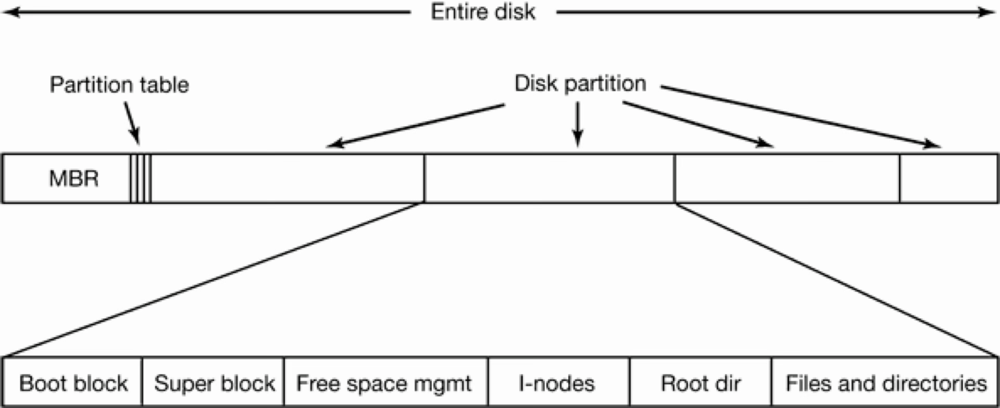

### MBR

- Sector 0 of the disk is called the MBR (Master Boot Record).
- The MBR is used to boot the computer.
- The end of the MBR contains the partition table.
- The partition table gives the starting and ending addresses of each partition.
- One of the partitions in the table is marked as active.
- When the computer is booted, the BIOS reads in and executes the MBR.
- The first thing the MBR program does is locate the active partition.
- Then it reads in the active partition's first block, called the boot block.
- The boot block program is then executed.
- The program in the boot block loads the operating system contained in that partition.
- For uniformity, every partition starts with a boot block.
- This is true even if the partition does not contain a bootable operating system. Contains tiny code that prints: Error: No bootable device found. Press any key to reboot.
- Super block contains information like file system type (ext4, ntfs,), individual block size, etc.
- Free space management block contains information like bitmap vector, linked list.

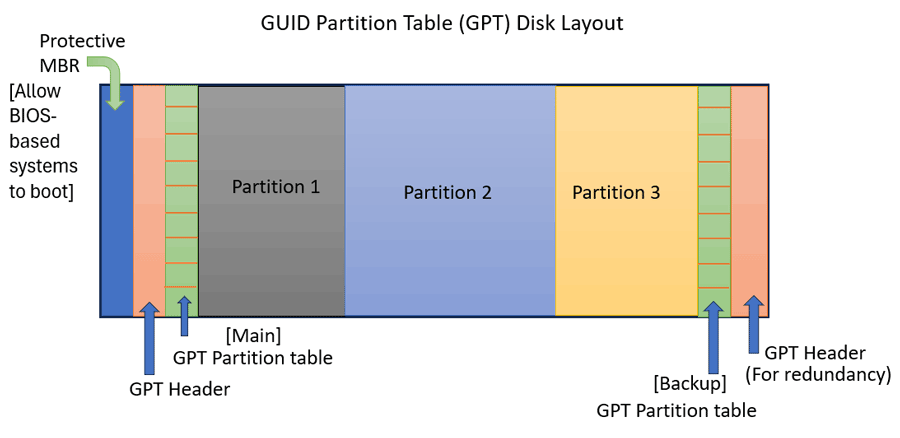

### UEFI vs Legacy BIOS Boot

**Legacy BIOS (Basic Input/Output System):**

- Older firmware standard stored in a ROM chip on the motherboard.
- Uses MBR partitioning. Reads the first sector of the boot drive (MBR) to find the bootloader.
- Limited to booting from drives up to 2 TB.
- Text-based setup interface; no built-in security features.
- When you power on a computer, the BIOS runs a POST check, reads the MBR, executes the bootloader, and finally loads the operating system.

**UEFI (Unified Extensible Firmware Interface):**

- Modern firmware standard designed to replace legacy BIOS.
- Uses GPT partitioning. Stores bootloader files in a special EFI System Partition (ESP).
- Supports drives larger than 2 TB and boots faster.
- Features a graphical setup interface, Secure Boot (verifies bootloader signatures to prevent malware from loading during startup), and network boot capabilities.
- When you power on a computer, UEFI runs a POST check, reads the EFI System Partition on a GPT disk, executes the bootloader, and loads the operating system.

Many modern UEFI motherboards include a CSM (Compatibility Support Module) that can emulate legacy BIOS mode, allowing them to boot from MBR-partitioned disks.

---

---

---

## 2. Process Management

## 2.1 Process Description, States and Control

### Process

A process is a program in execution. A process consists of program code along with the current activity represented by the program counter value. Each process requires system resources such as processor time, memory space, files, and I/O devices to complete its task. Instructions in a process execute in a sequential manner. Multiple processes can exist simultaneously in a system.

A program is a passive entity (an executable file stored on disk), while a process is an active entity with a program counter specifying the next instruction and associated resources. A program becomes a process when its executable file is loaded into memory.

### Process States

> **Describe the various states of the process. [3 marks] (2082 Bhadra)**

**Two-State Process Model:** The simplest model considers two states: **Running** (process is executing on CPU) and **Not Running** (process is waiting in a queue). A dispatcher gives CPU control to a process (Not Running → Running), and a higher-priority process or I/O request can preempt the current process (Running → Not Running).

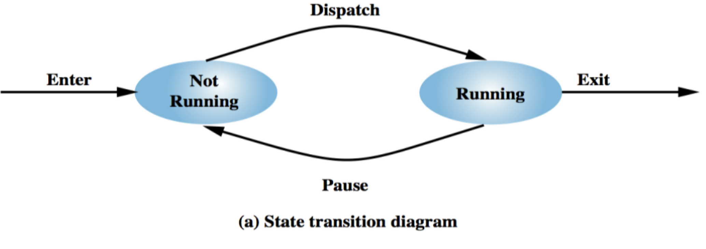

**Five-State Process Model:** A more practical model defines five states:

- **New:** Process has just been created. The OS is setting up necessary data structures (PCB, PID, priority, owner). Not yet admitted to the pool of executable processes.
- **Ready:** Process is loaded in RAM and prepared to execute. It is waiting only for CPU availability. All ready processes are kept in a ready queue.
- **Running:** Process is currently being executed on the CPU. Only one process per CPU core can be in this state at any time.
- **Blocked (Waiting):** Process cannot execute until some event occurs, such as completion of an I/O operation, availability of a resource, or a signal from another process.
- **Exit (Terminated):** Process has been released from the pool of executable processes. It either completed successfully or terminated due to an error. Resources are being deallocated.

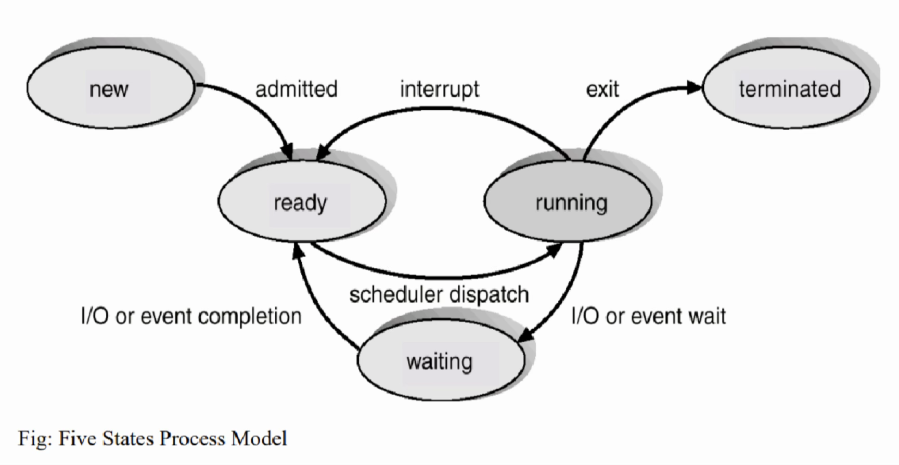

### Process Control Block (PCB)

The PCB is a data structure maintained by the OS for each process. It stores all information needed to manage and control the process, and is essential for multiprogramming and context switching.

**Components of the PCB:**

- **Process ID (PID):** A unique number assigned to distinguish the process from all other active processes.
- **Process State:** Current state of the process (new, ready, running, blocked, terminated).
- **Program Counter (PC):** Stores the address of the next instruction to be executed. If the process is paused, the PC remembers exactly where to resume later.
- **CPU Registers:** When a process stops, register values (accumulators, index registers, stack pointers) must be saved so they can be restored exactly when the process resumes.
- **Process Priority:** Used by the OS to decide which process gets the CPU next.
- **Memory Management Information:** Page tables, segment tables, base/limit registers.
- **Accounting Information:** Tracks CPU time used, time limits, execution ID, and process owner details.
- **PCB Pointers:** Pointers that link this PCB to other PCBs, used to create queues such as the ready queue.
- **List of Open Files:** Files the process is currently using, so the OS can close them properly if the process finishes or crashes.
- **I/O Status Information:** List of I/O devices allocated to the process and status of pending I/O requests.

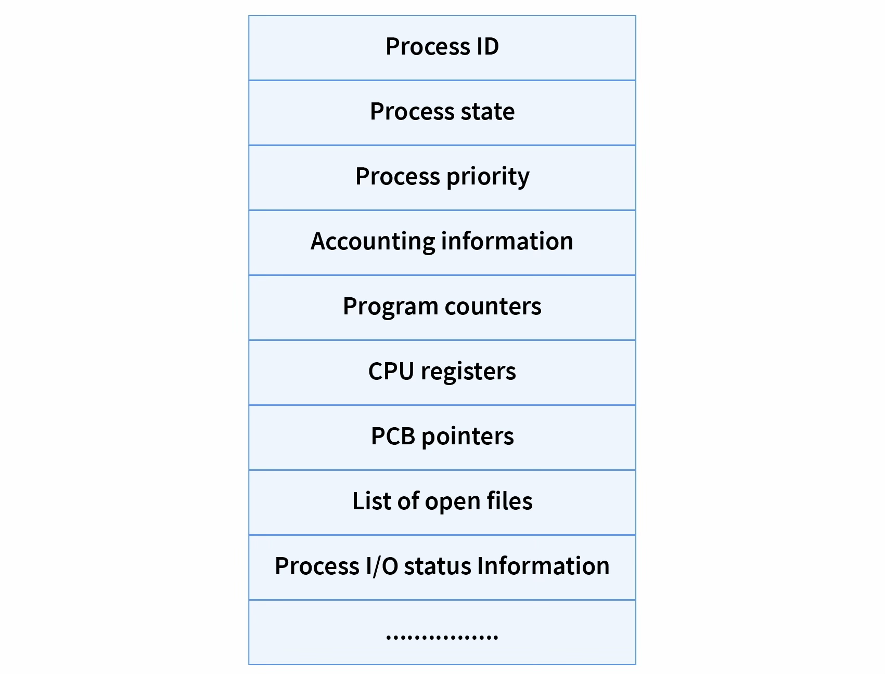

### Context Switching

Context switching enables the processor to switch between multiple processes efficiently. The OS saves the current process state into its PCB (register values, program counter, and other execution context). It then loads the saved state of the next process from its PCB. The processor resumes execution of the new process from where it previously stopped. Context switching overhead depends on hardware support and the number of registers. Fast context switching enables responsive multitasking.

### Schedulers and Dispatcher

**Long-Term Scheduler (Job Scheduler):** Selects processes from disk storage to load into main memory. Executes infrequently. Balances the mix of compute-intensive and I/O-intensive processes. Controls the degree of multiprogramming.

**Medium-Term Scheduler:** Removes processes from main memory to improve performance. Swapping out sends blocked processes to disk temporarily; swapping in returns them when conditions improve. Helps manage memory allocation by reducing active processes.

**Short-Term Scheduler (CPU Scheduler):** Runs very frequently. Selects the next process from the ready queue for processor allocation. Must execute quickly to minimize scheduling overhead.

**Dispatcher:** The module that gives control of the CPU to the process selected by the short-term scheduler. It performs the actual context switch by loading the context of the selected process from its PCB.

### Scheduling Criteria

- **CPU Utilization:** Keep the CPU as busy as possible (practical range: 40–90%).
- **Throughput:** Number of processes completed per unit of time.
- **Turnaround Time (TAT):** Time gap between submission of a process and its completion. TAT = Completion Time − Arrival Time.
- **Waiting Time (WT):** Sum of time periods spent waiting in the ready queue. WT = TAT − Burst Time.
- **Response Time (RT):** Time from request submission until the first response is produced.
- **Fairness:** Each process should receive a fair share of CPU.

### Preemptive vs Non-Preemptive Scheduling

**Preemptive Scheduling:** The OS can interrupt a running process before completion. Higher-priority processes can preempt lower-priority ones. Interrupted processes return to the ready queue. Enables responsive systems but requires context switching overhead and carries a risk of starvation for low-priority processes.

**Non-Preemptive Scheduling:** Once a process starts executing, it runs until completion or voluntary blocking. New processes wait in the ready queue regardless of priority. Simpler to implement with less overhead, but long-running processes can monopolize the processor and responsiveness is poor for interactive applications.

---

## 2.2 Scheduling Algorithms

**Common formulas used across all algorithms:**

- **Completion Time (CT):** Time at which the process finishes execution.
- **Turnaround Time (TAT):** CT − AT (Arrival Time).
- **Waiting Time (WT):** TAT − BT (Burst Time).
- **Response Time (RT):** Start Time − AT. In non-preemptive algorithms, RT equals WT.

### 2.2.1 First Come First Serve (FCFS)

FCFS is the simplest scheduling algorithm. Processes execute in the exact order they arrive in the ready queue. It is non-preemptive, meaning a running process cannot be interrupted. Implementation uses a simple FIFO queue. No priority calculations are needed. However, average waiting time often becomes quite long, and a single long process can delay all subsequent processes (the convoy effect).

> **For given processes, draw a Gantt Chart and calculate average turn around time and average waiting time for FCFS. [5 marks] (Model Question)**

| Process | Arrival Time (AT) | Burst Time (BT) |
| ------- | ----------------- | --------------- |
| P1      | 0                 | 10              |
| P2      | 1                 | 6               |
| P3      | 3                 | 2               |
| P4      | 5                 | 4               |

```text
Gantt Chart: | P1  | P2  | P3  | P4  |
              0     10    16    18    22
```

| Process   | AT  | BT  | CT  | TAT=CT-AT | WT=TAT-BT |
| --------- | --- | --- | --- | --------- | --------- |
| P1        | 0   | 10  | 10  | 10        | 0         |
| P2        | 1   | 6   | 16  | 15        | 9         |
| P3        | 3   | 2   | 18  | 15        | 13        |
| P4        | 5   | 4   | 22  | 17        | 13        |
| **Total** |     |     |     | **57**    | **35**    |

Average Turnaround Time (ATAT)

$= \frac{\sum TAT}{\text{Number of processes}}$

$= \frac{10+15+15+17}{4}$

$= 14.25 \text{ ms}$

Average Waiting Time (AWT)

$= \frac{\sum WT}{\text{Number of processes}}$

$= \frac{0+9+13+13}{4}$

$= 8.75 \text{ ms}$

> **For given processes, draw a Gantt Chart and calculate average turn around time and average waiting time for FCFS. [5 marks] (Model Question)**

| Process | Arrival Time (AT) | Burst Time (BT) |
| ------- | ----------------- | --------------- |
| P1      | 0                 | 3               |
| P2      | 2                 | 6               |
| P3      | 4                 | 4               |
| P4      | 6                 | 5               |
| P5      | 8                 | 2               |

```text
Gantt Chart: | P1  | P2  | P3  | P4  | P5  |
              0     3     9     13    18   20
```

| Process   | AT  | BT  | CT  | TAT=CT-AT | WT=TAT-BT |
| --------- | --- | --- | --- | --------- | --------- |
| P1        | 0   | 3   | 3   | 3         | 0         |
| P2        | 2   | 6   | 9   | 7         | 1         |
| P3        | 4   | 4   | 13  | 9         | 5         |
| P4        | 6   | 5   | 18  | 12        | 7         |
| P5        | 8   | 2   | 20  | 12        | 10        |
| **Total** |     |     |     | **43**    | **23**    |

Average Turnaround Time (ATAT)

$= \frac{\sum TAT}{\text{Number of processes}}$

$= \frac{3+7+9+12+12}{5}$

$= 8.6 \text{ ms}$

Average Waiting Time (AWT)

$= \frac{\sum WT}{\text{Number of processes}}$

$= \frac{0+1+5+7+10}{5}$

$= 4.6 \text{ ms}$

### 2.2.2 Shortest Job First (SJF)

SJF prioritizes the process with the smallest estimated execution time. It is non-preemptive, meaning the running process completes before the next is selected. It provides the optimal (minimum) average waiting time for a given set of processes. However, it requires accurate prediction of burst time, and starvation can occur if short processes continuously arrive, starving long processes indefinitely.

> **For given processes, draw a Gantt Chart and calculate average turn around time and average waiting time for SJF. [5 marks] (Model Question)**

| Process | Arrival Time (AT) | Burst Time (BT) |
| ------- | ----------------- | --------------- |
| P1      | 0                 | 7               |
| P2      | 2                 | 4               |
| P3      | 4                 | 1               |
| P4      | 5                 | 4               |

```text
Gantt Chart: | P1  | P3  | P2  | P4  |
              0     7     8     12    16
```

| Process   | AT  | BT  | CT  | TAT=CT-AT | WT=TAT-BT |
| --------- | --- | --- | --- | --------- | --------- |
| P1        | 0   | 7   | 7   | 7         | 0         |
| P2        | 2   | 4   | 12  | 10        | 6         |
| P3        | 4   | 1   | 8   | 4         | 3         |
| P4        | 5   | 4   | 16  | 11        | 7         |
| **Total** |     |     |     | **32**    | **16**    |

Average Turnaround Time (ATAT)

$= \frac{\sum TAT}{\text{Number of processes}}$

$= \frac{32}{4}$

$= 8 \text{ ms}$

Average Waiting Time (AWT)

$= \frac{\sum WT}{\text{Number of processes}}$

$= \frac{16}{4}$

$= 4 \text{ ms}$

> **For given processes, draw a Gantt Chart and calculate average turn around time and average waiting time for SJF. [5 marks] (Model Question)**

| Process | Arrival Time (AT) | Burst Time (BT) |
| ------- | ----------------- | --------------- |
| P1      | 0                 | 3               |
| P2      | 2                 | 6               |
| P3      | 4                 | 4               |
| P4      | 6                 | 5               |
| P5      | 8                 | 2               |

```text
Gantt Chart: | P1  | P2  | P5  | P3  | P4  |
              0     3     9     11    15   20
```

| Process   | AT  | BT  | CT  | TAT=CT-AT | WT=TAT-BT |
| --------- | --- | --- | --- | --------- | --------- |
| P1        | 0   | 3   | 3   | 3         | 0         |
| P2        | 2   | 6   | 9   | 7         | 1         |
| P3        | 4   | 4   | 15  | 11        | 7         |
| P4        | 6   | 5   | 20  | 14        | 9         |
| P5        | 8   | 2   | 11  | 3         | 1         |
| **Total** |     |     |     | **38**    | **18**    |

Average Turnaround Time (ATAT)

$= \frac{\sum TAT}{\text{Number of processes}}$

$= \frac{38}{5}$

$= 7.6 \text{ ms}$

Average Waiting Time (AWT)

$= \frac{\sum WT}{\text{Number of processes}}$

$= \frac{18}{5}$

$= 3.6 \text{ ms}$

### 2.2.3 Shortest Remaining Time (SRT / SRTF)

SRT is the preemptive version of SJF. The process with the shortest remaining execution time receives the processor. When a new process arrives with a burst time shorter than the remaining time of the currently running process, the running process is preempted. It provides better response time than non-preemptive SJF. However, context switching overhead increases and long processes face potential starvation.

> **For given processes, draw a Gantt Chart and calculate average turn around time and average waiting time for SRTF. [5 marks] (Model Question)**

| Process | Arrival Time (AT) | Burst Time (BT) |
| ------- | ----------------- | --------------- |
| P1      | 0                 | 7               |
| P2      | 2                 | 4               |
| P3      | 4                 | 1               |
| P4      | 5                 | 4               |

```text
Gantt Chart: | P1  | P2  | P3  | P2  | P4  | P1  |
              0     2     4     5     7     11    16
```

| Process   | AT  | BT  | CT  | TAT=CT-AT | WT=TAT-BT | RT=StartTime-AT |
| --------- | --- | --- | --- | --------- | --------- | --------------- |
| P1        | 0   | 3   | 16  | 16        | 9         | 0               |
| P2        | 2   | 6   | 7   | 5         | 1         | 0               |
| P3        | 4   | 4   | 5   | 1         | 0         | 0               |
| P4        | 6   | 5   | 11  | 6         | 2         | 2               |
| **Total** |     |     |     | **28**    | **12**    |                 |

Average Turnaround Time (ATAT)

$= \frac{\sum TAT}{\text{Number of processes}}$

$= \frac{28}{4}$

$= 7 \text{ ms}$

Average Waiting Time (AWT)

$= \frac{\sum WT}{\text{Number of processes}}$

$= \frac{12}{4}$

$= 3 \text{ ms}$

> **For given processes, draw a Gantt Chart and calculate average turn around time and average waiting time for SRTF. [5 marks] (Model Question)**

| Process | Arrival Time (AT) | Burst Time (BT) |
| ------- | ----------------- | --------------- |
| P1      | 0                 | 3               |
| P2      | 2                 | 6               |
| P3      | 4                 | 4               |
| P4      | 6                 | 5               |
| P5      | 8                 | 2               |

```text
Gantt Chart: | P1  | P2  | P3  | P5  | P2  | P4  |
              0     3     4     8     10    15    20
```

| Process   | AT  | BT  | CT  | TAT=CT-AT | WT=TAT-BT | RT=StartTime-AT |
| --------- | --- | --- | --- | --------- | --------- | --------------- |
| P1        | 0   | 3   | 3   | 3         | 0         | 0               |
| P2        | 2   | 6   | 15  | 13        | 7         | 1               |
| P3        | 4   | 4   | 8   | 4         | 0         | 0               |
| P4        | 6   | 5   | 20  | 14        | 9         | 9               |
| P5        | 8   | 2   | 10  | 2         | 0         | 0               |
| **Total** |     |     |     | **36**    | **16**    |                 |

Average Turnaround Time (ATAT)

$= \frac{\sum TAT}{\text{Number of processes}}$

$= \frac{36}{5}$

$= 7.2 \text{ ms}$

Average Waiting Time (AWT)

$= \frac{\sum WT}{\text{Number of processes}}$

$= \frac{16}{5}$

$= 3.2 \text{ ms}$

### 2.2.4 Round Robin (RR)

Round Robin is designed for time-sharing systems. A fixed time quantum defines the maximum execution duration for each process turn. The ready queue operates as a circular queue. When a process's quantum expires, a timer interrupt moves it to the rear of the ready queue, and the next process gets the CPU. It is inherently preemptive and ensures fair distribution of CPU time.

**Time Quantum Selection:** A small quantum increases context switching overhead. A large quantum reduces responsiveness and degrades toward FCFS behavior. The optimal quantum balances overhead with responsiveness (typically 10–100 ms).

> **Schedule the following set of processes according to Round Robin algorithm (Time quantum: 4). Draw Gantt Chart and find average turnaround time and average waiting time. [3 marks] (2082 Bhadra)**

| Process | Arrival Time (AT) | Burst Time (BT) |
| ------- | ----------------- | --------------- |
| A       | 0                 | 12              |
| B       | 2                 | 8               |
| C       | 5                 | 7               |
| D       | 10                | 9               |

Ready Queue:

| A   | B   | A   | C   | B   | D   | A   | C   | D   | D   |
| --- | --- | --- | --- | --- | --- | --- | --- | --- | --- |

```text
Gantt Chart: | A  | B  | A  | C  | B  | D  | A  | C  | D  | D  |
              0    4    8    12   16   20   24   28   31   35   36
```

| Process   | AT  | BT           | CT  | TAT=CT-AT | WT=TAT-BT | RT=StartTime-AT |
| --------- | --- | ------------ | --- | --------- | --------- | --------------- |
| A         | 0   | ~~12, 8~~, 4 | 28  | 28        | 16        | 0               |
| B         | 2   | ~~8~~, 4     | 20  | 18        | 10        | 2               |
| C         | 5   | ~~7~~, 3     | 31  | 26        | 19        | 7               |
| D         | 10  | ~~9, 5~~, 1  | 36  | 26        | 17        | 10              |
| **Total** |     |              |     | **98**    | **62**    |                 |

Average Turnaround Time (ATAT)

$= \frac{\sum TAT}{\text{Number of processes}}$

$= \frac{98}{4}$

$= 24.5 \text{ ms}$

Average Waiting Time (AWT)

$= \frac{\sum WT}{\text{Number of processes}}$

$= \frac{61}{4}$

$= 15.5 \text{ ms}$

> **Schedule the following set of processes according to Round Robin algorithm (Time quantum: 2). Draw Gantt Chart and find average turnaround time and average waiting time.**

| Process | Arrival Time (AT) | Burst Time (BT) |
| ------- | ----------------- | --------------- |
| P1      | 0                 | 5               |
| P2      | 1                 | 3               |
| P3      | 2                 | 1               |
| P4      | 3                 | 2               |

Ready Queue:

| P1  | P2  | P3  | P1  | P4  | P2  | P1  |
| --- | --- | --- | --- | --- | --- | --- |

```text
Gantt Chart: | P1  | P2  | P3  | P1  | P4  | P2  | P1  |
              0     2     4     5     7     9     10    11
```

| Process   | AT  | BT          | CT  | TAT=CT-AT | WT=TAT-BT | RT=StartTime-AT |
| --------- | --- | ----------- | --- | --------- | --------- | --------------- |
| P1        | 0   | ~~5, 3~~, 1 | 11  | 11        | 6         | 0               |
| P2        | 1   | ~~3~~, 1    | 10  | 9         | 6         | 1               |
| P3        | 2   | 1           | 5   | 3         | 2         | 2               |
| P4        | 3   | 2           | 9   | 6         | 4         | 4               |
| **Total** |     |             |     | **29**    | **18**    |                 |

Average Turnaround Time (ATAT)

$= \frac{\sum TAT}{\text{Number of processes}}$

$= \frac{29}{4}$

$= 7.25 \text{ ms}$

Average Waiting Time (AWT)

$= \frac{\sum WT}{\text{Number of processes}}$

$= \frac{18}{4}$

$= 4.5 \text{ ms}$

### 2.2.5 Highest Response Ratio Next (HRRN)

HRRN is a non-preemptive scheduling algorithm designed to prevent starvation while maintaining efficiency. It combines waiting time and service time in a priority calculation:

**Response Ratio = (Waiting Time + Burst Time) / Burst Time**

The process with the highest response ratio executes next. Short processes naturally have favorable ratios, and long-waiting processes accumulate higher priority over time, guaranteeing no process starves indefinitely. HRRN improves upon SJF by balancing efficiency with fairness.

> **Schedule the following set of processes according to HRRN algorithm. Draw Gantt Chart and find average turnaround time and average waiting time. [3 marks] (2082 Bhadra)**

| Process | Arrival Time (AT) | Burst Time (BT) |
| ------- | ----------------- | --------------- |
| P1      | 0                 | 3               |
| P2      | 2                 | 6               |
| P3      | 4                 | 4               |
| P4      | 6                 | 5               |
| P5      | 8                 | 2               |

Step1:  
At t = 0; only P1 has arrived. It runs to completion (t = 3)

Step2:  
At t = 3; only P2 (arrived at t = 2) is in the queue. It runs to completion (t = 9)

```text
Gantt Chart: | P1  | P2  |
              0     3     9
```

Step3:  
At t = 9; P3, P4 and P5 have arrived. We calculate their Response Ratios:  
P3: RR = $\frac{WT + BT}{BT}$ = $\frac{(9 - 4) + 4}{4}$ = 2.25 (Winner)
P4: RR = $\frac{WT + BT}{BT}$ = $\frac{(9 - 6) + 5}{5}$ = 1.6
P5: RR = $\frac{WT + BT}{BT}$ = $\frac{(9 - 8) + 2}{2}$ = 1.5

P3 executes until t = 13

```text
Gantt Chart: | P1  | P2  | P3  |
              0     3     9     13
```

Step4:  
At t = 13; P4 and P5 are in the queue. Recalculate their Response Ratios:
P4: RR = $\frac{WT + BT}{BT}$ = $\frac{(13 - 6) + 5}{5}$ = 2.4
P5: RR = $\frac{WT + BT}{BT}$ = $\frac{(13 - 8) + 2}{2}$ = 3.5 (Winner)

P5 executes until t = 15

```text
Gantt Chart: | P1  | P2  | P3  | P5  |
              0     3     9     13    15
```

Step5:  
At t = 15; Only P4 remains. It runs to completion (t = 20)

```text
Gantt Chart: | P1  | P2  | P3  | P5  | P4  |
              0     3     9     13    15    20
```

```text
Gantt Chart: | P1  | P2  | P3  | P5  | P4  |
              0     3     9     13    15    20
```

| Process   | AT  | BT  | CT  | TAT=CT-AT | WT=TAT-BT |
| --------- | --- | --- | --- | --------- | --------- |
| P1        | 0   | 3   | 3   | 3         | 0         |
| P2        | 2   | 6   | 9   | 7         | 1         |
| P3        | 4   | 4   | 13  | 9         | 5         |
| P4        | 6   | 5   | 20  | 14        | 9         |
| P5        | 8   | 2   | 15  | 7         | 5         |
| **Total** |     |     |     | **40**    | **20**    |

Average Turnaround Time (ATAT)

$= \frac{\sum TAT}{\text{Number of processes}}$

$= \frac{40}{5}$

$= 8 \text{ ms}$

Average Waiting Time (AWT)

$= \frac{\sum WT}{\text{Number of processes}}$

$= \frac{20}{5}$

$= 4 \text{ ms}$

> **Schedule the following set of processes according to HRRN algorithm. Draw Gantt Chart and find average turnaround time and average waiting time. [3 marks] (2082 Bhadra)**

| Process | Arrival Time (AT) | Burst Time (BT) |
| ------- | ----------------- | --------------- |
| P1      | 0                 | 12              |
| P2      | 2                 | 8               |
| P3      | 5                 | 7               |
| P4      | 10                | 9               |

Step1:  
At t = 0; only P1 has arrived. It runs to completion (t = 12)

```text
Gantt Chart: | P1  |
              0     12
```

Step2:  
At t = 12; P2, P3 and P4 have arrived. We calculate their Response Ratios:  
P2: RR = $\frac{WT + BT}{BT}$ = $\frac{10 + 8}{8}$ = 2.25 (Winner)
P3: RR = $\frac{WT + BT}{BT}$ = $\frac{7 + 7}{7}$ = 2
P4: RR = $\frac{WT + BT}{BT}$ = $\frac{2 + 9}{9}$ = 1.22

P2 executes until t = 20

```text
Gantt Chart: | P1  | P2  |
              0     12    20
```

Step3:  
At t = 20; P4 and P5 are in the queue. Recalculate their Response Ratios:
P4: RR = $\frac{WT + BT}{BT}$ = $\frac{15 + 7}{7}$ = 3.14 (Winner)
P5: RR = $\frac{WT + BT}{BT}$ = $\frac{10 + 9}{9}$ = 2.11

P3 executes until t = 27

```text
Gantt Chart: | P1  | P2  | P3  |
              0     12    20    27
```

Step4:  
At t = 27; Only P4 remains. It runs to completion (t = 36)

```text
Gantt Chart: | P1  | P2  | P3  | P4  |
              0     12    20    27    36
```

| Process   | AT  | BT  | CT  | TAT=CT-AT | WT=TAT-BT |
| --------- | --- | --- | --- | --------- | --------- |
| P1        | 0   | 12  | 12  | 12        | 0         |
| P2        | 2   | 8   | 20  | 18        | 10        |
| P3        | 5   | 7   | 27  | 22        | 15        |
| P4        | 10  | 9   | 36  | 26        | 17        |
| **Total** |     |     |     | **78**    | **42**    |

Average Turnaround Time (ATAT)

$= \frac{\sum TAT}{\text{Number of processes}}$

$= \frac{78}{4}$

$= 19.5 \text{ ms}$

Average Waiting Time (AWT)

$= \frac{\sum WT}{\text{Number of processes}}$

$= \frac{42}{4}$

$= 10.5 \text{ ms}$

### 2.2.6 Completely Fair Scheduler (CFS), Used in Linux

CFS was the default process scheduler in the Linux kernel from version 2.6.23 (2007) until kernel 6.6 (2023), when it was replaced by the EEVDF scheduler. Designed by Ingo Molnár, CFS replaced the earlier Linux O(1) scheduler(one querue per priority level).

**Core Concept, Virtual Runtime (vruntime):** Instead of using fixed time slices, CFS tracks how much CPU time each process has consumed using a metric called `vruntime`. CFS aims to keep the vruntime of all runnable tasks as close to each other as possible. The process with the smallest vruntime (i.e., the one that has received the least CPU time relative to its weight) is always selected next.

**Red-Black Tree:** CFS stores all runnable tasks in a red-black tree (a self-balancing binary search tree), ordered by vruntime. The task with the smallest vruntime is always at the leftmost node. Selecting the next task is O(log N), making CFS highly scalable.

**Weighted Fair Queuing:** CFS respects process priorities through nice values (ranging from −20 to +19). High-priority (lower nice value) tasks have their vruntime increase more slowly, allowing them to run longer. Low-priority (higher nice value) tasks have their vruntime increase faster, causing them to be preempted sooner.

**Operation:** When a task runs, its vruntime increases. Once its vruntime is no longer the smallest, the scheduler preempts it in favor of the new leftmost task. Tasks waking from sleep receive a vruntime close to the current minimum, ensuring they are not penalized for sleeping (sleeper fairness).

---

## 2.3 Threads and Thread Scheduling

### Threads

> **What are the advantages of multithreading? [2 marks] (Model Question)**

A thread is a single sequence of execution within a process. Multiple threads can exist within one process, sharing the same memory space. Each thread has its own program counter, register set, and stack space, but threads within a process share the code section, data section, and OS resources (open files, signals).

**Advantages of Multithreading:**

- **Responsiveness:** Blocking one thread does not stop other threads in the process. A user interface thread can remain responsive while a background thread performs computation.
- **Resource Sharing:** Threads share code and data segments, requiring fewer resources than creating separate processes.
- **Economy:** Thread creation and switching are faster and cheaper than process creation and switching due to shared memory space.
- **Multiprocessor Utilization:** Different threads can execute on different processors simultaneously, achieving true parallelism.
- **Scalability:** Server applications can handle multiple client requests using separate threads.

**Process vs Thread:** Processes have independent memory spaces and require IPC for communication; threads share memory within a process. Creating a thread requires fewer resources than creating a process. Thread switching is faster than process switching. Both can execute concurrently and create children.

### Implementation of Threads

**User-Level Threads (ULT):** Thread management occurs entirely within the application using a thread library, without kernel involvement. The OS treats the process as single-threaded. Thread operations execute quickly without system call overhead. However, all threads share a single time quantum, the kernel schedules processes not individual threads (limiting parallelism), and a blocking system call from one thread blocks the entire process. ULTs can run on OSes that do not natively support threading.

**Kernel-Level Threads (KLT):** The OS kernel directly manages and schedules individual threads. Each thread is visible to the kernel as a separate schedulable entity. Blocking one thread does not prevent other threads from executing. True parallel execution occurs on multiprocessor systems. However, thread creation and management require system calls (slower), and the kernel must maintain data structures for every thread, consuming more memory.

### Multithreading Models

**Many-to-One:** Multiple user threads map to a single kernel thread. Thread management happens in user space. Only one thread can access kernel functionality at a time. A blocking system call blocks all threads. True parallelism is impossible. Example: Green threads.

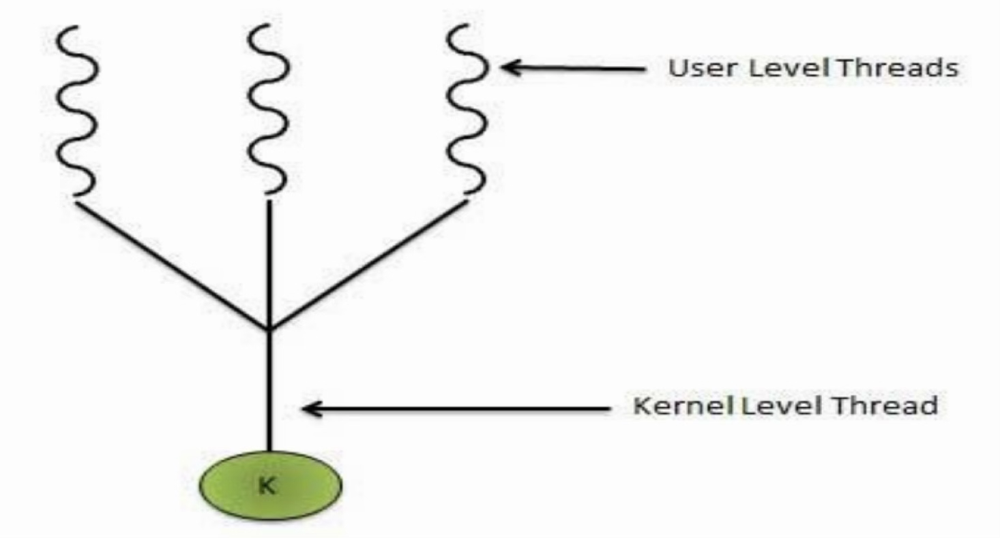

**One-to-One:** Each user thread maps directly to a separate kernel thread. Provides true parallelism on multiprocessors and independent thread execution. Blocking one thread does not affect others. Thread creation overhead is higher. Examples: Windows, Linux (NPTL).

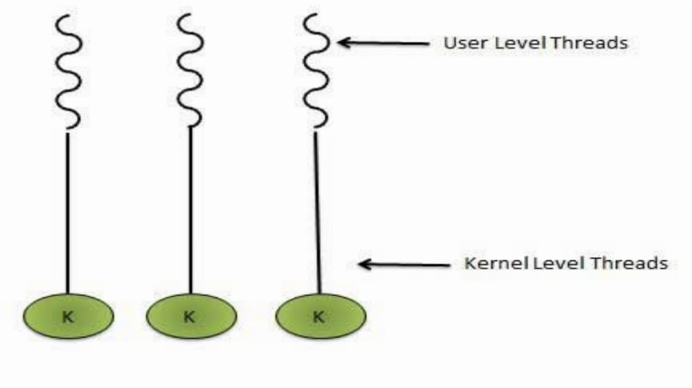

**Many-to-Many:** Multiple user threads map to multiple kernel threads (equal or smaller number). Applications create as many user threads as needed, and the kernel schedules available kernel threads on processors. Blocking system calls do not necessarily block all threads. Provides flexibility balancing concurrency with resource usage.

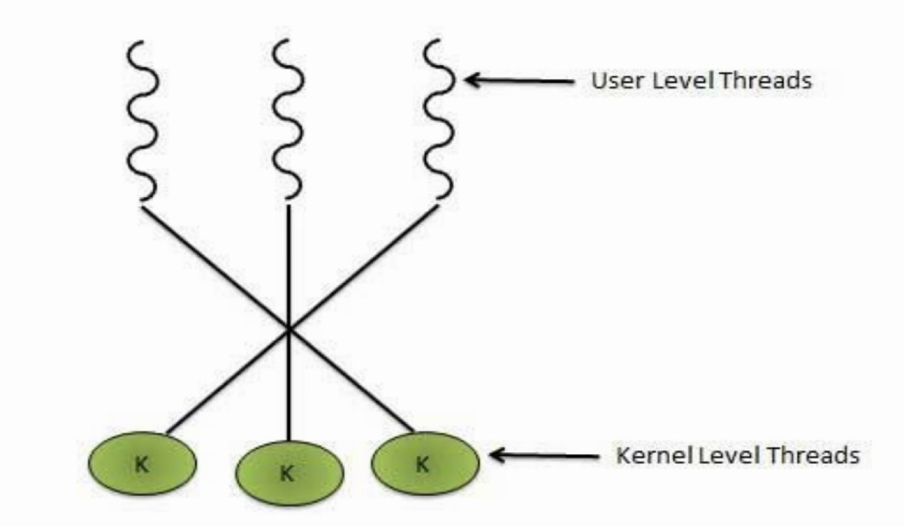

### Thread Scheduling

**User-Level Thread Scheduling:** The thread library performs all scheduling decisions in user space. The kernel schedules the containing process, not individual threads. All threads share one process time quantum. Thread switching is fast (no system calls needed).

**Kernel-Level Thread Scheduling:** The OS kernel directly schedules individual threads. Each thread appears as a separate schedulable entity. Standard scheduling algorithms (FCFS, RR, priority) apply to kernel threads. Multiple threads from the same process can run simultaneously on different processors. Context switching requires kernel involvement but provides better multiprocessor parallelism.

### Multiprocessor Scheduling

**Symmetric Multiprocessing (SMP):** All processors have equal capability and access to system resources. Each processor can execute any process or thread. A global ready queue serves all processors equally.

**Asymmetric Multiprocessing:** One master processor handles all scheduling decisions. Other slave processors only execute assigned tasks. Simpler but the master can become a bottleneck.

**Processor Affinity:** The tendency of threads to execute on the same processor repeatedly. A warm cache on a processor contains data from previous thread execution; migrating a thread invalidates cached data. Soft affinity allows migration but prefers the same processor. Hard affinity prohibits migration entirely.

**Load Balancing:** Distributes work evenly across all processors. Push migration moves processes from overloaded to idle processors proactively. Pull migration occurs when an idle processor takes processes from a busy one. Load balancing conflicts with processor affinity, so a balance between distribution and cache performance is necessary.

---

---

---

## 3. Process Communication and Synchronization

## 3.1 Principles of Concurrency, Race Condition, Critical Region

### Concurrency

Concurrency refers to the ability of a system to handle multiple processes at the same time. Processes that exist in memory simultaneously are called concurrent processes.

**Types of Concurrent Processes:**

- **Independent processes** do not share data or information with each other. They compete for system resources such as CPU time and I/O devices.
- **Cooperating processes** share data and need to exchange information with each other. A cooperating process can affect or be affected by other processes. Example: a compiler producing output for an assembler.

In a single-processor system, process execution is interleaved (pseudo-parallelism) and true parallelism is not achieved. In multiprocessor systems, processes can execute truly in parallel on different CPUs.

**Problems in concurrent processing:**  
(1) Sharing of global resources, where uncontrolled access to shared variables leads to inconsistent results.  
(2) Optimal resource allocation, where a process may receive a resource but get suspended before using it, potentially leading to deadlock.  
(3) Locating programming errors, because results are non-deterministic and not easily reproducible, making debugging extremely difficult.

### Inter-Process Communication (IPC)

IPC refers to mechanisms that allow processes to exchange data and information. Three key issues in IPC are:  
(1) how one process can pass information to another,  
(2) ensuring that two or more processes do not interfere with each other (e.g., two processes in an airline reservation system trying to book the last seat), and  
(3) proper sequencing when dependencies exist (if process A produces data and process B prints it, B must wait until A has produced the data).

**Shared Memory:** Processes share a common memory region to exchange information. The shared memory resides in the address space of the creating process; other processes must attach it to their own address spaces. This is fast but requires explicit synchronization to avoid race conditions. One process can accidentally corrupt data used by another.

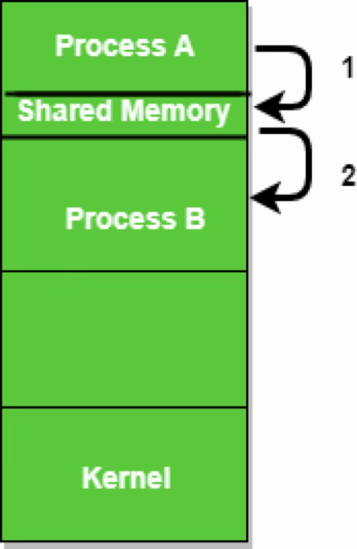

**Message Passing:** Processes communicate by exchanging messages through the OS, so no shared memory is needed. Processes must first establish a communication link. The sending process calls `send(destination, message)` and the receiving process calls `receive(sender, message)`. The OS handles transmission. Message passing is ideal for distributed systems.

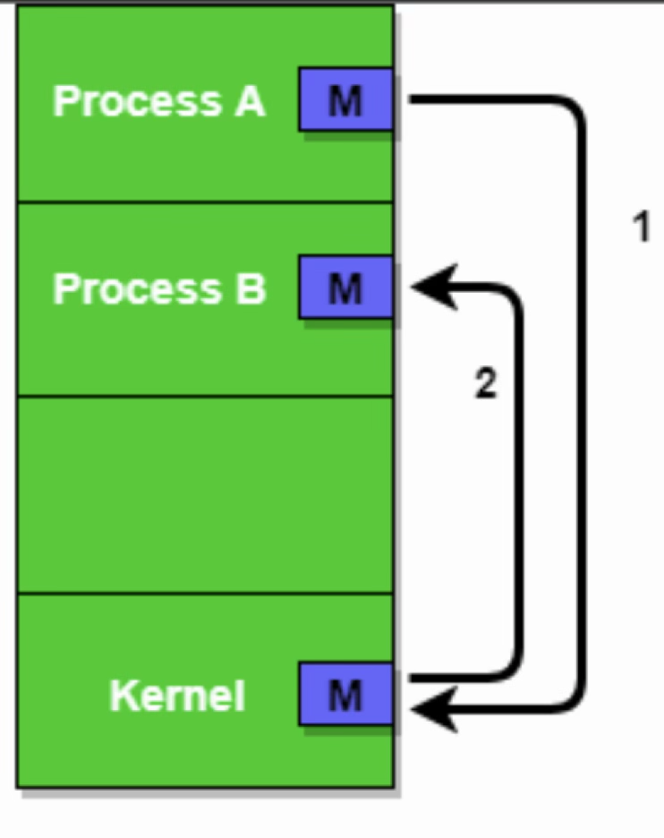

**Buffering:** Messages reside in temporary queues. Zero capacity means the sender must wait for receiver (synchronous/blocking). Bounded capacity means the sender blocks when the queue is full, and the receiver blocks when empty. Unbounded capacity means the sender never blocks (asynchronous/non-blocking).

### Race Condition

> **Define race condition. [1 mark] (2082 Bhadra)**

A race condition occurs when two or more processes access shared data simultaneously and the final result depends on the precise timing of which process runs when, leading to unpredictable and incorrect behavior.

**Print Spooler Example:** Two shared variables exist: `out` (next file to print) and `in` (next free slot). Process A reads `in` as 7 and stores it locally. Before A can update `in`, a clock interrupt switches to process B, which also reads `in` as 7. B writes its filename into slot 7 and sets `in` to 8. When A resumes, it overwrites slot 7 with its own filename and also sets `in` to 8. The spooler appears consistent, but B's file will never be printed.

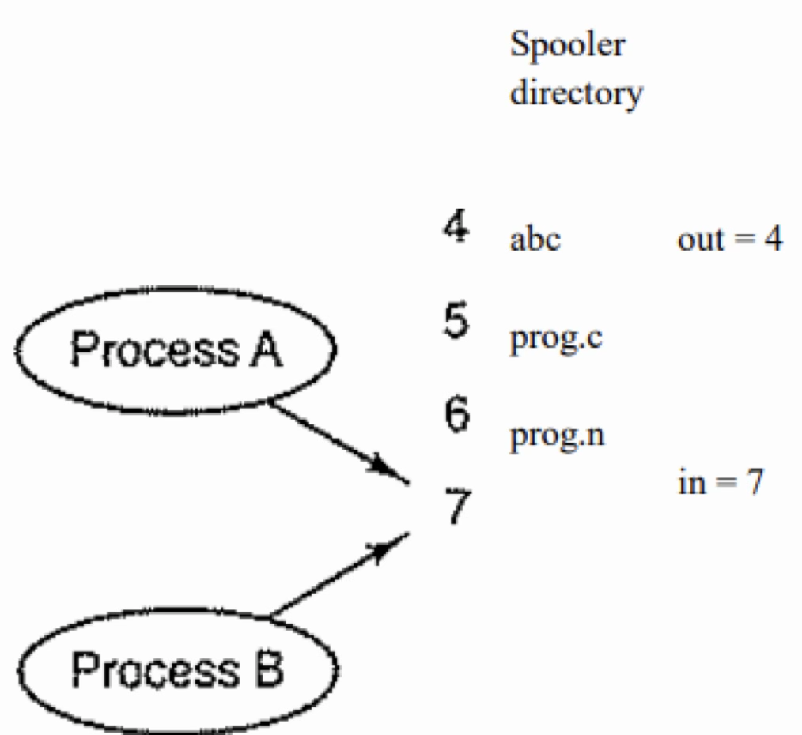

**Counter Variable of Buffer Size Example:** If `counter = 5` and producer executes `counter++` while consumer concurrently executes `counter--`, the result could be 4, 5, or 6 instead of the correct value 5. This happens because each high-level statement translates to multiple machine instructions (load, modify, store) that can interleave.

```text
"counter++" implementation:"       "counter--" implementation:

register₁ = counter                register₂ = counter
register₁ = register₁ + 1          register₂ = register₂ - 1
counter = register₁                counter = register₂
```

| Time | Process  | Action  | Instruction               | Local State       |
| ---- | -------- | ------- | ------------------------- | ----------------- |
| T₀   | producer | execute | register₁ = counter       | { register₁ = 5 } |
| T₁   | producer | execute | register₁ = register₁ + 1 | { register₁ = 6 } |
| T₂   | consumer | execute | register₂ = counter       | { register₂ = 5 } |
| T₃   | consumer | execute | register₂ = register₂ - 1 | { register₂ = 4 } |
| T₄   | producer | execute | counter = register₁       | { counter = 6 }   |
| T₅   | consumer | execute | counter = register₂       | { counter = 4 }   |

### Critical Region (Critical Section)

A critical region is a section of code where shared resources (common variables, shared memory, files) are accessed. Access must be carefully controlled to prevent race conditions.

**Four requirements for a correct solution:**

- **Mutual Exclusion:** No two processes may be simultaneously inside their critical regions.
- **No assumptions:** No assumptions should be made about CPU speeds or the number of CPUs.
- **Progress:** No process running outside its critical region may block other processes from entering theirs. Only processes wanting to enter compete.
- **Bounded Waiting:** No process should wait forever to enter its critical region.

**Structure of a process using critical sections:**  
Entry section (request permission)  
Critical section (access shared resource)  
Exit section (release)  
Remainder section (other code)

**Structure of a process using critical sections:**

```c
do {
    entry section
        critical section
    exit section
        remainder section
} while(true)
```

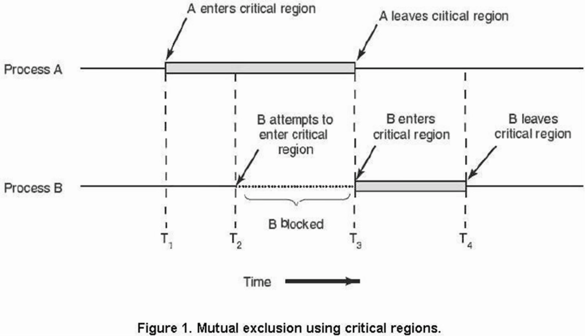

---

## 3.2 Mutual Exclusion, Semaphores, and Mutex

### Approaches to Mutual Exclusion

**Disabling Interrupts:** On a single processor, a process disables interrupts upon entering its critical region and re-enables them before leaving. With interrupts disabled, no clock interrupt occurs and the CPU cannot switch to another process. However, a buggy process could disable interrupts and never re-enable them, crashing the system. On multiprocessor systems, disabling interrupts on one CPU does not affect others, and they can still access shared memory.

**Lock Variables:** A shared variable (initially 0) is checked before entering the critical region. If 0, the process sets it to 1 and enters; if 1, it waits. This has the same flaw as the spooler problem. Two processes can read the lock as 0 before either sets it to 1, both entering their critical regions simultaneously.

```c
do {
    while(lock == 1); // do nothing
    lock = 1; // enter critical section

    // critical section

    lock = 0; // exit critical section

    // remainder section

} while(true);
```

**Strict Alternation:** A `turn` variable tracks whose turn it is. Process 0 enters when `turn == 0`, process 1 enters when `turn == 1`. Each process sets `turn` to the other upon exit. This works but violates the progress requirement. If one process is much slower or in its non-critical region, it blocks the other process.

```c
// process 0
do {
    // non critical section

    while(turn != 0); // do nothing

    // critical section

    turn = 1; // exit critical section

    // remainder non critical section

} while(true);
```

```c
// process 1
do {
    // non critical section

    while(turn != 1); // do nothing

    // critical section

    turn = 0; // exit critical section

    // remainder non critical section

} while(true);
```

**Peterson's Solution:**

> **What is Peterson's Solution? [2 marks] (Model Question)**

A classic software-based solution for two processes that satisfies mutual exclusion, progress, and bounded waiting. It uses two shared variables: `int turn` (indicates whose turn it is) and `boolean flag[2]` (indicates if a process is ready to enter).

When process `i` wants to enter, it sets `flag[i] = true` and `turn = j` (giving priority to the other process). It then waits while `flag[j] == true && turn == j`. This ensures that if both processes try to enter simultaneously, only one succeeds, which is the one whose turn it is. When a process exits, it sets `flag[i] = false`.

```c
do {
    flag[i] = true;
    turn = j;
    while(flag[j] && turn == j);

    // critical section

    flag[i] = false;

    // remainder section

} while(true);
```

Structure of Pi

```c
do {
    flag[j] = true;
    turn = i;
    while(flag[i] && turn == i);

    // critical section

    flag[j] = false;

    // remainder section

} while(true);
```

Structure of Pj

**Test and Set Lock (TSL), Hardware-Based:** Uses a special atomic hardware instruction `TestAndSet()` that reads a lock variable and sets it to 1 in a single indivisible operation. A process calls `TestAndSet(&lock)`. If the old value was 0, the process enters the critical region; if 1, it loops (busy waits). Because the instruction is atomic, no interleaving can occur between the read and the set.

```c
bool TestAndSet (bool *target) {
    bool rv = *target;
    *target = true;
    return rv;
}
```

```c
do {
    while(TestAndSet(&lock)); // "Spin"

    // critical section

    lock = false; // Release lock

    // remainder section

} while(true);
```

**Busy Waiting (Spin-Locking):** All the above solutions involve busy waiting, where a process continuously tests a condition in a loop, wasting CPU time. Alternatively, a process can block itself and go to a waiting queue until it is woken up.

### Semaphores

A semaphore is a variable used to solve the critical section problem and achieve process synchronization. It can only be accessed using two atomic operations:

- **wait(S)** (also called P(to wait) or down): If `S > 0`, decrement `S` by 1 and proceed. If `S == 0`, the process waits (blocks) until `S` becomes greater than 0. wait operation is called when a process wants access to a resource.
- **signal(S)** (also called V(to increment) or up): Increment `S` by 1. If any processes are waiting, one is woken up. signal operation is called when a process is done using a resource.

**Binary Semaphore (Mutex):** Takes values 0 or 1 only. Used for mutual exclusion. Initialize to 1. When process P1 enters its critical section, it calls `wait(s)` and `s` becomes 0. If P2 tries to enter, it calls `wait(s)` and blocks since `s == 0`. When P1 exits and calls `signal(s)`, `s` becomes 1, unblocking P2.

**Counting Semaphore:** Takes any non-negative integer value. Used to control access to resources with multiple instances. The initial value represents the number of available resources.

### Semaphore Operations

```c
void P() {
    while(S <= 0);
    S--;
}

void V() {
    S++;
}
```

---

## 3.3 Message Passing and Monitors

### Message Passing

(Covered under IPC in Section 3.1.) Message passing allows processes to communicate without shared memory. Two primitives are used: `send(destination, message)` and `receive(sender, message)`. The OS manages message transmission. Communication links can be direct (naming the process) or indirect (using mailboxes/ports). Message passing is also a solution for race conditions because no shared memory is involved, so no conflict arises.

### Monitors

A monitor is a high-level synchronization construct that provides mutual exclusion automatically. It encapsulates shared data, the procedures that operate on that data, and synchronization code into a single module.

**Rules:** A procedure defined within a monitor can access only variables declared locally within the monitor and its formal parameters. Local variables of a monitor can be accessed only by its local procedures. The monitor construct ensures that only one process at a time can be active within the monitor. If another process calls a monitor procedure while one is already active, it blocks and waits in an entry queue.

**Condition Variables:** Declared as `condition x, y;`. They support two operations:

- **x.wait():** The calling process is suspended and placed in a waiting queue for condition `x`. The monitor lock is released, allowing another process to enter.
- **x.signal():** Resumes exactly one suspended process waiting on condition `x`. If no process is waiting, the signal has no effect (no history is kept).

```c
// Syntax of a Monitor
monitor monitor_name
{
    // shared variable declarations
    procedure P1(...) { ... }
    procedure P2(...) { ... }
    ...
    procedure Pn(...) { ... }
    initialization code(...) { ... }
}
```

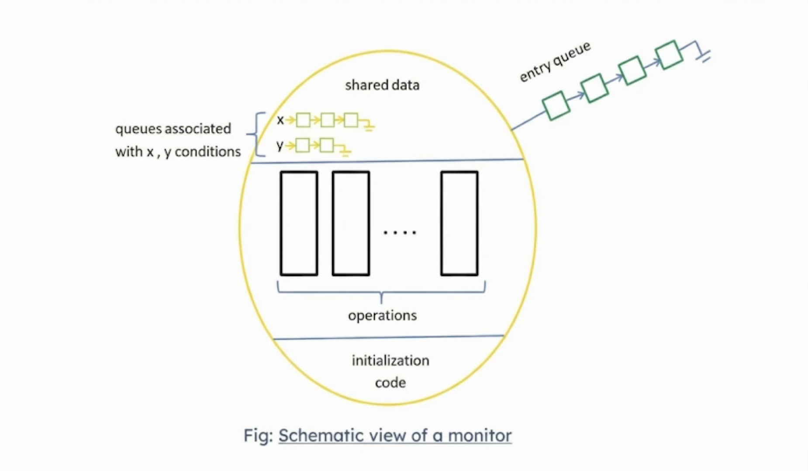

---

## 3.4 Classical Problems of Synchronization

### Producer-Consumer Problem (Bounded Buffer)

> **Explain how the producer-consumer problem can be solved using semaphore with its respective pseudo-code implementations. [5 marks] (2082 Bhadra)**

A buffer of `n` slots exists. The Producer inserts data into empty slots. The Consumer removes data from filled slots. Constraints: the producer must not insert when the buffer is full, the consumer must not remove when the buffer is empty, and they must not access the buffer simultaneously.

**Solution using three semaphores:**

- `mutex`: binary semaphore initialized to 1 (mutual exclusion for buffer access).
- `empty`: counting semaphore initialized to n (tracks empty slots).
- `full`: counting semaphore initialized to 0 (tracks filled slots).

```c
// Producer
do {
    // 1. Wait until there is at least one empty slot
    wait(empty);

    // 2. Lock the buffer (Mutual Exclusion)
    wait(mutex);

    /* Critical Section: Add data to the buffer */

    // 3. Unlock the buffer
    signal(mutex);

    // 4. Increment the count of full slots
    signal(full);
} while(true);
```

```c
// Consumer
do {
    // 1. Wait until there is at least one full slot
    wait(full);

    // 2. Lock the buffer (Mutual Exclusion)
    wait(mutex);

    /* Critical Section: Remove data from the buffer */

    // 3. Unlock the buffer
    signal(mutex);

    // 4. Increment the count of empty slots
    signal(empty);
} while(true);
```

The producer waits if no empty slots (`wait(empty)`), acquires the lock (`wait(mutex)`), inserts the item, releases the lock (`signal(mutex)`), and signals that a full slot is available (`signal(full)`). The consumer does the symmetric operation.

### Readers-Writers Problem

> **Explain solution of Reader-Writer problem using semaphore with its respective pseudo-code implementations. [5 marks] (Model Question)**

A database is shared among concurrent processes. Readers only read data, and multiple readers can read simultaneously without adverse effects. Writers update data, and a writer must have exclusive access (no other reader or writer may access the database simultaneously).

**Solution using two semaphores and an integer variable:**

- `mutex`: semaphore initialized to **1** (protects `readcount`).
- `wrt`: semaphore initialized to **1** (provides exclusive access for writers, shared between readers and writers).
- `readcount`: integer initialized to **0** (tracks current number of readers).

```c
// Writer
do {
    // writer requests for critical section
    wait(wrt);

    /* performs the write */

    // leaves the critical section
    signal(wrt);
} while(true);
```

```c
// Reader
do {
    wait(mutex);
    readcnt++;   // The number of readers has now increased by 1

    if(readcnt == 1)
        wait(wrt);   // ensures no writer can enter if there is even one reader
    signal(mutex);   // other readers can enter while this current reader is
                     // inside the critical section

    /* current reader performs reading here */

    wait(mutex);
    readcnt--;   // a reader wants to leave

    if (readcnt == 0)   // no reader is left in the critical section
        signal(wrt);   // writers can enter

    signal(mutex);   // reader leaves
} while(true);
```

The first reader to arrive locks out writers by calling `wait(wrt)`. Subsequent readers increment `readcount` without blocking on `wrt`. The last reader to leave (when `readcount` becomes 0) calls `signal(wrt)`, allowing writers to proceed. Writers call `wait(wrt)` for exclusive access.

### Dining Philosophers Problem

> **Under what condition does the solution to the Dining philosopher using semaphore leads to a deadlock conditions? [2 marks] (Model Question)**

Five philosophers sit around a table, each alternating between thinking and eating. Between each pair of adjacent philosophers lies one fork (chopstick). A philosopher needs both left and right forks to eat.

**Semaphore-Based Solution:** Each fork is represented by a semaphore initialized to 1. A philosopher calls `wait(fork[i])` and `wait(fork[(i+1)%5])` to pick up forks, and `signal()` on both to put them down.

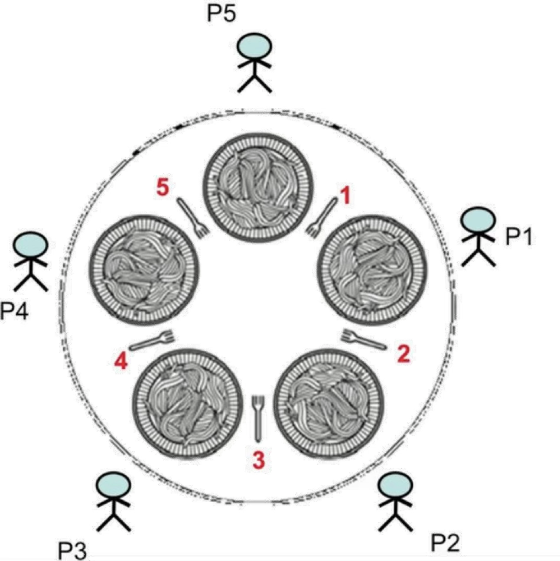

```c
// The structure of philosopher i

do {

    wait(chopstick[i]);

    wait(chopstick[(i + 1) % 5]);

    ...

    // eat

    signal(chopstick[i]);

    signal(chopstick[(i + 1) % 5]);

    // think

} while(true);
```

**Deadlock condition:** If all five philosophers become hungry simultaneously and each grabs their right fork first, all fork semaphores become 0. When each philosopher then tries to grab the left fork, all are delayed forever in a circular wait (deadlock).

**Remedies to avoid deadlock:**

- Allow at most four philosophers to sit at the table simultaneously.
- Allow a philosopher to pick up forks only if both are available (pick up in a critical section).
- Use an asymmetric solution: odd philosophers pick up left fork first, even philosophers pick up right fork first.
- **Monitor-Based Solution (Deadlock-Free):** Three states are defined: `thinking`, `hungry`, `eating`. A philosopher can set `state[i] = eating` only if neither neighbor is eating. A condition variable `self[i]` allows philosopher `i` to delay when hungry but unable to obtain both forks.

```c
monitor dp {
    enum { THINKING, HUNGRY, EATING } state[5];
    condition self[5];

    void pickup(int i) {
        state[i] = HUNGRY;
        test(i);
        if (state[i] != EATING)
            self[i].wait();
    }

    void putdown(int i) {
        state[i] = THINKING;
        test((i + 4) % 5);
        test((i + 1) % 5);
    }

    void test(int i) {
        if ((state[(i + 4) % 5] != EATING) &&
            (state[i] == HUNGRY) &&
            (state[(i + 1) % 5] != EATING)) {
            state[i] = EATING;
            self[i].signal();
        }
    }

    initialization_code() {
        for (int i = 0; i < 5; i++)
            state[i] = THINKING;
    }
}
```

---

## 3.5 Deadlock: Prevention, Ignorance, Avoidance, Detection and Recovery

### Deadlock

A deadlock is a situation where a set of processes is permanently blocked because each process is holding a resource and waiting for a resource held by another process in the set. It represents a circular wait condition where no process can proceed.

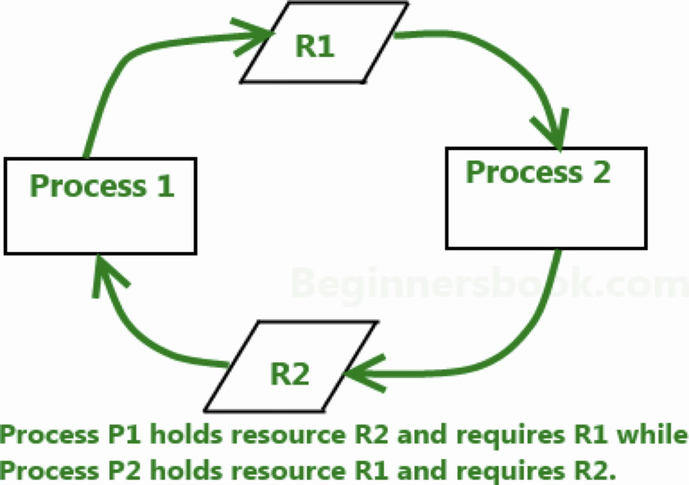

**Starvation vs Deadlock:** Starvation occurs when a process waits indefinitely because other processes are continuously given preference. The process could potentially run, but the scheduler never selects it. A starved process might eventually proceed (e.g., through aging), while a deadlocked process will never proceed without external intervention.

**Livelock:** Processes are not blocked but still cannot make progress. They continuously change state in response to each other, consuming CPU but performing useless work. Example: two processes repeatedly acquire and release their first resource, each backing off "politely" when they find the other's resource is unavailable. Solution: introduce randomness in retry timing or set maximum retry attempts.

### Four Necessary Conditions for Deadlock

All four must hold simultaneously for deadlock to occur:

- **Mutual Exclusion:** At least one resource is held in a non-sharable mode. Only one process can use it at a time; others must wait.
- **Hold and Wait:** A process holds at least one resource while waiting to acquire additional resources held by other processes. It does not release currently held resources while waiting.
- **No Preemption:** Resources cannot be forcibly taken away. A resource is released only voluntarily by the process holding it, after completing its task.
- **Circular Wait:** A set of processes {P₀, P₁, ..., Pₙ} exists such that P₀ waits for a resource held by P₁, P₁ waits for P₂, ..., Pₙ waits for P₀.

### Deadlock Prevention

Deadlock prevention ensures that at least one of the four necessary conditions cannot hold.

**1. Preventing Mutual Exclusion:** For sharable resources (e.g., read-only files), mutual exclusion is not required. However, for inherently non-sharable resources (e.g., printers), mutual exclusion cannot be denied. Spooling can convert some non-sharable resources into sharable ones. In general, this approach is not practical for most resources.

**2. Preventing Hold and Wait:** Require a process to request all resources at once before execution begins, or allow a process to request new resources only after releasing all currently held ones. This prevents a process from holding resources while waiting, but leads to low resource utilization and possible starvation.

**3. Preventing No Preemption:** If a process holding resources requests another that cannot be immediately allocated, all its currently held resources are preempted (released). The process must re-acquire all resources when they become available. This is applicable only to resources whose state can be easily saved and restored (e.g., CPU registers, memory), not to resources like printers.

**4. Preventing Circular Wait:** Assign each resource type a unique integer number. A process can request resources only in increasing order of the assigned numbers. This imposes a total ordering that prevents circular wait.

### Deadlock Ignorance (Ostrich Algorithm)

The ostrich algorithm handles deadlocks by simply ignoring them, pretending they do not occur. This approach is used by most general-purpose operating systems (Windows, Linux, macOS) because deadlocks are rare in practice, and the overhead of continuous prevention/detection outweighs the cost of occasional manual intervention (killing a frozen process or rebooting). This is not suitable for safety-critical systems (flight control, medical devices) where continuous reliable operation is essential.

### Deadlock Avoidance

Deadlock avoidance requires additional information about future resource requests. The system dynamically examines the resource-allocation state before granting each request to ensure the system never enters an unsafe state. Unlike prevention, avoidance does not restrict how requests are made.

**Safe State:** A state is safe if there exists a safe sequence, which is an ordering ⟨P₁, P₂, ..., Pₙ⟩ of all processes such that for each Pᵢ, the resources it still needs can be satisfied by currently available resources plus resources held by all Pⱼ where j < i. If no such sequence exists, the state is unsafe. An unsafe state is not necessarily a deadlock, but it means the system cannot guarantee deadlock avoidance.

**Banker's Algorithm:**

> **Use Banker's algorithm to claim that the system is in safe state and show the safe sequence. [7 marks] (2082 Bhadra)**
> **Is the state safe? If so, show the safe execution of the processes. [6 marks] (Model Question)**

Named after a banker who allocates capital ensuring all customers can complete their transactions. Designed for systems with multiple instances of each resource type.

**Data structures** (n = number of processes, m = number of resource types):

- **Available[m]:** Number of available instances of each resource type.
- **Max[n][m]:** Maximum demand of each process.
- **Allocation[n][m]:** Resources currently allocated to each process.
- **Need[n][m]:** Remaining resource need. `Need[i][j] = Max[i][j] − Allocation[i][j]`.

Consider a system with 3 concurrent processes (P0, P1, P2) and 3 resources (R0, R1, R2). The number of resources of each resource type in the system are 5, 5, 5 respectively. Allocation table and Current Need table are given below:
Is the system safe? If so, show the safe execution of process.

|     | R0  | R1  | R2  |
| --- | --- | --- | --- |
| P0  | 1   | 2   | 1   |
| P1  | 2   | 0   | 1   |
| P2  | 2   | 2   | 1   |

Allocation Table

<br>

|     | R0  | R1  | R2  |
| --- | --- | --- | --- |
| P0  | 1   | 0   | 3   |
| P1  | 0   | 1   | 2   |
| P2  | 1   | 2   | 0   |

Current Need

<br>


<br>

Consider a system with 5 concurrent processes (P0, P1, P2, P3, P4) and 4 resources (R0, R1, R2, R3). The number of resources of each resource type in the system are 6, 4, 4, 2 respectively. Allocation table and maximum claim table are given below:
Is the system safe? If so, show the safe execution of process.

|     | R0  | R1  | R2  | R3  |
| --- | --- | --- | --- | --- |
| P0  | 2   | 0   | 1   | 1   |
| P1  | 1   | 1   | 0   | 0   |
| P2  | 1   | 1   | 0   | 0   |
| P3  | 1   | 0   | 1   | 0   |
| P4  | 0   | 1   | 0   | 1   |

Allocation Table

<br>

|     | R0  | R1  | R2  | R3  |
| --- | --- | --- | --- | --- |
| P0  | 3   | 2   | 1   | 1   |
| P1  | 1   | 2   | 0   | 2   |
| P2  | 1   | 1   | 2   | 0   |
| P3  | 3   | 2   | 1   | 0   |
| P4  | 2   | 1   | 0   | 1   |

Maximum Claim

<br>


<br>

Consider a system with 3 concurrent processes (P0, P1, P2) and 3 resources (R0, R1, R2). The number of resources of each resource type in the system are 5, 5, 5 respectively. Allocation table and Current Need table are given below:
Is the system safe? If so, show the safe execution of process.

|     | R0  | R1  | R2  |
| --- | --- | --- | --- |
| P0  | 1   | 2   | 2   |
| P1  | 2   | 0   | 1   |
| P2  | 2   | 2   | 1   |

Allocation Table

<br>

|     | R0  | R1  | R2  |
| --- | --- | --- | --- |
| P0  | 1   | 0   | 2   |
| P1  | 0   | 1   | 2   |
| P2  | 1   | 2   | 0   |

Current Need

<br>


### Deadlock Detection

When neither prevention nor avoidance is used, the system must detect deadlocks after they occur.

**Resource Allocation Graph (RAG):** A directed graph where process nodes (circles) and resource nodes (rectangles with dots for instances) are connected by request edges (Pᵢ → Rⱼ, process requests resource) and assignment edges (Rⱼ → Pᵢ, resource allocated to process).

- If the graph contains no cycle, there is no deadlock.
- If each resource type has exactly one instance, a cycle is both a necessary and sufficient condition for deadlock.
- If resource types have multiple instances, a cycle is a necessary condition for deadlock but not a sufficient condition; a more sophisticated deadlock detection algorithm is required.

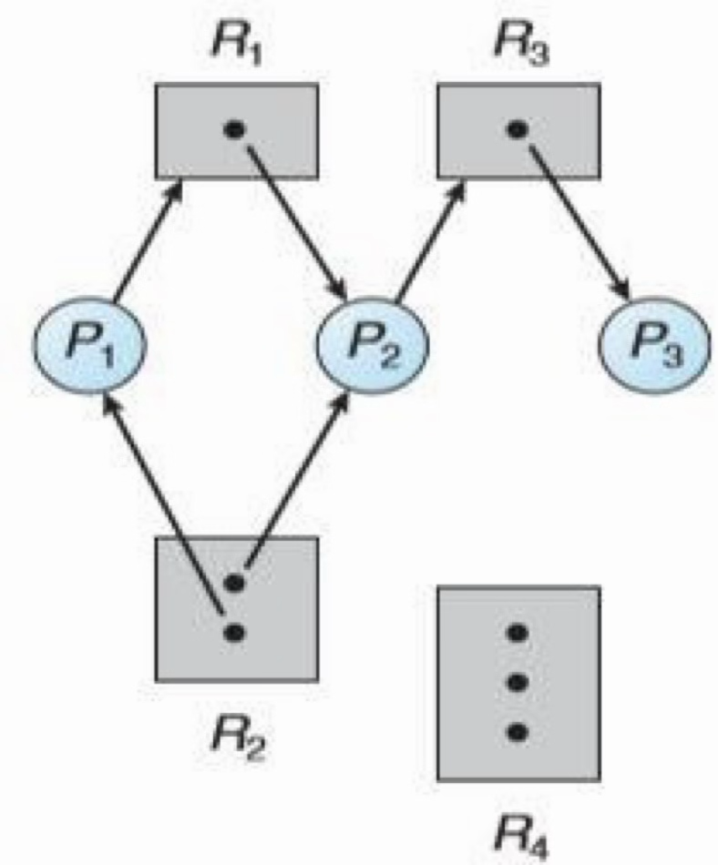

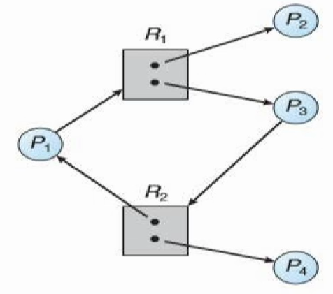

**Wait-For Graph:** A simplified version of the RAG for single-instance resources. Remove all resource nodes and create a direct edge from Pᵢ to Pⱼ if Pᵢ is waiting for a resource held by Pⱼ. A cycle in the wait-for graph indicates deadlock.

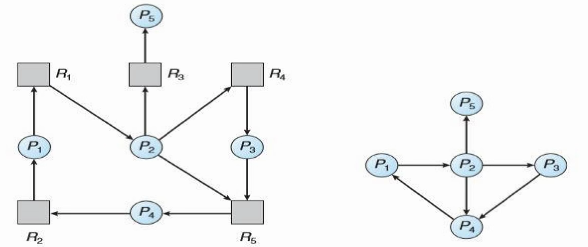

Deadlock detection can be invoked whenever a resource request cannot be granted immediately, at regular intervals, or when CPU utilization falls below a specified threshold.

### Recovery from Deadlock

Once detected, the system must break the circular wait.

**A. Process Termination:**

1. **Abort all deadlocked processes:** This is simple but drastic; all computation is lost.
2. **Abort one process at a time:** Terminate processes one by one until the deadlock cycle is broken. Higher overhead since detection must re-run after each termination.

**Criteria for selecting a victim:** lowest priority, shortest computation time so far, most additional time needed, fewest resources used (or most resources held to free up more), batch processes over interactive ones.

**B. Resource Preemption:** Take resources from some processes and give them to others. The preempted process must be rolled back, either through total rollback (restart from the beginning) or partial rollback (to a state before it acquired the preempted resource). The same process may repeatedly be chosen as a victim, causing starvation. Including a cost factor (number of rollbacks) can prevent this.

**Checkpoint and Rollback:** A process periodically saves its state (memory contents, register values, resource allocation). If rollback is needed, the process is restored to a previous checkpoint instead of restarting entirely. More frequent checkpoints mean less work lost but higher overhead.

### Integrated Deadlock Strategy

No single approach is optimal for all resources. An integrated strategy partitions resources into classes and applies the most appropriate method to each: prevention for some, avoidance for others, detection and recovery where needed.

### Two-Phase Locking

Two-phase locking (2PL) is a concurrency control protocol primarily used in database systems. It ensures serializability of transactions.

- **Growing Phase:** A transaction may acquire locks but may not release any. The number of locks only increases.
- **Shrinking Phase:** A transaction may release locks but may not acquire new ones. The number of locks only decreases.

2PL does not prevent deadlock. Because transactions accumulate locks during the growing phase, circular wait can easily arise. Prevention strategies include: always locking resources in a fixed order, acquiring all locks atomically at the start, or using timeouts with rollback and restart.

### Communication Deadlock

A communication deadlock occurs when processes are blocked waiting for messages that will never arrive. Each process waits for a message from another process in the set, creating a circular dependency. Causes include circular message dependencies and buffer exhaustion (both processes trying to send to each other's full buffers). Solutions: set timeouts on receive operations, use sufficient buffer space.
