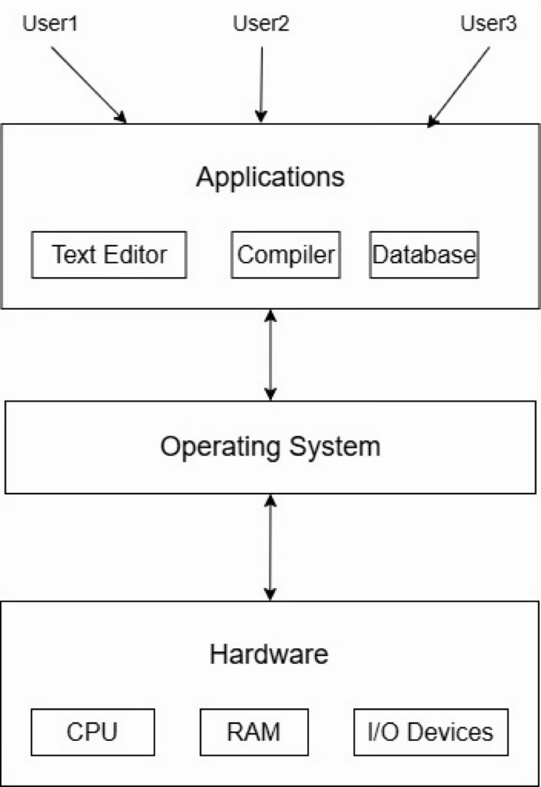
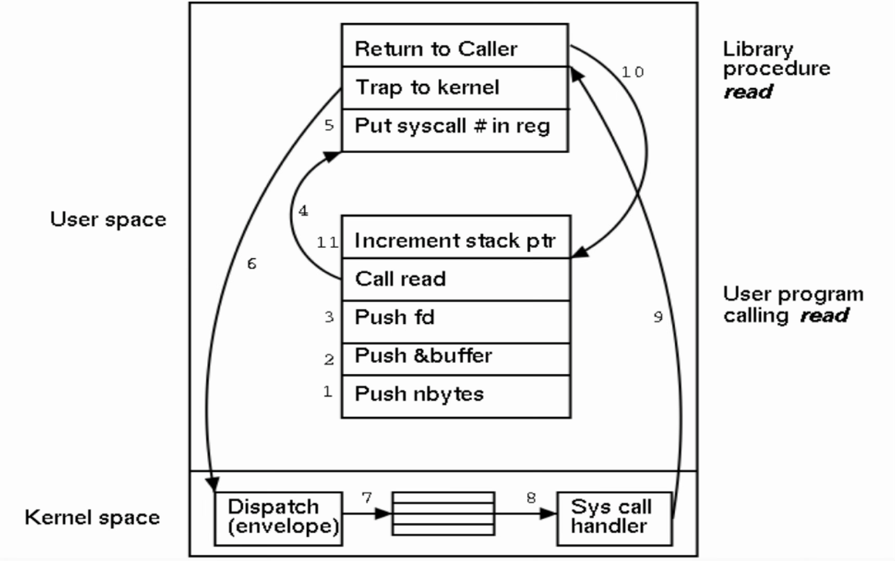
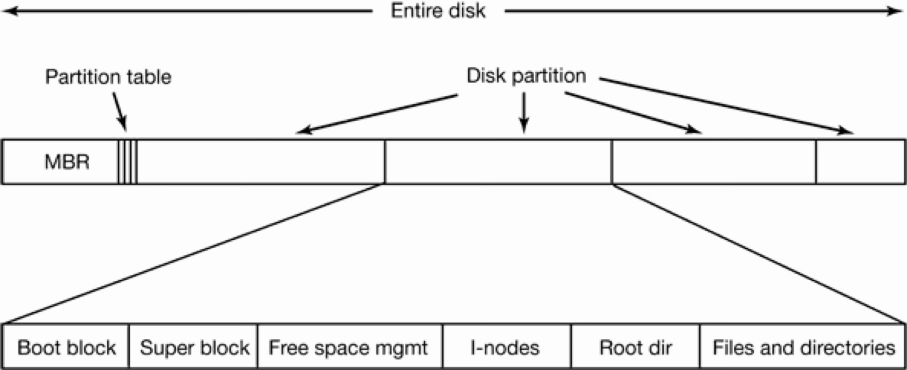
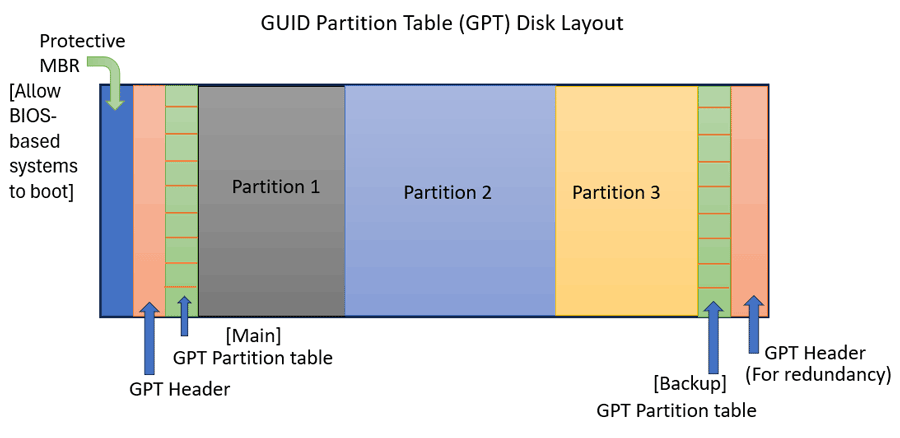

<!-- _class: title-slide -->

# 1 Introduction

(6 hours, 8 marks)
By Bidur Sapkota

---

# 1.1 Introduction to Operating Systems

An operating system (OS) is software that manages computer hardware and provides an environment for application programs to run. It acts as an intermediary between the user and the computer hardware. The two primary goals of an OS are convenience (making the computer easy to use) and throughput (maximizing the amount of useful work performed per unit time).

 

An OS performs two essentially unrelated functions: providing application programmers a clean abstract set of resources instead of the messy hardware ones, and managing these hardware resources. Examples include Windows, Linux, macOS, Android, iOS, and Unix.

---

# 1.1 Introduction to Operating Systems

---

# 1.2 OS as an Extended Machine and Resource Manager

> **How does an operating system provide abstraction to user level application from underlying hardware? Explain. [4 marks] (2082 Bhadra)**
> **How does an operating system act as Extended machine? Explain. [4 marks] (Model Question)**

---

# 1.2 OS as an Extended Machine and Resource Manager

### OS as an Extended Machine (Abstraction Provider)

The OS hides the messy details of hardware and presents clean, elegant, consistent abstractions to work with. Instead of dealing with raw hardware (e.g., disk sectors, memory addresses, CPU registers), programs interact with high-level abstractions:

1. **Processes:** Running programs with their own execution context, so that each program appears to have the CPU to itself.
2. **Address Spaces:** Virtual memory for each process, giving each program the illusion of having its own private, contiguous memory.

---

# 1.2 OS as an Extended Machine and Resource Manager

### OS as an Extended Machine (Abstraction Provider)

3. **Files:** Logical organization of data instead of raw disk sectors, allowing programs to read/write named data without knowing the underlying storage technology.

For example, when a user program reads a file, it simply calls `read(fd, &buffer, nbytes)`. The OS translates this into the complex sequence of disk controller commands, DMA setup, and interrupt handling needed to actually retrieve the data. The program never sees this complexity.

---

# 1.2 OS as an Extended Machine and Resource Manager

### OS as a Resource Manager

The OS provides orderly and controlled allocation of processors, memories, and I/O devices among various competing programs. It handles:

1. **Time multiplexing:** Multiple programs take turns using a resource. Examples include CPU scheduling (each process gets time slices) and printer queues (print jobs are processed in order).
2. **Space multiplexing:** A resource is divided among multiple programs simultaneously. Examples include memory partitioning (each process gets a portion of RAM) and disk space allocation.

---

# 1.2 OS as an Extended Machine and Resource Manager

### OS as a Resource Manager

The OS manages conflicting requests for resources and keeps track of resource usage. The kernel runs in kernel mode (supervisor mode) with complete hardware access, while user programs run in user mode with restricted instruction access. Instructions that affect machine control or I/O are forbidden to user-mode programs.

---

# 1.3 History of Operating System

### First Generation (1945–55): Vacuum Tubes

No operating systems existed. A single programmer designed, built, programmed, operated, and maintained each machine. Programming was done in absolute machine language using plugboards. Programmers physically wired the program into the computer using cables and switches. Programs were simple numerical calculations such as tables of sines, cosines, and logarithms.

---

# 1.3 History of Operating System

### Second Generation (1955–65): Transistors and Batch Systems

Clear separation between designers, builders, operators, and programmers emerged. Batch processing was introduced: jobs were collected on magnetic tape or punch cards and processed sequentially. Inexpensive computers (IBM 1401) handled I/O, while expensive ones (IBM 7094) did computation. Control cards (`$JOB`, `$FORTRAN`, `$LOAD`, `$RUN`, `$END`) were forerunners of modern command interpreters. Operating systems of this era included FMS and IBSYS.

---

# 1.3 History of Operating System

### Third Generation (1965–80): ICs and Multiprogramming

Introduction of Integrated Circuits (ICs) provided major price/performance advantages. IBM System/360 was a family of software-compatible machines with different performance levels, and its OS/360 had to work on all models. This resulted in an enormous, complex system with thousands of bugs.

1. **Multiprogramming:** Memory was partitioned into sections with a different job in each partition. While one job waits for I/O, another can use the CPU, greatly improving CPU utilization.

---

# 1.3 History of Operating System

### Third Generation (1965–80): ICs and Multiprogramming

2. **Spooling (Simultaneous Peripheral Operations On-Line):** Jobs were read from cards onto disk and loaded into memory when a partition becomes available.
3. **Timesharing:** Many users share one computer interactively. The CPU gives each user "time slices," making it feel like each user has their own computer. Notable systems include CTSS (Compatible Time Sharing System) and MULTICS, which later led to the development of UNIX.

---

# 1.3 History of Operating System

### Fourth Generation (1980–Present): Personal Computers

LSI (Large-Scale Integration) circuits made personal computers affordable for individual ownership.

1. **CP/M:** One of the first popular disk-based operating systems, created by Gary Kildall for Intel 8080. Dominated the microcomputer market for about 5 years.
2. **MS-DOS:** Microsoft bought rights to QDOS from Seattle Computer Products, improved it, and it became MS-DOS. It became dominant through IBM's bundling strategy.

---

# 1.3 History of Operating System

### Fourth Generation (1980–Present): Personal Computers

3. **GUI Development:** Doug Engelbart invented the GUI concept with windows, icons, menus, and mouse at Stanford in the 1960s. Steve Jobs saw the GUI at Xerox PARC and led to the Apple Macintosh. Microsoft developed Windows, initially as a graphical shell on top of MS-DOS.

---

# 1.3 History of Operating System

### Fifth Generation (1990–Present): Mobile Computers

The first real smartphone appeared in the mid-1990s (Nokia N9000). Symbian OS was initially dominant but later declined. Android (Linux-based, released 2008) became the dominant mobile OS, with Apple's iOS in second place. Android's open-source nature was a key advantage.

---

# 1.4 Types of Operating System

**Mainframe OS:** Designed for large-scale, high-capacity computers used by major organizations. These systems handle massive I/O operations and support batch processing, transaction processing, and timesharing for hundreds of simultaneous users. Examples: IBM z/OS, OS/390.

**Server OS:** Runs on servers and provides services to multiple clients over a network, such as file sharing, web hosting, print services, and database management. Built for stability, security, and handling heavy concurrent network traffic. Examples: Windows Server, Linux (Ubuntu Server, Red Hat), FreeBSD.

---

# 1.4 Types of Operating System

**Personal Computer OS:** Designed for general-purpose use on desktops and laptops. Focuses on providing a user-friendly graphical interface and supporting a wide range of applications for individual users. Examples: Windows 10/11, macOS, Linux (Ubuntu, Fedora).

**Smartphone and Handheld OS:** Specialized for mobile devices, balancing rich functionality with power efficiency, limited hardware resources, and touch-based user interfaces. Examples: Android, iOS.

---

# 1.4 Types of Operating System

**IoT and Embedded OS:** Lightweight operating systems designed for devices with specific, dedicated functions. IoT OS focuses on connectivity and data exchange between interconnected devices. Embedded OS controls specific hardware within a larger machine (e.g., appliances, automotive systems). They are small in footprint, fast, reliable, and usually do not allow user-installed applications. Examples: FreeRTOS, Contiki, VxWorks, Embedded Linux.

---

# 1.4 Types of Operating System

**Real-Time OS (RTOS):** Designed for systems with strict time constraints where processing must complete within a specific deadline.

- **Hard Real-Time:** Missing a deadline is catastrophic (e.g., airbag systems, missile guidance, pacemakers).
- **Soft Real-Time:** Deadlines are important but occasional misses are tolerable (e.g., multimedia streaming, video conferencing).

---

# 1.4 Types of Operating System

**Smart Card OS:** The most constrained type, running on tiny chips embedded in smart cards (credit cards, SIM cards, security badges). They have extremely limited memory (a few kilobytes) and processing power, focusing on security and simple data transactions. Some support multiple Java applets running concurrently. Examples: MULTOS, Java Card OS.

---

# 1.5 Operating System Components

**1. Kernel:** The core of the OS. It receives commands from the shell, processes them, coordinates system resources, interacts with hardware (CPU, RAM, disk), and returns results. Functions include process management, memory management, file system management, and security enforcement.

**2. Shell:** Acts as a command interpreter. It is the interface between the user and the kernel. It receives commands from the user, translates them into a form the kernel can understand, and forwards the request for execution. In Windows, the command prompt (cmd) uses the Windows API (DLL functions), which internally invokes system calls.

---

# 1.5 Operating System Components

**3. Utilities:** Utilities are ready-made programs that help you do useful tasks on the computer. They are NOT part of the core OS logic (like scheduling or memory management), but they are important tools that come with the OS. Provide useful functionality such as file management tools (copy, move, delete), text editors, compilers, and system monitoring tools. They use system calls to interact with the kernel.

**4. Applications:** User-level programs that perform specific tasks (web browsers, word processors, media players). Applications interact with the OS through system calls or higher-level APIs provided by the OS.

---

# 1.6 Types of OS Kernel

### Monolithic Kernel

All core functions (process management, memory management, file systems, device drivers) reside inside one large kernel running as a single executable in kernel mode. Components can call each other directly, making the system fast. However, the structure is hard to manage, and a failure in any part of the kernel can crash the entire system. Examples: Linux, traditional Unix.

---

# 1.6 Types of OS Kernel

### Layered Kernel

The OS is organized into layers, from hardware at the bottom to the user interface at the top. Each layer depends only on the layer directly below it. This structure makes debugging easier because problems can be traced to a specific layer, but it increases overhead since data must pass through multiple layers. Privilege decreases from inner (low) layers to outer (high) layers. Example: THE operating system (by Dijkstra).

---

# 1.6 Types of OS Kernel

### Microkernel

Only the essential functions (IPC, basic scheduling, low-level memory management) remain inside the kernel. Most services (file systems, device drivers, networking) run in user space. Failures in one service do not crash the whole system, and it is easier to add, remove, or modify services. Communication happens through message passing, which creates overhead and makes microkernels slower than monolithic ones. Examples: MINIX 3, QNX, L4.

---

# 1.6 Types of OS Kernel

### Nanokernel

An ultra-minimalist kernel that provides only the most fundamental hardware abstraction, which includes interrupt handling, basic hardware access and context switching. Almost all OS services (including memory management and scheduling) are delegated to user-space processes. The extremely small footprint makes it ideal for resource-constrained and real-time environments. Examples: EROS, KeyKOS.

---

# 1.6 Types of OS Kernel

### Hybrid Kernel

Combines the speed of a monolithic kernel with the modularity of a microkernel. Many services (device drivers, file systems) run in kernel space for performance, but the system is designed with a modular, layered structure for better organization and flexibility. Examples: Windows NT (all modern Windows), macOS (XNU kernel, which combines Mach microkernel with BSD components).

---

# 1.6 Types of OS Kernel

### Exokernel

Provides applications direct access to hardware resources. The kernel only handles protection and resource allocation. It ensures applications use only the resources assigned to them. No abstractions (files, processes, sockets) are enforced by the kernel; applications define their own abstractions tailored to their needs (e.g., a streaming app can create a video-optimized file structure). This minimizes overhead. Examples: MIT Exokernel, Nemesis.

---

# 1.7 System Calls, Shell Commands, Shell Programming

### System Calls

A system call is how a user program requests a service from the OS kernel. It provides the essential interface between a process and the operating system. System calls are needed because user-mode programs cannot directly execute privileged instructions. They must request the kernel (running in kernel mode) to perform operations on their behalf.

---

# 1.7 System Calls, Shell Commands, Shell Programming

### System Calls

**Services provided by system calls:**

- Process creation and management
- Main memory management
- File access, directory and file system management
- Device handling (I/O)
- Protection
- Communication (inter-process communication)

---

# 1.7 System Calls, Shell Commands, Shell Programming

### System Calls

**Example of `read(fd, &buffer, nbytes)`:**

- `fd`: File descriptor. It is an integer ID representing the specific file to read from (previously opened).
- `&buffer`: Memory address (pointer) where the data read from disk should be stored.
- `nbytes`: Number of bytes the program wants to read.
- The call returns the number of bytes actually read, which may be smaller than `nbytes` if end-of-file is encountered.

---

# 1.7 System Calls, Shell Commands, Shell Programming

---

# 1.7 System Calls, Shell Commands, Shell Programming

### System Calls

**System Call Mechanism (Steps):**

1. Push parameters onto the stack.
2. Call the library procedure (e.g., `read()`).
3. Library puts the system call number in a CPU register.
4. Execute the TRAP instruction (switches from user mode to kernel mode).
5. Kernel dispatches to the appropriate system call handler using the call number.
6. Handler executes the requested operation.

---

# 1.7 System Calls, Shell Commands, Shell Programming

### System Calls

7. Control returns to the library procedure (switches back to user mode).
8. Library returns to the user program.
9. Clean up the stack.

---

# 1.7 System Calls, Shell Commands, Shell Programming

### Shell Commands

Shell commands are tools used to interact with the OS via the command-line interface. They are either built into the shell (builtins like `cd`, `echo`) or exist as standalone executable programs.

Common categories:

1. **File/Directory Management:** `ls` (list), `cd` (change directory), `pwd` (print working directory), `mkdir`, `rm`, `cp`, `mv`
2. **Text/Data Processing:** `cat` (display file), `grep` (search patterns), `sort`, `awk`

---

# 1.7 System Calls, Shell Commands, Shell Programming

### Shell Commands

Common categories:

3. **Process Management:** `ps` (list processes), `top` (monitor), `kill` (terminate)
4. **Permissions:** `chmod` (change file permissions), `chown` (change ownership)

---

# 1.7 System Calls, Shell Commands, Shell Programming

### Shell Programming

Shell programming (scripting) involves writing a sequence of shell commands in a file (a shell script) to automate tasks. Shell scripts support variables, control structures (if-else, loops), functions, and I/O redirection.

**Types of shells:**

| Shell | Full Name          | Key Characteristics                                                                    |
| ----- | ------------------ | -------------------------------------------------------------------------------------- |
| sh    | Bourne Shell       | Original Unix shell; compact, fast, portable; lacks interactive features               |

---

# 1.7 System Calls, Shell Commands, Shell Programming

### Shell Programming

**Types of shells:**

| Shell | Full Name          | Key Characteristics                                                                    |
| ----- | ------------------ | -------------------------------------------------------------------------------------- |
| bash  | Bourne-Again Shell | Default on most Linux; superset of sh; adds command-line editing, job control, history |
| csh   | C Shell            | Syntax similar to C language; introduced command history and aliases                   |

---

# 1.7 System Calls, Shell Commands, Shell Programming

### Shell Programming

**Types of shells:**

| Shell | Full Name          | Key Characteristics                                                                    |
| ----- | ------------------ | -------------------------------------------------------------------------------------- |
| ksh   | Korn Shell         | Combines features of sh and csh; powerful scripting and interactive use                |
| zsh   | Z Shell            | Highly customizable; advanced tab completion, plugins, themes; default on macOS        |

---

# 1.8 POSIX Standard

POSIX (Portable Operating System Interface) is a family of standards specified by the IEEE (IEEE Std 1003) to maintain compatibility between operating systems. Its primary purpose is to ensure application portability, allowing software written for one POSIX-compliant OS to be ported to another with little or no modification.

**POSIX defines:**

1. **System Interfaces (API):** Standard C library functions for process management, file I/O, threading (pthreads), and signal handling.
2. **Command-Line Shell:** A standard shell environment for command execution and scripting.

---

# 1.8 POSIX Standard

**POSIX defines:**

3. **Utilities:** A set of common command-line tools (`ls`, `cd`, `echo`, `grep`, etc.) that behave the same on any compliant system.
4. **Environment Variables:** Standardized ways for programs to access environment configuration.

 

Linux, macOS, and BSD variants are highly POSIX-compliant. POSIX compliance is especially important for server infrastructure, embedded systems, and cross-platform software development where portability across different hardware and OS platforms is essential.

---

# 1.9 Bootloader, MBR/GPT, UEFI and Legacy Boot

> **Explain the difference between MBR and GPT Partitions. [2 marks] (2082 Bhadra)**
> **Define Bootloader. Explain any 2 types of boot mechanism. [4 marks] (Model Question)**

### Bootloader

A bootloader is a small program responsible for initiating the system startup process. When a computer is powered on, the firmware (BIOS or UEFI) initializes the hardware. Since the OS is stored on non-volatile storage and is not yet in RAM, the bootloader locates the OS kernel on the storage device, loads it into RAM, and hands over control to the OS.

---

# 1.9 Bootloader, MBR/GPT, UEFI and Legacy Boot

**Common bootloaders:**

1. **GRUB (GRand Unified Bootloader):** Default on most Linux distributions. Supports multiple file systems, multi-booting, and both legacy BIOS and UEFI systems.
2. **Windows Boot Manager (BOOTMGR):** Standard bootloader for modern Windows (Vista onward). Reads the Boot Configuration Data (BCD) store to identify available operating systems.
3. **NTLDR:** Legacy bootloader for Windows NT through Windows XP. Used `boot.ini` for configuration. Replaced by BOOTMGR.

---

# 1.9 Bootloader, MBR/GPT, UEFI and Legacy Boot

**Common bootloaders:**

4. **LILO (Linux Loader):** Older Linux bootloader, now largely replaced by GRUB.

---

# 1.9 Bootloader, MBR/GPT, UEFI and Legacy Boot

### MBR vs GPT

MBR (Master Boot Record) and GPT (GUID(Globally Unique Identifiers) Partition Table) are two methods for storing partition information on a storage drive.

| MBR                                                                                  | GPT                                                                     |
| ------------------------------------------------------------------------------------ | ----------------------------------------------------------------------- |
| Supports a maximum disk size of 2 TB                                                 | Supports disks up to 9.4 ZB (zettabytes)                                |
| Allows only 4 primary partitions (extended/logical partitions are needed for more)   | Allows up to 128 partitions without requiring extended partitions       |

---

# 1.9 Bootloader, MBR/GPT, UEFI and Legacy Boot

| MBR                                                                                  | GPT                                                                     |
| ------------------------------------------------------------------------------------ | ----------------------------------------------------------------------- |
| Stores all partition and boot data in a single sector (the first sector of the disk) | Stores redundant copies of partition headers and tables across the disk |
| Corruption of the single data sector can make the entire drive unbootable            | Includes CRC error-checking and backup headers for high reliability     |
| An older standard introduced in 1983                                                 | A modern standard that is part of the UEFI specification                |

---

# 1.9 Bootloader, MBR/GPT, UEFI and Legacy Boot

---

# 1.9 Bootloader, MBR/GPT, UEFI and Legacy Boot

### MBR

- Sector 0 of the disk is called the MBR (Master Boot Record).
- The MBR is used to boot the computer.
- The end of the MBR contains the partition table.
- The partition table gives the starting and ending addresses of each partition.
- One of the partitions in the table is marked as active.
- When the computer is booted, the BIOS reads in and executes the MBR.

---

# 1.9 Bootloader, MBR/GPT, UEFI and Legacy Boot

### MBR

- The first thing the MBR program does is locate the active partition.
- Then it reads in the active partition's first block, called the boot block.
- The boot block program is then executed.
- The program in the boot block loads the operating system contained in that partition.

---

# 1.9 Bootloader, MBR/GPT, UEFI and Legacy Boot

### MBR

- For uniformity, every partition starts with a boot block.
- This is true even if the partition does not contain a bootable operating system. Contains tiny code that prints: Error: No bootable device found. Press any key to reboot.
- Super block contains information like file system type (ext4, ntfs,), individual block size, etc.
- Free space management block contains information like bitmap vector, linked list.

---

# 1.9 Bootloader, MBR/GPT, UEFI and Legacy Boot

---

# 1.9 Bootloader, MBR/GPT, UEFI and Legacy Boot

### UEFI vs Legacy BIOS Boot

**Legacy BIOS (Basic Input/Output System):**

- Older firmware standard stored in a ROM chip on the motherboard.
- Uses MBR partitioning. Reads the first sector of the boot drive (MBR) to find the bootloader.
- Limited to booting from drives up to 2 TB.
- Text-based setup interface; no built-in security features.
- When you power on a computer, the BIOS runs a POST check, reads the MBR, executes the bootloader, and finally loads the operating system.

---

# 1.9 Bootloader, MBR/GPT, UEFI and Legacy Boot

### UEFI vs Legacy BIOS Boot

**UEFI (Unified Extensible Firmware Interface):**

- Modern firmware standard designed to replace legacy BIOS.
- Uses GPT partitioning. Stores bootloader files in a special EFI System Partition (ESP).
- Supports drives larger than 2 TB and boots faster.

---

# 1.9 Bootloader, MBR/GPT, UEFI and Legacy Boot

### UEFI vs Legacy BIOS Boot

**UEFI (Unified Extensible Firmware Interface):**

- Features a graphical setup interface, Secure Boot (verifies bootloader signatures to prevent malware from loading during startup), and network boot capabilities.
- When you power on a computer, UEFI runs a POST check, reads the EFI System Partition on a GPT disk, executes the bootloader, and loads the operating system.

 

Many modern UEFI motherboards include a CSM (Compatibility Support Module) that can emulate legacy BIOS mode, allowing them to boot from MBR-partitioned disks.

