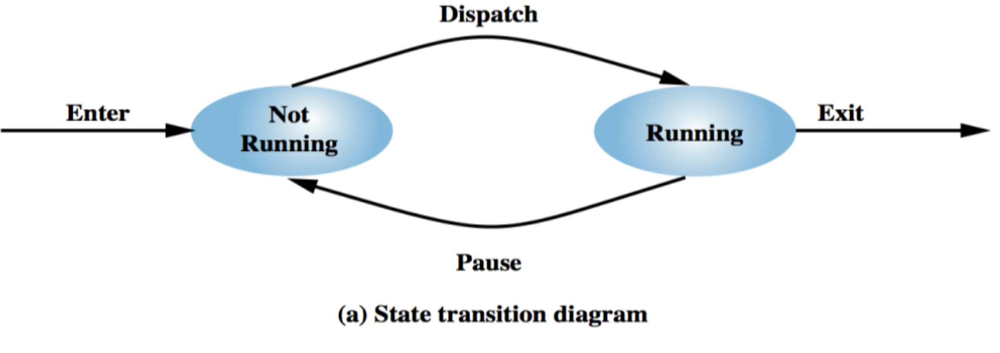
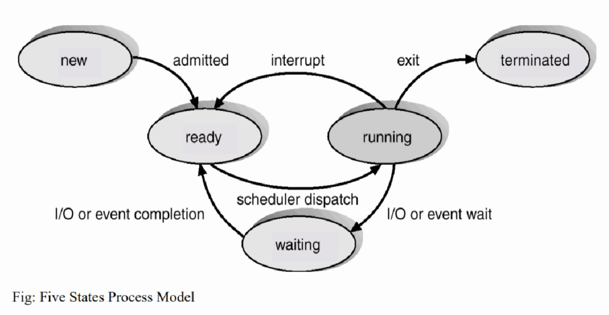
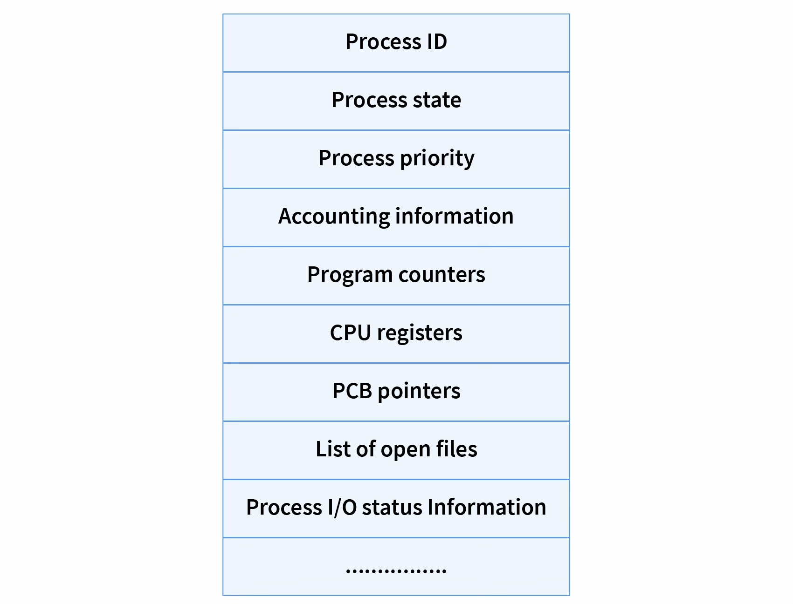

<!-- _class: title-slide -->

# 2. Process Management

(7 hours, 10 marks)
By Bidur Sapkota

---

# 2.1 Process Description, States and Control

### Process

A process is a program in execution. A process consists of program code along with the current activity represented by the program counter value. Each process requires system resources such as processor time, memory space, files, and I/O devices to complete its task. Instructions in a process execute in a sequential manner. Multiple processes can exist simultaneously in a system.

A program is a passive entity (an executable file stored on disk), while a process is an active entity with a program counter specifying the next instruction and associated resources. A program becomes a process when its executable file is loaded into memory.

---

# 2.1 Process Description, States and Control

### Process States

> **Describe the various states of the process. [3 marks] (2082 Bhadra)**

**Two-State Process Model:** The simplest model considers two states: **Running** (process is executing on CPU) and **Not Running** (process is waiting in a queue). A dispatcher gives CPU control to a process (Not Running → Running), and a higher-priority process or I/O request can preempt the current process (Running → Not Running).

---

# 2.1 Process Description, States and Control



---

# 2.1 Process Description, States and Control

**Five-State Process Model:** A more practical model defines five states:

- **New:** Process has just been created. The OS is setting up necessary data structures (PCB, PID, priority, owner). Not yet admitted to the pool of executable processes.
- **Ready:** Process is loaded in RAM and prepared to execute. It is waiting only for CPU availability. All ready processes are kept in a ready queue.
- **Running:** Process is currently being executed on the CPU. Only one process per CPU core can be in this state at any time.
- **Blocked (Waiting):** Process cannot execute until some event occurs, such as completion of an I/O operation, availability of a resource, or a signal from another process.

---

# 2.1 Process Description, States and Control

- **Exit (Terminated):** Process has been released from the pool of executable processes. It either completed successfully or terminated due to an error. Resources are being deallocated.

---

# 2.1 Process Description, States and Control



---

# 2.1 Process Description, States and Control

### Process Control Block (PCB)

The PCB is a data structure maintained by the OS for each process. It stores all information needed to manage and control the process, and is essential for multiprogramming and context switching.

**Components of the PCB:**

- **Process ID (PID):** A unique number assigned to distinguish the process from all other active processes.
- **Process State:** Current state of the process (new, ready, running, blocked, terminated).

---

# 2.1 Process Description, States and Control

**Components of the PCB:**

- **Program Counter (PC):** Stores the address of the next instruction to be executed. If the process is paused, the PC remembers exactly where to resume later.
- **CPU Registers:** When a process stops, register values (accumulators, index registers, stack pointers) must be saved so they can be restored exactly when the process resumes.
- **Process Priority:** Used by the OS to decide which process gets the CPU next.
- **Memory Management Information:** Page tables, segment tables, base/limit registers.

---

# 2.1 Process Description, States and Control

**Components of the PCB:**

- **Accounting Information:** Tracks CPU time used, time limits, execution ID, and process owner details.
- **PCB Pointers:** Pointers that link this PCB to other PCBs, used to create queues such as the ready queue.
- **List of Open Files:** Files the process is currently using, so the OS can close them properly if the process finishes or crashes.
- **I/O Status Information:** List of I/O devices allocated to the process and status of pending I/O requests.

---

# 2.1 Process Description, States and Control



---

# 2.1 Process Description, States and Control

### Context Switching

Context switching enables the processor to switch between multiple processes efficiently. The OS saves the current process state into its PCB (register values, program counter, and other execution context). It then loads the saved state of the next process from its PCB. The processor resumes execution of the new process from where it previously stopped. Context switching overhead depends on hardware support and the number of registers. Fast context switching enables responsive multitasking.

---

# 2.1 Process Description, States and Control

### Schedulers and Dispatcher

**Long-Term Scheduler (Job Scheduler):** Selects processes from disk storage to load into main memory. Executes infrequently. Balances the mix of compute-intensive and I/O-intensive processes. Controls the degree of multiprogramming.

**Medium-Term Scheduler:** Removes processes from main memory to improve performance. Swapping out sends blocked processes to disk temporarily; swapping in returns them when conditions improve. Helps manage memory allocation by reducing active processes.

---

# 2.1 Process Description, States and Control

**Short-Term Scheduler (CPU Scheduler):** Runs very frequently. Selects the next process from the ready queue for processor allocation. Must execute quickly to minimize scheduling overhead.

**Dispatcher:** The module that gives control of the CPU to the process selected by the short-term scheduler. It performs the actual context switch by loading the context of the selected process from its PCB.

---

# 2.1 Process Description, States and Control

### Scheduling Criteria

- **CPU Utilization:** Keep the CPU as busy as possible (practical range: 40–90%).
- **Throughput:** Number of processes completed per unit of time.
- **Turnaround Time (TAT):** Time gap between submission of a process and its completion. TAT = Completion Time − Arrival Time.
- **Waiting Time (WT):** Sum of time periods spent waiting in the ready queue. WT = TAT − Burst Time.

---

# 2.1 Process Description, States and Control

### Scheduling Criteria

- **Response Time (RT):** Time from request submission until the first response is produced.
- **Fairness:** Each process should receive a fair share of CPU.

---

# 2.1 Process Description, States and Control

### Preemptive vs Non-Preemptive Scheduling

**Preemptive Scheduling:** The OS can interrupt a running process before completion. Higher-priority processes can preempt lower-priority ones. Interrupted processes return to the ready queue. Enables responsive systems but requires context switching overhead and carries a risk of starvation for low-priority processes.

---

# 2.1 Process Description, States and Control

### Preemptive vs Non-Preemptive Scheduling

**Non-Preemptive Scheduling:** Once a process starts executing, it runs until completion or voluntary blocking. New processes wait in the ready queue regardless of priority. Simpler to implement with less overhead, but long-running processes can monopolize the processor and responsiveness is poor for interactive applications.

---

# 2.2 Scheduling Algorithms

**Common formulas used across all algorithms:**

<br>

- **Completion Time (CT):** Time at which the process finishes execution.
- **Turnaround Time (TAT):** CT − AT (Arrival Time).
- **Waiting Time (WT):** TAT − BT (Burst Time).
- **Response Time (RT):** Start Time − AT. In non-preemptive algorithms, RT equals WT.

---

# 2.2 Scheduling Algorithms

### 2.2.1 First Come First Serve (FCFS)

FCFS is the simplest scheduling algorithm. Processes execute in the exact order they arrive in the ready queue. It is non-preemptive, meaning a running process cannot be interrupted. Implementation uses a simple FIFO queue. No priority calculations are needed. However, average waiting time often becomes quite long, and a single long process can delay all subsequent processes (the convoy effect).

---

# 2.2 Scheduling Algorithms

### 2.2.1 First Come First Serve (FCFS)

> **For given processes, draw a Gantt Chart and calculate average turn around time and average waiting time for FCFS. [5 marks] (Model Question)**

---

# 2.2 Scheduling Algorithms

| Process | Arrival Time (AT) | Burst Time (BT) |
| ------- | ----------------- | --------------- |
| P1      | 0                 | 10              |
| P2      | 1                 | 6               |
| P3      | 3                 | 2               |
| P4      | 5                 | 4               |

---

# 2.2 Scheduling Algorithms

```text
Gantt Chart: | P1  | P2  | P3  | P4  |
              0     10    16    18    22
```

| Process   | AT  | BT  | CT  | TAT=CT-AT | WT=TAT-BT |
| --------- | --- | --- | --- | --------- | --------- |
| P1        | 0   | 10  | 10  | 10        | 0         |
| P2        | 1   | 6   | 16  | 15        | 9         |
| P3        | 3   | 2   | 18  | 15        | 13        |
| P4        | 5   | 4   | 22  | 17        | 13        |
| **Total** |     |     |     | **57**    | **35**    |

---

# 2.2 Scheduling Algorithms

Average Turnaround Time (ATAT)

$= \frac{\sum TAT}{\text{Number of processes}}$

$= \frac{10+15+15+17}{4}$

$= 14.25 \text{ ms}$

Average Waiting Time (AWT)

$= \frac{\sum WT}{\text{Number of processes}}$

$= \frac{0+9+13+13}{4}$

$= 8.75 \text{ ms}$

---

# 2.2 Scheduling Algorithms

### 2.2.1 First Come First Serve (FCFS)

> **For given processes, draw a Gantt Chart and calculate average turn around time and average waiting time for FCFS. [5 marks] (Model Question)**

---

# 2.2 Scheduling Algorithms

| Process | Arrival Time (AT) | Burst Time (BT) |
| ------- | ----------------- | --------------- |
| P1      | 0                 | 3               |
| P2      | 2                 | 6               |
| P3      | 4                 | 4               |
| P4      | 6                 | 5               |
| P5      | 8                 | 2               |

---

# 2.2 Scheduling Algorithms

<style scoped>
 td, th {
  font-size: 26pt
 }
</style>

```text
Gantt Chart: | P1  | P2  | P3  | P4  | P5  |
              0     3     9     13    18   20
```

| Process   | AT  | BT  | CT  | TAT=CT-AT | WT=TAT-BT |
| --------- | --- | --- | --- | --------- | --------- |
| P1        | 0   | 3   | 3   | 3         | 0         |
| P2        | 2   | 6   | 9   | 7         | 1         |
| P3        | 4   | 4   | 13  | 9         | 5         |
| P4        | 6   | 5   | 18  | 12        | 7         |
| P5        | 8   | 2   | 20  | 12        | 10        |
| **Total** |     |     |     | **43**    | **23**    |

---

# 2.2 Scheduling Algorithms

Average Turnaround Time (ATAT)

$= \frac{\sum TAT}{\text{Number of processes}}$

$= \frac{3+7+9+12+12}{5}$

$= 8.6 \text{ ms}$

Average Waiting Time (AWT)

$= \frac{\sum WT}{\text{Number of processes}}$

$= \frac{0+1+5+7+10}{5}$

$= 4.6 \text{ ms}$

---

# 2.2 Scheduling Algorithms

### 2.2.2 Shortest Job First (SJF)

SJF prioritizes the process with the smallest estimated execution time. It is non-preemptive, meaning the running process completes before the next is selected. It provides the optimal (minimum) average waiting time for a given set of processes. However, it requires accurate prediction of burst time, and starvation can occur if short processes continuously arrive, starving long processes indefinitely.

---

# 2.2 Scheduling Algorithms

### 2.2.2 Shortest Job First (SJF)

> **For given processes, draw a Gantt Chart and calculate average turn around time and average waiting time for SJF. [5 marks] (Model Question)**

---

# 2.2 Scheduling Algorithms

| Process | Arrival Time (AT) | Burst Time (BT) |
| ------- | ----------------- | --------------- |
| P1      | 0                 | 7               |
| P2      | 2                 | 4               |
| P3      | 4                 | 1               |
| P4      | 5                 | 4               |

---

# 2.2 Scheduling Algorithms

```text
Gantt Chart: | P1  | P3  | P2  | P4  |
              0     7     8     12    16
```

| Process   | AT  | BT  | CT  | TAT=CT-AT | WT=TAT-BT |
| --------- | --- | --- | --- | --------- | --------- |
| P1        | 0   | 7   | 7   | 7         | 0         |
| P2        | 2   | 4   | 12  | 10        | 6         |
| P3        | 4   | 1   | 8   | 4         | 3         |
| P4        | 5   | 4   | 16  | 11        | 7         |
| **Total** |     |     |     | **32**    | **16**    |

---

# 2.2 Scheduling Algorithms

Average Turnaround Time (ATAT)

$= \frac{\sum TAT}{\text{Number of processes}}$

$= \frac{32}{4}$

$= 8 \text{ ms}$

Average Waiting Time (AWT)

$= \frac{\sum WT}{\text{Number of processes}}$

$= \frac{16}{4}$

$= 4 \text{ ms}$

---

# 2.2 Scheduling Algorithms

### 2.2.2 Shortest Job First (SJF)

> **For given processes, draw a Gantt Chart and calculate average turn around time and average waiting time for SJF. [5 marks] (Model Question)**

---

# 2.2 Scheduling Algorithms

| Process | Arrival Time (AT) | Burst Time (BT) |
| ------- | ----------------- | --------------- |
| P1      | 0                 | 3               |
| P2      | 2                 | 6               |
| P3      | 4                 | 4               |
| P4      | 6                 | 5               |
| P5      | 8                 | 2               |

---

# 2.2 Scheduling Algorithms

<style scoped>
 td, th {
  font-size: 26pt
 }
</style>

```text
Gantt Chart: | P1  | P2  | P5  | P3  | P4  |
              0     3     9     11    15   20
```

| Process   | AT  | BT  | CT  | TAT=CT-AT | WT=TAT-BT |
| --------- | --- | --- | --- | --------- | --------- |
| P1        | 0   | 3   | 3   | 3         | 0         |
| P2        | 2   | 6   | 9   | 7         | 1         |
| P3        | 4   | 4   | 15  | 11        | 7         |
| P4        | 6   | 5   | 20  | 14        | 9         |
| P5        | 8   | 2   | 11  | 3         | 1         |
| **Total** |     |     |     | **38**    | **18**    |

---

# 2.2 Scheduling Algorithms

Average Turnaround Time (ATAT)

$= \frac{\sum TAT}{\text{Number of processes}}$

$= \frac{38}{5}$

$= 7.6 \text{ ms}$

Average Waiting Time (AWT)

$= \frac{\sum WT}{\text{Number of processes}}$

$= \frac{18}{5}$

$= 3.6 \text{ ms}$

---

# 2.2 Scheduling Algorithms

### 2.2.3 Shortest Remaining Time (SRT / SRTF)

SRT is the preemptive version of SJF. The process with the shortest remaining execution time receives the processor. When a new process arrives with a burst time shorter than the remaining time of the currently running process, the running process is preempted. It provides better response time than non-preemptive SJF. However, context switching overhead increases and long processes face potential starvation.

---

# 2.2 Scheduling Algorithms

### 2.2.3 Shortest Remaining Time (SRT / SRTF)

> **For given processes, draw a Gantt Chart and calculate average turn around time and average waiting time for SRTF. [5 marks] (Model Question)**

---

# 2.2 Scheduling Algorithms

| Process | Arrival Time (AT) | Burst Time (BT) |
| ------- | ----------------- | --------------- |
| P1      | 0                 | 7               |
| P2      | 2                 | 4               |
| P3      | 4                 | 1               |
| P4      | 5                 | 4               |

---

# 2.2 Scheduling Algorithms

```text
Gantt Chart: | P1  | P2  | P3  | P2  | P4  | P1  |
              0     2     4     5     7     11    16
```

| Process   | AT  | BT  | CT  | TAT=CT-AT | WT=TAT-BT | RT=StartTime-AT |
| --------- | --- | --- | --- | --------- | --------- | --------------- |
| P1        | 0   | 3   | 16  | 16        | 9         | 0               |
| P2        | 2   | 6   | 7   | 5         | 1         | 0               |
| P3        | 4   | 4   | 5   | 1         | 0         | 0               |
| P4        | 6   | 5   | 11  | 6         | 2         | 2               |
| **Total** |     |     |     | **28**    | **12**    |                 |

---

# 2.2 Scheduling Algorithms

Average Turnaround Time (ATAT)

$= \frac{\sum TAT}{\text{Number of processes}}$

$= \frac{28}{4}$

$= 7 \text{ ms}$

Average Waiting Time (AWT)

$= \frac{\sum WT}{\text{Number of processes}}$

$= \frac{12}{4}$

$= 3 \text{ ms}$

---

# 2.2 Scheduling Algorithms

### 2.2.3 Shortest Remaining Time (SRT / SRTF)

> **For given processes, draw a Gantt Chart and calculate average turn around time and average waiting time for SRTF. [5 marks] (Model Question)**

---

# 2.2 Scheduling Algorithms

| Process | Arrival Time (AT) | Burst Time (BT) |
| ------- | ----------------- | --------------- |
| P1      | 0                 | 3               |
| P2      | 2                 | 6               |
| P3      | 4                 | 4               |
| P4      | 6                 | 5               |
| P5      | 8                 | 2               |

---

# 2.2 Scheduling Algorithms

<style scoped>
 td, th {
  font-size: 26pt
 }
</style>

```text
Gantt Chart: | P1  | P2  | P3  | P5  | P2  | P4  |
              0     3     4     8     10    15    20
```

| Process   | AT  | BT  | CT  | TAT=CT-AT | WT=TAT-BT | RT=StartTime-AT |
| --------- | --- | --- | --- | --------- | --------- | --------------- |
| P1        | 0   | 3   | 3   | 3         | 0         | 0               |
| P2        | 2   | 6   | 15  | 13        | 7         | 1               |
| P3        | 4   | 4   | 8   | 4         | 0         | 0               |
| P4        | 6   | 5   | 20  | 14        | 9         | 9               |
| P5        | 8   | 2   | 10  | 2         | 0         | 0               |
| **Total** |     |     |     | **36**    | **16**    |                 |

---

# 2.2 Scheduling Algorithms

Average Turnaround Time (ATAT)

$= \frac{\sum TAT}{\text{Number of processes}}$

$= \frac{36}{5}$

$= 7.2 \text{ ms}$

Average Waiting Time (AWT)

$= \frac{\sum WT}{\text{Number of processes}}$

$= \frac{16}{5}$

$= 3.2 \text{ ms}$

---

# 2.2 Scheduling Algorithms

### 2.2.4 Round Robin (RR)

> **Schedule the following set of processes according to Round Robin algorithm (Time quantum: 4). Draw Gantt Chart and find average turnaround time and waiting time. [3 marks] (2082 Bhadra)**

Round Robin is designed for **time-sharing systems**. A fixed **time quantum** defines the maximum execution duration for each process turn. The ready queue operates as a circular queue. When a process's quantum expires, a timer interrupt moves it to the rear of the ready queue, and the next process gets the CPU. It is inherently **preemptive** and ensures fair distribution of CPU time.

**Time Quantum Selection:** A small quantum increases context switching overhead. A large quantum reduces responsiveness and degrades toward FCFS behavior. The optimal quantum balances overhead with responsiveness (typically 10–100 ms).

**Example (2082 Bhadra):** A(AT=0, BT=12), B(AT=2, BT=8), C(AT=5, BT=7), D(AT=10, BT=9). Time Quantum = 4.

Ready queue trace (newly arriving processes enter before the preempted process re-enters):

- t=0: A arrives. Run A[0–4]. Rem=8. Queue after: B, A.
- t=4: Run B[4–8]. Rem=4. C arrived at 5. Queue after: C, A, B.
- t=8: Run C[8–12]. Rem=3. D arrived at 10. Queue after: A, B, D, C.
- t=12: Run A[12–16]. Rem=4. Queue after: B, D, C, A.
- t=16: Run B[16–20]. Rem=0. B finishes. Queue after: D, C, A.
- t=20: Run D[20–24]. Rem=5. Queue after: C, A, D.
- t=24: Run C[24–27]. Rem=0. C finishes. Queue after: A, D.
- t=27: Run A[27–31]. Rem=0. A finishes. Queue after: D.
- t=31: Run D[31–35]. Rem=1. Queue after: D.
- t=35: Run D[35–36]. Rem=0. D finishes.

```
Gantt Chart: | A | B | C | A | B | D | C | A | D | D |
              0   4   8  12  16  20  24  27  31  35  36
```

| Process | AT  | BT  | CT  | TAT | WT  |
| ------- | --- | --- | --- | --- | --- |
| A       | 0   | 12  | 31  | 31  | 19  |
| B       | 2   | 8   | 20  | 18  | 10  |
| C       | 5   | 7   | 27  | 22  | 15  |
| D       | 10  | 9   | 36  | 26  | 17  |

Average TAT = (31+18+22+26)/4 = **24.25 ms**. Average WT = (19+10+15+17)/4 = **15.25 ms**.

### 2.2.5 Highest Response Ratio Next (HRRN)

> **Schedule the following set of processes according to HRRN algorithm. Draw Gantt Chart and find average turnaround time and waiting time. [3 marks] (2082 Bhadra)**

HRRN is a **non-preemptive** scheduling algorithm designed to prevent starvation while maintaining efficiency. It combines waiting time and service time in a priority calculation:

**Response Ratio = (Waiting Time + Burst Time) / Burst Time**

The process with the highest response ratio executes next. Short processes naturally have favorable ratios, and long-waiting processes accumulate higher priority over time, guaranteeing no process starves indefinitely. HRRN improves upon SJF by balancing efficiency with fairness.

**Example (2082 Bhadra):** A(AT=0, BT=12), B(AT=2, BT=8), C(AT=5, BT=7), D(AT=10, BT=9).

- t=0: Only A available. Run A[0–12].
- t=12: B(W=10, RR=(10+8)/8=2.25), C(W=7, RR=(7+7)/7=2.0), D(W=2, RR=(2+9)/9=1.22). Pick B.
- t=20: C(W=15, RR=(15+7)/7=3.14), D(W=10, RR=(10+9)/9=2.11). Pick C.
- t=27: Only D remains. Run D[27–36].

```
Gantt Chart: | A            | B        | C       | D         |
              0              12         20        27          36
```

| Process | AT  | BT  | CT  | TAT | WT  |
| ------- | --- | --- | --- | --- | --- |
| A       | 0   | 12  | 12  | 12  | 0   |
| B       | 2   | 8   | 20  | 18  | 10  |
| C       | 5   | 7   | 27  | 22  | 15  |
| D       | 10  | 9   | 36  | 26  | 17  |

Average TAT = (12+18+22+26)/4 = **19.5 ms**. Average WT = (0+10+15+17)/4 = **10.5 ms**.

### 2.2.6 Completely Fair Scheduler (CFS), Used in Linux

CFS was the default process scheduler in the Linux kernel from version 2.6.23 (2007) until kernel 6.6 (2023), when it was replaced by the EEVDF scheduler. Designed by Ingo Molnár, CFS replaced the earlier O(1) scheduler.

**Core Concept, Virtual Runtime (vruntime):** Instead of using fixed time slices, CFS tracks how much CPU time each process has consumed using a metric called `vruntime`. CFS aims to keep the vruntime of all runnable tasks as close to each other as possible. The process with the **smallest vruntime** (i.e., the one that has received the least CPU time relative to its weight) is always selected next.

**Red-Black Tree:** CFS stores all runnable tasks in a **red-black tree** (a self-balancing binary search tree), ordered by vruntime. The task with the smallest vruntime is always at the leftmost node. Selecting the next task is O(log N), making CFS highly scalable.

**Weighted Fair Queuing:** CFS respects process priorities through **nice values** (ranging from −20 to +19). High-priority (lower nice value) tasks have their vruntime increase more slowly, allowing them to run longer. Low-priority (higher nice value) tasks have their vruntime increase faster, causing them to be preempted sooner.

**Operation:** When a task runs, its vruntime increases. Once its vruntime is no longer the smallest, the scheduler preempts it in favor of the new leftmost task. Tasks waking from sleep receive a vruntime close to the current minimum, ensuring they are not penalized for sleeping (sleeper fairness).

**Scheduling Goals by System Type:**

- **Batch Systems:** Maximize throughput, minimize turnaround time, keep CPU busy.
- **Interactive Systems:** Minimize response time, ensure fairness, provide proportionality.
- **Real-Time Systems:** Meet deadlines, guarantee predictability.

## 2.3 Threads and Thread Scheduling

### Threads

> **What are the advantages of multithreading? [2 marks] (Model Question)**

A thread is a **single sequence of execution within a process**. Multiple threads can exist within one process, sharing the same memory space. Each thread has its own **program counter, register set, and stack space**, but threads within a process share the **code section, data section**, and OS resources (open files, signals).

**Advantages of Multithreading:**

- **Responsiveness:** Blocking one thread does not stop other threads in the process. A user interface thread can remain responsive while a background thread performs computation.
- **Resource Sharing:** Threads share code and data segments, requiring fewer resources than creating separate processes.
- **Economy:** Thread creation and switching are faster and cheaper than process creation and switching due to shared memory space.
- **Multiprocessor Utilization:** Different threads can execute on different processors simultaneously, achieving true parallelism.
- **Scalability:** Server applications can handle multiple client requests using separate threads.

**Process vs Thread:** Processes have independent memory spaces and require IPC for communication; threads share memory within a process. Creating a thread requires fewer resources than creating a process. Thread switching is faster than process switching. Both can execute concurrently and create children.

### Implementation of Threads

**User-Level Threads (ULT):** Thread management occurs entirely within the application using a thread library, without kernel involvement. The OS treats the process as single-threaded. Thread operations execute quickly without system call overhead. However, all threads share a single time quantum, the kernel schedules processes not individual threads (limiting parallelism), and a blocking system call from one thread blocks the entire process. ULTs can run on OSes that do not natively support threading.

**Kernel-Level Threads (KLT):** The OS kernel directly manages and schedules individual threads. Each thread is visible to the kernel as a separate schedulable entity. Blocking one thread does not prevent other threads from executing. True parallel execution occurs on multiprocessor systems. However, thread creation and management require system calls (slower), and the kernel must maintain data structures for every thread, consuming more memory.

### Multithreading Models

**Many-to-One:** Multiple user threads map to a single kernel thread. Thread management happens in user space. Only one thread can access kernel functionality at a time. A blocking system call blocks all threads. True parallelism is impossible. Example: Green threads.

**One-to-One:** Each user thread maps directly to a separate kernel thread. Provides true parallelism on multiprocessors and independent thread execution. Blocking one thread does not affect others. Thread creation overhead is higher. Examples: Windows, Linux (NPTL).

**Many-to-Many:** Multiple user threads map to multiple kernel threads (equal or smaller number). Applications create as many user threads as needed, and the kernel schedules available kernel threads on processors. Blocking system calls do not necessarily block all threads. Provides flexibility balancing concurrency with resource usage.

### Thread Scheduling

**User-Level Thread Scheduling:** The thread library performs all scheduling decisions in user space. The kernel schedules the containing process, not individual threads. All threads share one process time quantum. Thread switching is fast (no system calls needed).

**Kernel-Level Thread Scheduling:** The OS kernel directly schedules individual threads. Each thread appears as a separate schedulable entity. Standard scheduling algorithms (FCFS, RR, priority) apply to kernel threads. Multiple threads from the same process can run simultaneously on different processors. Context switching requires kernel involvement but provides better multiprocessor parallelism.

### Multiprocessor Scheduling

**Symmetric Multiprocessing (SMP):** All processors have equal capability and access to system resources. Each processor can execute any process or thread. A global ready queue serves all processors equally.

**Asymmetric Multiprocessing:** One master processor handles all scheduling decisions. Other slave processors only execute assigned tasks. Simpler but the master can become a bottleneck.

**Processor Affinity:** The tendency of threads to execute on the same processor repeatedly. A warm cache on a processor contains data from previous thread execution; migrating a thread invalidates cached data. **Soft affinity** allows migration but prefers the same processor. **Hard affinity** prohibits migration entirely.

**Load Balancing:** Distributes work evenly across all processors. **Push migration** moves processes from overloaded to idle processors proactively. **Pull migration** occurs when an idle processor takes processes from a busy one. Load balancing conflicts with processor affinity, so a balance between distribution and cache performance is necessary.
