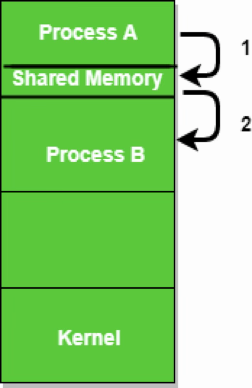
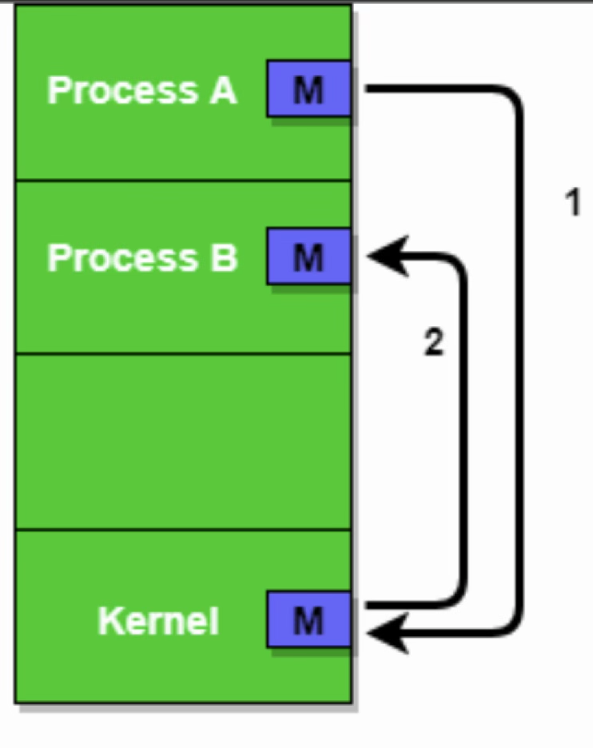
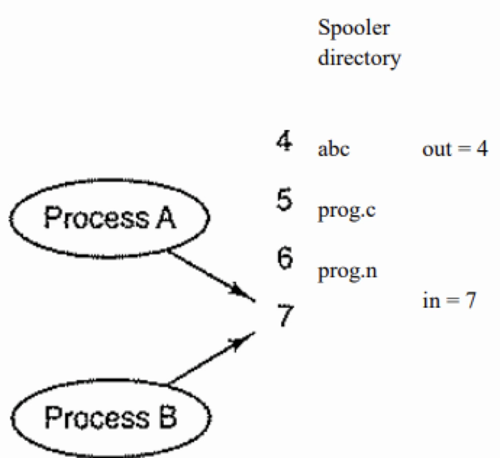
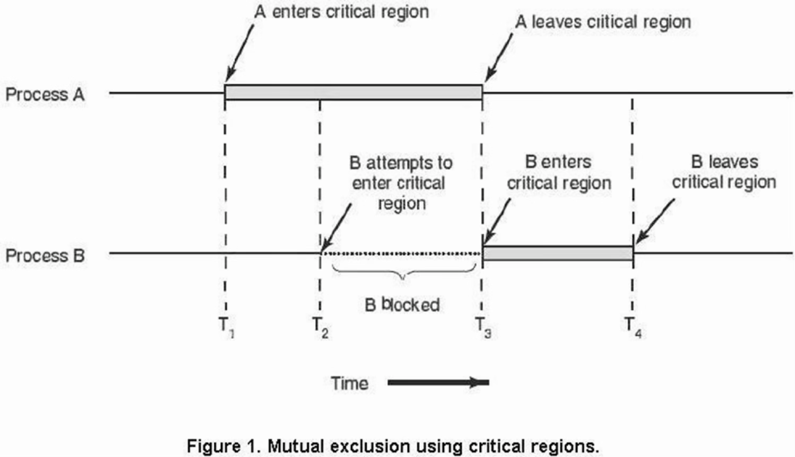
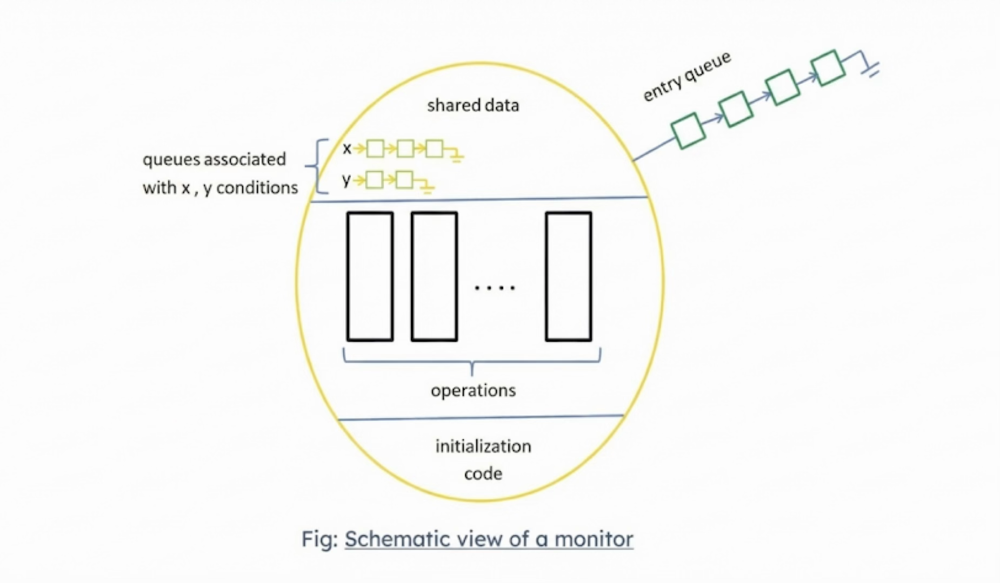
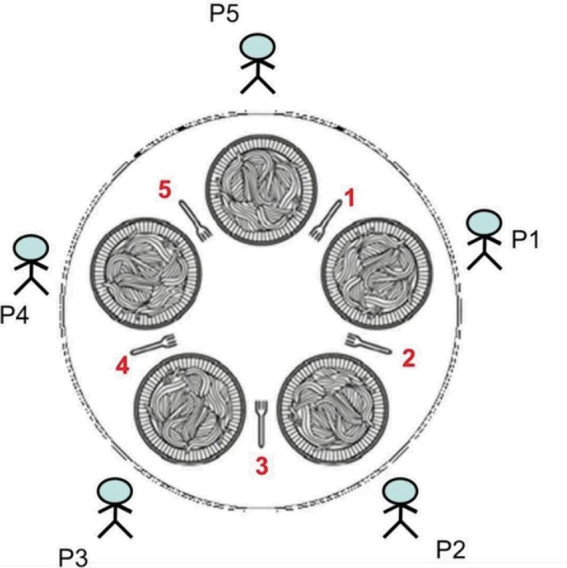

<!-- _class: title-slide -->

# 3. Process Communication and Synchronization

(10 hours, 13 marks)
By Bidur Sapkota

---

# 3.1 Principles of Concurrency, Race Condition, Critical Region

### Concurrency

Concurrency refers to the ability of a system to handle multiple processes at the same time. Processes that exist in memory simultaneously are called concurrent processes.

**Types of Concurrent Processes:**

- **Independent processes** do not share data or information with each other. They compete for system resources such as CPU time and I/O devices.
- **Cooperating processes** share data and need to exchange information with each other. A cooperating process can affect or be affected by other processes. Example: a compiler producing output for an assembler.

---

# 3.1 Principles of Concurrency, Race Condition, Critical Region

In a single-processor system, process execution is interleaved (pseudo-parallelism) and true parallelism is not achieved. In multiprocessor systems, processes can execute truly in parallel on different CPUs.

**Problems in concurrent processing:**  
(1) Sharing of global resources, where uncontrolled access to shared variables leads to inconsistent results.  
(2) Optimal resource allocation, where a process may receive a resource but get suspended before using it, potentially leading to deadlock.  
(3) Locating programming errors, because results are non-deterministic and not easily reproducible, making debugging extremely difficult.

---

# 3.1 Principles of Concurrency, Race Condition, Critical Region

### Inter-Process Communication (IPC)

IPC refers to mechanisms that allow processes to exchange data and information. Three key issues in IPC are:  
(1) how one process can pass information to another,  
(2) ensuring that two or more processes do not interfere with each other (e.g., two processes in an airline reservation system trying to book the last seat), and  
(3) proper sequencing when dependencies exist (if process A produces data and process B prints it, B must wait until A has produced the data).

---

# 3.1 Principles of Concurrency, Race Condition, Critical Region

**Shared Memory:** Processes share a common memory region to exchange information. The shared memory resides in the address space of the creating process; other processes must attach it to their own address spaces. This is fast but requires explicit synchronization to avoid race conditions. One process can accidentally corrupt data used by another.

**Message Passing:** Processes communicate by exchanging messages through the OS, so no shared memory is needed. Processes must first establish a communication link. The sending process calls `send(destination, message)` and the receiving process calls `receive(sender, message)`. The OS handles transmission. Message passing is ideal for distributed systems.

---

# 3.1 Principles of Concurrency, Race Condition, Critical Region

|  |  |
| ----------------------------------------------- | --------------------------------------------------- |
| Shared Memory                                   | Message Passing                                     |

---

# 3.1 Principles of Concurrency, Race Condition, Critical Region

**Buffering:** Messages reside in temporary queues. Zero capacity means the sender must wait for receiver (synchronous/blocking). Bounded capacity means the sender blocks when the queue is full, and the receiver blocks when empty. Unbounded capacity means the sender never blocks (asynchronous/non-blocking).

---

# 3.1 Principles of Concurrency, Race Condition, Critical Region

### Race Condition

> **Define race condition. [1 mark] (2082 Bhadra)**

A race condition occurs when two or more processes access shared data simultaneously and the final result depends on the precise timing of which process runs when, leading to unpredictable and incorrect behavior.

---

# 3.1 Principles of Concurrency, Race Condition, Critical Region

**Print Spooler Example:** Two shared variables exist: `out` (next file to print) and `in` (next free slot). Process A reads `in` as 7 and stores it locally. Before A can update `in`, a clock interrupt switches to process B, which also reads `in` as 7. B writes its filename into slot 7 and sets `in` to 8. When A resumes, it overwrites slot 7 with its own filename and also sets `in` to 8. The spooler appears consistent, but B's file will never be printed.

---

# 3.1 Principles of Concurrency, Race Condition, Critical Region



---

# 3.1 Principles of Concurrency, Race Condition, Critical Region

**Counter Variable of Buffer Size Example:** If `counter = 5` and producer executes `counter++` while consumer concurrently executes `counter--`, the result could be 4, 5, or 6 instead of the correct value 5. This happens because each high-level statement translates to multiple machine instructions (load, modify, store) that can interleave.

```text
"counter++" implementation:"       "counter--" implementation:

register₁ = counter                register₂ = counter
register₁ = register₁ + 1          register₂ = register₂ - 1
counter = register₁                counter = register₂
```

---

# 3.1 Principles of Concurrency, Race Condition, Critical Region

| Time | Process  | Action  | Instruction               | Local State       |
| ---- | -------- | ------- | ------------------------- | ----------------- |
| T₀   | producer | execute | register₁ = counter       | { register₁ = 5 } |
| T₁   | producer | execute | register₁ = register₁ + 1 | { register₁ = 6 } |
| T₂   | consumer | execute | register₂ = counter       | { register₂ = 5 } |
| T₃   | consumer | execute | register₂ = register₂ - 1 | { register₂ = 4 } |
| T₄   | producer | execute | counter = register₁       | { counter = 6 }   |
| T₅   | consumer | execute | counter = register₂       | { counter = 4 }   |

---

# 3.1 Principles of Concurrency, Race Condition, Critical Region

### Critical Region (Critical Section)

A critical region is a section of code where shared resources (common variables, shared memory, files) are accessed. Access must be carefully controlled to prevent race conditions.

**Four requirements for a correct solution:**

- **Mutual Exclusion:** No two processes may be simultaneously inside their critical regions.
- **No assumptions:** No assumptions should be made about CPU speeds or the number of CPUs.

---

# 3.1 Principles of Concurrency, Race Condition, Critical Region

**Four requirements for a correct solution:**

- **Progress:** No process running outside its critical region may block other processes from entering theirs. Only processes wanting to enter compete.
- **Bounded Waiting:** No process should wait forever to enter its critical region.

<br>

**Structure of a process using critical sections:**  
Entry section (request permission)  
Critical section (access shared resource)  
Exit section (release)  
Remainder section (other code)

---

# 3.1 Principles of Concurrency, Race Condition, Critical Region

**Structure of a process using critical sections:**

```c
do {
    entry section
        critical section
    exit section
        remainder section
} while(true)
```

---

# 3.1 Principles of Concurrency, Race Condition, Critical Region



---

# 3.2 Mutual Exclusion, Semaphores, and Mutex

### Approaches to Mutual Exclusion

**Disabling Interrupts:** On a single processor, a process disables interrupts upon entering its critical region and re-enables them before leaving. With interrupts disabled, no clock interrupt occurs and the CPU cannot switch to another process. However, a buggy process could disable interrupts and never re-enable them, crashing the system. On multiprocessor systems, disabling interrupts on one CPU does not affect others, and they can still access shared memory.

---

# 3.2 Mutual Exclusion, Semaphores, and Mutex

### Approaches to Mutual Exclusion

**Lock Variables:** A shared variable (initially 0) is checked before entering the critical region. If 0, the process sets it to 1 and enters; if 1, it waits. This has the same flaw as the spooler problem. Two processes can read the lock as 0 before either sets it to 1, both entering their critical regions simultaneously.

---

# 3.2 Mutual Exclusion, Semaphores, and Mutex

```c
do {
    while(lock == 1); // do nothing
    lock = 1; // enter critical section

    // critical section

    lock = 0; // exit critical section

    // remainder section

} while(true);
```

---

# 3.2 Mutual Exclusion, Semaphores, and Mutex

**Strict Alternation:** A `turn` variable tracks whose turn it is. Process 0 enters when `turn == 0`, process 1 enters when `turn == 1`. Each process sets `turn` to the other upon exit. This works but violates the progress requirement. If one process is much slower or in its non-critical region, it blocks the other process.

---

# 3.2 Mutual Exclusion, Semaphores, and Mutex

```c
// process 0
do {
    // non critical section

    while(turn != 0); // do nothing

    // critical section

    turn = 1; // exit critical section

    // remainder non critical section

} while(true);
```

---

# 3.2 Mutual Exclusion, Semaphores, and Mutex

```c
// process 1
do {
    // non critical section

    while(turn != 1); // do nothing

    // critical section

    turn = 0; // exit critical section

    // remainder non critical section

} while(true);
```

---

# 3.2 Mutual Exclusion, Semaphores, and Mutex

**Peterson's Solution:**

> **What is Peterson's Solution? [2 marks] (Model Question)**

A classic software-based solution for two processes that satisfies mutual exclusion, progress, and bounded waiting. It uses two shared variables: `int turn` (indicates whose turn it is) and `boolean flag[2]` (indicates if a process is ready to enter).

When process `i` wants to enter, it sets `flag[i] = true` and `turn = j` (giving priority to the other process). It then waits while `flag[j] == true && turn == j`. This ensures that if both processes try to enter simultaneously, only one succeeds, which is the one whose turn it is. When a process exits, it sets `flag[i] = false`.

---

# 3.2 Mutual Exclusion, Semaphores, and Mutex

```c
do {
    flag[i] = true;
    turn = j;
    while(flag[j] && turn == j);

    // critical section

    flag[i] = false;

    // remainder section

} while(true);
```

Structure of Pi

---

# 3.2 Mutual Exclusion, Semaphores, and Mutex

```c
do {
    flag[j] = true;
    turn = i;
    while(flag[i] && turn == i);

    // critical section

    flag[j] = false;

    // remainder section

} while(true);
```

Structure of Pj

---

# 3.2 Mutual Exclusion, Semaphores, and Mutex

**Test and Set Lock (TSL), Hardware-Based:** Uses a special atomic hardware instruction `TestAndSet()` that reads a lock variable and sets it to 1 in a single indivisible operation. A process calls `TestAndSet(&lock)`. If the old value was 0, the process enters the critical region; if 1, it loops (busy waits). Because the instruction is atomic, no interleaving can occur between the read and the set.

```c
bool TestAndSet (bool *target) {
    bool rv = *target;
    *target = true;
    return rv;
}
```

---

# 3.2 Mutual Exclusion, Semaphores, and Mutex

```c
do {
    while(TestAndSet(&lock)); // "Spin"

    // critical section

    lock = false; // Release lock

    // remainder section

} while(true);
```

---

# 3.2 Mutual Exclusion, Semaphores, and Mutex

**Busy Waiting (Spin-Locking):** All the above solutions involve busy waiting, where a process continuously tests a condition in a loop, wasting CPU time. Alternatively, a process can block itself and go to a waiting queue until it is woken up.

---

# 3.2 Mutual Exclusion, Semaphores, and Mutex

### Semaphores

A semaphore is a variable used to solve the critical section problem and achieve process synchronization. It can only be accessed using two atomic operations:

- **wait(S)** (also called P(to wait) or down): If `S > 0`, decrement `S` by 1 and proceed. If `S == 0`, the process waits (blocks) until `S` becomes greater than 0. wait operation is called when a process wants access to a resource.
- **signal(S)** (also called V(to increment) or up): Increment `S` by 1. If any processes are waiting, one is woken up. signal operation is called when a process is done using a resource.

---

# 3.2 Mutual Exclusion, Semaphores, and Mutex

### Semaphores

**Binary Semaphore (Mutex):** Takes values 0 or 1 only. Used for mutual exclusion. Initialize to 1. When process P1 enters its critical section, it calls `wait(s)` and `s` becomes 0. If P2 tries to enter, it calls `wait(s)` and blocks since `s == 0`. When P1 exits and calls `signal(s)`, `s` becomes 1, unblocking P2.

**Counting Semaphore:** Takes any non-negative integer value. Used to control access to resources with multiple instances. The initial value represents the number of available resources.

---

# 3.2 Mutual Exclusion, Semaphores, and Mutex

### Semaphore Operations

```c
void P() {
    while(S <= 0);
    S--;
}

void V() {
    S++;
}
```

---

# 3.3 Message Passing and Monitors

### Message Passing

(Covered under IPC in Section 3.1.) Message passing allows processes to communicate without shared memory. Two primitives are used: `send(destination, message)` and `receive(sender, message)`. The OS manages message transmission. Communication links can be direct (naming the process) or indirect (using mailboxes/ports). Message passing is also a solution for race conditions because no shared memory is involved, so no conflict arises.

---

# 3.3 Message Passing and Monitors

### Monitors

A monitor is a high-level synchronization construct that provides mutual exclusion automatically. It encapsulates shared data, the procedures that operate on that data, and synchronization code into a single module.

**Rules:** A procedure defined within a monitor can access only variables declared locally within the monitor and its formal parameters. Local variables of a monitor can be accessed only by its local procedures. The monitor construct ensures that only one process at a time can be active within the monitor. If another process calls a monitor procedure while one is already active, it blocks and waits in an entry queue.

---

# 3.3 Message Passing and Monitors

### Monitors

**Condition Variables:** Declared as `condition x, y;`. They support two operations:

- **x.wait():** The calling process is suspended and placed in a waiting queue for condition `x`. The monitor lock is released, allowing another process to enter.
- **x.signal():** Resumes exactly one suspended process waiting on condition `x`. If no process is waiting, the signal has no effect (no history is kept).

---

# 3.3 Message Passing and Monitors

### Monitors

```c
// Syntax of a Monitor
monitor monitor_name
{
    // shared variable declarations
    procedure P1(...) { ... }
    procedure P2(...) { ... }
    ...
    procedure Pn(...) { ... }
    initialization code(...) { ... }
}
```

---

# 3.3 Message Passing and Monitors



---

# 3.4 Classical Problems of Synchronization

### Producer-Consumer Problem (Bounded Buffer)

> **Explain how the producer-consumer problem can be solved using semaphore with its respective pseudo-code implementations. [5 marks] (2082 Bhadra)**

A buffer of `n` slots exists. The Producer inserts data into empty slots. The Consumer removes data from filled slots. Constraints: the producer must not insert when the buffer is full, the consumer must not remove when the buffer is empty, and they must not access the buffer simultaneously.

---

# 3.4 Classical Problems of Synchronization

### Producer-Consumer Problem (Bounded Buffer)

**Solution using three semaphores:**

- `mutex`: binary semaphore initialized to 1 (mutual exclusion for buffer access).
- `empty`: counting semaphore initialized to n (tracks empty slots).
- `full`: counting semaphore initialized to 0 (tracks filled slots).

---

# 3.4 Classical Problems of Synchronization

```c
// Producer
do {
    // 1. Wait until there is at least one empty slot
    wait(empty);

    // 2. Lock the buffer (Mutual Exclusion)
    wait(mutex);

    /* Critical Section: Add data to the buffer */

    // 3. Unlock the buffer
    signal(mutex);

    // 4. Increment the count of full slots
    signal(full);
} while(true);
```

---

# 3.4 Classical Problems of Synchronization

```c
// Consumer
do {
    // 1. Wait until there is at least one full slot
    wait(full);

    // 2. Lock the buffer (Mutual Exclusion)
    wait(mutex);

    /* Critical Section: Remove data from the buffer */

    // 3. Unlock the buffer
    signal(mutex);

    // 4. Increment the count of empty slots
    signal(empty);
} while(true);
```

---

# 3.4 Classical Problems of Synchronization

### Producer-Consumer Problem (Bounded Buffer)

The producer waits if no empty slots (`wait(empty)`), acquires the lock (`wait(mutex)`), inserts the item, releases the lock (`signal(mutex)`), and signals that a full slot is available (`signal(full)`). The consumer does the symmetric operation.

---

# 3.4 Classical Problems of Synchronization

### Readers-Writers Problem

> **Explain solution of Reader-Writer problem using semaphore with its respective pseudo-code implementations. [5 marks] (Model Question)**

A database is shared among concurrent processes. Readers only read data, and multiple readers can read simultaneously without adverse effects. Writers update data, and a writer must have exclusive access (no other reader or writer may access the database simultaneously).

---

# 3.4 Classical Problems of Synchronization

### Readers-Writers Problem

**Solution using two semaphores and an integer variable:**

- `mutex`: semaphore initialized to **1** (protects `readcount`).
- `wrt`: semaphore initialized to **1** (provides exclusive access for writers, shared between readers and writers).
- `readcount`: integer initialized to **0** (tracks current number of readers).

---

# 3.4 Classical Problems of Synchronization

### Readers-Writers Problem

```c
// Writer
do {
    // writer requests for critical section
    wait(wrt);

    /* performs the write */

    // leaves the critical section
    signal(wrt);
} while(true);
```

---

# 3.4 Classical Problems of Synchronization

```c
// Reader
do {
    wait(mutex);
    readcnt++;   // The number of readers has now increased by 1

    if(readcnt == 1)
        wait(wrt);   // ensures no writer can enter if there is even one reader
    signal(mutex);   // other readers can enter while this current reader is
                     // inside the critical section

    /* current reader performs reading here */

    wait(mutex);
    readcnt--;   // a reader wants to leave

    if (readcnt == 0)   // no reader is left in the critical section
        signal(wrt);   // writers can enter

    signal(mutex);   // reader leaves
} while(true);
```

---

# 3.4 Classical Problems of Synchronization

### Readers-Writers Problem

The first reader to arrive locks out writers by calling `wait(wrt)`. Subsequent readers increment `readcount` without blocking on `wrt`. The last reader to leave (when `readcount` becomes 0) calls `signal(wrt)`, allowing writers to proceed. Writers call `wait(wrt)` for exclusive access.

---

# 3.4 Classical Problems of Synchronization

### Dining Philosophers Problem

> **Under what condition does the solution to the Dining philosopher using semaphore leads to a deadlock conditions? [2 marks] (Model Question)**

Five philosophers sit around a table, each alternating between thinking and eating. Between each pair of adjacent philosophers lies one fork (chopstick). A philosopher needs both left and right forks to eat.

**Semaphore-Based Solution:** Each fork is represented by a semaphore initialized to 1. A philosopher calls `wait(fork[i])` and `wait(fork[(i+1)%5])` to pick up forks, and `signal()` on both to put them down.

---

# 3.4 Classical Problems of Synchronization

### Dining Philosophers Problem



---

# 3.4 Classical Problems of Synchronization

```c
// The structure of philosopher i

do {

    wait(chopstick[i]);

    wait(chopstick[(i + 1) % 5]);

    ...

    // eat

    signal(chopstick[i]);

    signal(chopstick[(i + 1) % 5]);

    // think

} while(true);
```

---

# 3.4 Classical Problems of Synchronization

### Dining Philosophers Problem

**Deadlock condition:** If all five philosophers become hungry simultaneously and each grabs their right fork first, all fork semaphores become 0. When each philosopher then tries to grab the left fork, all are delayed forever in a circular wait (deadlock).

---

# 3.4 Classical Problems of Synchronization

### Dining Philosophers Problem

**Remedies to avoid deadlock:**

- Allow at most four philosophers to sit at the table simultaneously.
- Allow a philosopher to pick up forks only if both are available (pick up in a critical section).
- Use an asymmetric solution: odd philosophers pick up left fork first, even philosophers pick up right fork first.

---

# 3.4 Classical Problems of Synchronization

### Dining Philosophers Problem

**Monitor-Based Solution (Deadlock-Free):** Three states are defined: `thinking`, `hungry`, `eating`. A philosopher can set `state[i] = eating` only if neither neighbor is eating. A condition variable `self[i]` allows philosopher `i` to delay when hungry but unable to obtain both forks.

---

# 3.4 Classical Problems of Synchronization

<style scoped>
  section {
    display: grid;
    grid-template-columns: repeat(2, 1fr);
    align-content: start;
  }
  section h1 {
        grid-column: 1 / 3;

  }
</style>

```c
monitor dp {
    enum { THINKING, HUNGRY, EATING } state[5];
    condition self[5];

    void pickup(int i) {
        state[i] = HUNGRY;
        test(i);
        if (state[i] != EATING)
            self[i].wait();
    }

    void putdown(int i) {
        state[i] = THINKING;
        test((i + 4) % 5);
        test((i + 1) % 5);
    }
```

```c
    void test(int i) {
        if ((state[(i + 4) % 5] != EATING) &&
            (state[i] == HUNGRY) &&
            (state[(i + 1) % 5] != EATING)) {
            state[i] = EATING;
            self[i].signal();
        }
    }

    initialization_code() {
        for (int i = 0; i < 5; i++)
            state[i] = THINKING;
    }
}
```

---

# 3.5 Deadlock: Prevention, Ignorance, Avoidance, Detection and Recovery

### Deadlock

A deadlock is a situation where a set of processes is permanently blocked because each process is holding a resource and waiting for a resource held by another process in the set. It represents a circular wait condition where no process can proceed.

**Starvation vs Deadlock:** Starvation occurs when a process waits indefinitely because other processes are continuously given preference. The process could potentially run, but the scheduler never selects it. A starved process might eventually proceed (e.g., through aging), while a deadlocked process will never proceed without external intervention.

**Livelock:** Processes are not blocked but still cannot make progress. They continuously change state in response to each other, consuming CPU but performing useless work. Example: two processes repeatedly acquire and release their first resource, each backing off "politely" when they find the other's resource is unavailable. Solution: introduce randomness in retry timing or set maximum retry attempts.

### Four Necessary Conditions for Deadlock

All four must hold simultaneously for deadlock to occur:

- **Mutual Exclusion:** At least one resource is held in a non-sharable mode. Only one process can use it at a time; others must wait.
- **Hold and Wait:** A process holds at least one resource while waiting to acquire additional resources held by other processes. It does not release currently held resources while waiting.
- **No Preemption:** Resources cannot be forcibly taken away. A resource is released only voluntarily by the process holding it, after completing its task.
- **Circular Wait:** A set of processes {P₀, P₁, ..., Pₙ} exists such that P₀ waits for a resource held by P₁, P₁ waits for P₂, ..., Pₙ waits for P₀.

### Deadlock Prevention

Deadlock prevention ensures that at least one of the four necessary conditions cannot hold.

**1. Preventing Mutual Exclusion:** For sharable resources (e.g., read-only files), mutual exclusion is not required. However, for inherently non-sharable resources (e.g., printers), mutual exclusion cannot be denied. Spooling can convert some non-sharable resources into sharable ones. In general, this approach is not practical for most resources.

**2. Preventing Hold and Wait:** Require a process to request all resources at once before execution begins, or allow a process to request new resources only after releasing all currently held ones. This prevents a process from holding resources while waiting, but leads to low resource utilization and possible starvation.

**3. Preventing No Preemption:** If a process holding resources requests another that cannot be immediately allocated, all its currently held resources are preempted (released). The process must re-acquire all resources when they become available. This is applicable only to resources whose state can be easily saved and restored (e.g., CPU registers, memory), not to resources like printers.

**4. Preventing Circular Wait:** Assign each resource type a unique integer number. A process can request resources only in increasing order of the assigned numbers. This imposes a total ordering that prevents circular wait.

### Deadlock Ignorance (Ostrich Algorithm)

The ostrich algorithm handles deadlocks by simply ignoring them, pretending they do not occur. This approach is used by most general-purpose operating systems (Windows, Linux, macOS) because deadlocks are rare in practice, and the overhead of continuous prevention/detection outweighs the cost of occasional manual intervention (killing a frozen process or rebooting). This is not suitable for safety-critical systems (flight control, medical devices) where continuous reliable operation is essential.

### Deadlock Avoidance

Deadlock avoidance requires additional information about future resource requests. The system dynamically examines the resource-allocation state before granting each request to ensure the system never enters an unsafe state. Unlike prevention, avoidance does not restrict how requests are made.

**Safe State:** A state is safe if there exists a **safe sequence**, which is an ordering ⟨P₁, P₂, ..., Pₙ⟩ of all processes such that for each Pᵢ, the resources it still needs can be satisfied by currently available resources plus resources held by all Pⱼ where j < i. If no such sequence exists, the state is **unsafe**. An unsafe state is not necessarily a deadlock, but it means the system cannot guarantee deadlock avoidance.

**Banker's Algorithm:**

> **Use Banker's algorithm to claim that the system is in safe state and show the safe sequence. [7 marks] (2082 Bhadra)**
> **Is the state safe? If so, show the safe execution of the processes. [6 marks] (Model Question)**

Named after a banker who allocates capital ensuring all customers can complete their transactions. Designed for systems with multiple instances of each resource type.

**Data structures** (n = number of processes, m = number of resource types):

- **Available[m]:** Number of available instances of each resource type.
- **Max[n][m]:** Maximum demand of each process.
- **Allocation[n][m]:** Resources currently allocated to each process.
- **Need[n][m]:** Remaining resource need. `Need[i][j] = Max[i][j] − Allocation[i][j]`.

**Safety Algorithm:**

1. Let `Work = Available` and `Finish[i] = false` for all processes.
2. Find a process Pᵢ such that `Finish[i] == false` and `Need[i] ≤ Work`.
3. If found: `Work = Work + Allocation[i]`, set `Finish[i] = true`, go to step 2.
4. If all `Finish[i] == true`, the system is in a safe state.

**Resource-Request Algorithm (when process Pᵢ requests resources):**

1. If `Request[i] > Need[i]`, raise an error (exceeded maximum claim).
2. If `Request[i] > Available`, Pᵢ must wait.
3. Otherwise, tentatively allocate: `Available -= Request[i]`, `Allocation[i] += Request[i]`, `Need[i] -= Request[i]`.
4. Run the safety algorithm. If safe, grant the request permanently. If unsafe, roll back and make Pᵢ wait.

**Example (2082 Bhadra):** 5 processes (P₀–P₄), 4 resource types with total instances (6, 4, 4, 2).

| Process | Allocation (R₀ R₁ R₂ R₃) | Max (R₀ R₁ R₂ R₃) | Need (R₀ R₁ R₂ R₃) |
| ------- | ------------------------ | ----------------- | ------------------ |
| P₀      | 2 0 1 1                  | 3 2 1 1           | 1 2 0 0            |
| P₁      | 1 1 0 0                  | 1 2 0 2           | 0 1 0 2            |
| P₂      | 1 1 0 0                  | 1 1 2 0           | 0 0 2 0            |
| P₃      | 1 0 1 0                  | 3 2 1 0           | 2 2 0 0            |
| P₄      | 0 1 0 1                  | 2 1 0 1           | 2 0 0 0            |

Total Allocated = (5, 3, 2, 2). Available = (6, 4, 4, 2) − (5, 3, 2, 2) = **(1, 1, 2, 0)**.

- P₂: Need(0,0,2,0) ≤ Available(1,1,2,0) ✓ → Work = (1,1,2,0) + (1,1,0,0) = (2,2,2,0)
- P₀: Need(1,2,0,0) ≤ (2,2,2,0) ✓ → Work = (2,2,2,0) + (2,0,1,1) = (4,2,3,1)
- P₁: Need(0,1,0,2) ≤ (4,2,3,1)? R₃: 2 > 1 ✗. Skip.
- P₃: Need(2,2,0,0) ≤ (4,2,3,1) ✓ → Work = (4,2,3,1) + (1,0,1,0) = (5,2,4,1)
- P₄: Need(2,0,0,0) ≤ (5,2,4,1) ✓ → Work = (5,2,4,1) + (0,1,0,1) = (5,3,4,2)
- P₁: Need(0,1,0,2) ≤ (5,3,4,2) ✓ → Work = (5,3,4,2) + (1,1,0,0) = (6,4,4,2)

Safe sequence: **⟨P₂, P₀, P₃, P₄, P₁⟩**. The system is in a safe state.

### Deadlock Detection

When neither prevention nor avoidance is used, the system must detect deadlocks after they occur.

**Resource Allocation Graph (RAG):** A directed graph where process nodes (circles) and resource nodes (rectangles with dots for instances) are connected by request edges (Pᵢ → Rⱼ, process requests resource) and assignment edges (Rⱼ → Pᵢ, resource allocated to process).

- If the graph contains **no cycle** → no deadlock.
- If each resource type has **exactly one instance** → a cycle is a necessary and sufficient condition for deadlock.
- If resources have **multiple instances** → a cycle is necessary but not sufficient; a more sophisticated algorithm is needed.

**Wait-For Graph:** A simplified version of the RAG for single-instance resources. Remove all resource nodes and create a direct edge from Pᵢ to Pⱼ if Pᵢ is waiting for a resource held by Pⱼ. A cycle in the wait-for graph indicates deadlock. Cycle detection using DFS runs in O(n²).

**When to invoke detection:** When a request cannot be granted immediately, at regular time intervals, or when CPU utilization drops below a threshold.

### Recovery from Deadlock

Once detected, the system must break the circular wait.

**Process Termination:**

- **Abort all deadlocked processes:** This is simple but drastic; all computation is lost.
- **Abort one process at a time:** Terminate processes one by one until the deadlock cycle is broken. Higher overhead since detection must re-run after each termination.

**Criteria for selecting a victim:** lowest priority, shortest computation time so far, most additional time needed, fewest resources used (or most resources held to free up more), batch processes over interactive ones.

**Resource Preemption:** Take resources from some processes and give them to others. The preempted process must be rolled back, either through total rollback (restart from the beginning) or partial rollback (to a state before it acquired the preempted resource). The same process may repeatedly be chosen as a victim, causing starvation. Including a cost factor (number of rollbacks) can prevent this.

**Checkpoint and Rollback:** A process periodically saves its state (memory contents, register values, resource allocation). If rollback is needed, the process is restored to a previous checkpoint instead of restarting entirely. More frequent checkpoints mean less work lost but higher overhead.

### Integrated Deadlock Strategy

No single approach is optimal for all resources. An integrated strategy partitions resources into classes and applies the most appropriate method to each: prevention for some, avoidance for others, detection and recovery where needed.

### Two-Phase Locking

Two-phase locking (2PL) is a concurrency control protocol primarily used in database systems. It ensures serializability of transactions.

- **Growing Phase:** A transaction may acquire locks but may not release any. The number of locks only increases.
- **Shrinking Phase:** A transaction may release locks but may not acquire new ones. The number of locks only decreases.

2PL does not prevent deadlock. Because transactions accumulate locks during the growing phase, circular wait can easily arise. Prevention strategies include: always locking resources in a fixed order, acquiring all locks atomically at the start, or using timeouts with rollback and restart.

### Communication Deadlock

A communication deadlock occurs when processes are blocked waiting for messages that will never arrive. Each process waits for a message from another process in the set, creating a circular dependency. Causes include circular message dependencies and buffer exhaustion (both processes trying to send to each other's full buffers). Solutions: set timeouts on receive operations, use sufficient buffer space.
