<!-- _class: title-slide -->

# 4. I/O and Memory Management

(9 hours, 12 marks)
By Bidur Sapkota

---

# 4.1.1 I/O Hardware

I/O devices allow communication between the computer and the outside world. The OS must manage a wide variety of devices and provide a uniform interface to applications despite device differences.

**Block Devices vs Character Devices:** Block devices (hard disks, SSDs, CD-ROMs) store information in fixed-size blocks, each with its own address, and blocks can be read or written independently. Character devices (keyboards, mice, printers, serial ports) deliver or accept a stream of characters without addressing or seek operations.

---

# 4.1.1 I/O Hardware

**Device Controllers:** I/O devices consist of a mechanical component (the device) and an electronic component (the device controller or adapter). The controller is a chip or circuit board that provides an interface between the device and the computer's bus. The OS communicates with the controller, not the device directly. Each controller has registers used for communicating with the CPU. The CPU writes commands/data and reads status/results from these registers.

---

# 4.1.1 I/O Hardware

An I/O port is a set of registers that the CPU can read from or write to. Each port has a unique address. Each device controller has one or more I/O ports.

**I/O Port Addressing:**

- **Separate I/O Space:** I/O ports have a separate address space from memory. Special I/O instructions (IN/OUT) are used to access ports. The x86 architecture supports this. It requires special hardware signals to distinguish I/O from memory access.
- **Memory-Mapped I/O:** I/O ports are mapped into the regular memory address space. No special instructions are needed because regular load/store instructions work. Simpler programming (C can access ports directly), but memory addresses are consumed by I/O mapping.

---

# 4.1.1 Principles of I/O Software

The primary goals are: making I/O devices easy to use (hiding hardware complexity), achieving good performance (minimal CPU overhead), providing uniform interfaces (device independence), error handling (as close to hardware as possible), supporting synchronous and asynchronous I/O, and buffering for speed mismatches.

**Device Independence:** Programs should work without knowing specific device types. A program that reads a file should work whether the file is on disk, SSD, or CD-ROM. Device drivers translate generic operations to device-specific commands.

---

# 4.1.1 Principles of I/O Software

**Uniform Naming:** In UNIX, devices are named as files in `/dev` (e.g., `/dev/sda1`). Applications access devices using the same naming scheme as ordinary files. Windows uses drive letters (C:, D:) and device names (COM1).

**Error Handling:** Errors should be handled as close to the hardware as possible. The controller typically retries operations first, followed by the device driver and higher layers if needed. Errors may be programming errors (invalid commands), transient errors (e.g., checksum errors from dust or vibration, often fixed by retrying), permanent errors (damaged blocks), seek errors, head crashes, or controller failures. Techniques such as ECC (Error-Correcting Codes), bad-sector remapping (sector sparing), and file system redundancy/journaling help detect, correct, and recover from errors.

---

# 4.1.1 Principles of I/O Software

**Synchronous vs Asynchronous I/O:** In synchronous (blocking) I/O, the program waits until the operation completes. This is simple but sequential. In asynchronous (non-blocking) I/O, the program continues while I/O proceeds and is notified on completion. This allows overlapping computation and I/O but is more complex.

**Buffering:** Temporary storage areas handle speed differences between devices and processes, and differences in data transfer sizes (a process may want 1 byte but the device transfers 512 bytes).

**Spooling (Simultaneous Peripheral Operations On-Line):** Used for dedicated devices that can only be used by one process at a time (e.g., printers). When a process wants to print, it creates a file in a spooling directory. A printer daemon is the only process that accesses the printer, printing each file one at a time.

---

# 4.1.1 I/O Handling Methods

- **Programmed I/O:** The CPU does all the work. It sends a command, polls (busy-waits) for device readiness, and transfers data one byte/word at a time. Simple but wastes CPU time on slow devices.
- **Interrupt-Driven I/O:** The CPU sends a command and switches to other work. When the device is ready, it generates an interrupt. The interrupt handler transfers data. More efficient, but each byte transferred causes an interrupt, resulting in significant overhead for high-speed devices.

---

# 4.1.1 I/O Handling Methods

- **DMA (Direct Memory Access):** The CPU programs the DMA controller with memory address, byte count, and direction. The DMA controller transfers data directly between device and memory without CPU involvement. The CPU is free for other work. Only one interrupt per transfer (not per byte). DMA can operate in cycle stealing mode (one word at a time, interleaved with CPU) or burst mode (holds bus for the entire transfer).

---

# 4.1.2 I/O Software Layer

I/O software is organized in four layers from bottom to top:

**1. Interrupt Handlers:** At the lowest level. Respond to hardware interrupts from devices. Save the state of the interrupted process, determine which device caused the interrupt, perform immediate actions (reading status), wake up the waiting driver, then restore state and return. Typically written in assembly. Run with interrupts disabled or at high priority.

**2. Device Drivers:** Software modules that control specific I/O devices. Each device type has its own driver. Drivers translate generic I/O requests into device-specific operations. They know the hardware details, including which registers to use and what commands the device understands. Typically provided by the device manufacturer. The OS defines a standard interface that all drivers must implement.

---

# 4.1.2 I/O Software Layer

**3. Device-Independent I/O Software:** Provides functions common to all devices, such as uniform interface for drivers, buffering, error reporting, allocating/releasing dedicated devices, and providing a device-independent block size.

**4. User-Level I/O Software:** Runs in user space. Includes library routines (C library functions like `printf`, `scanf`, `fread`, `fwrite` built on top of system calls). They provide formatting, parsing, user level buffering, and other conveniences.

---

# 4.1.2 I/O Software Layer

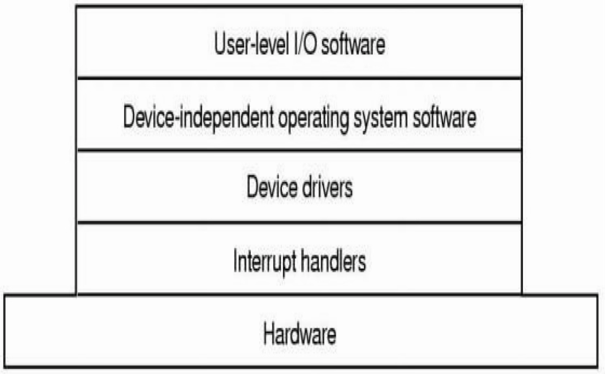

---

# 4.1.3 Disk Technologies: Magnetic Disk

**Magnetic Disk (HDD):** The traditional secondary storage device. Non-volatile, large capacity, lowest cost per GB. Consists of circular platters coated with magnetic material, mounted on a spindle rotating at 5400–15000 RPM. Each surface has a read/write head mounted on an actuator arm; all heads move together.

**Tracks, Cylinders, Sectors:** Data is recorded on concentric circles called tracks. The set of all tracks at the same radial position on all surfaces is a cylinder. Each track is divided into fixed-size sectors (512 bytes or 4096 bytes), which is the smallest readable/writable unit. Outer tracks can hold more sectors (zone bit recording). Each sector has a preamble (cylinder/head/sector numbers), data field, and ECC (Error Correcting Code) field.

---

# 4.1.3 Disk Technologies: Magnetic Disk

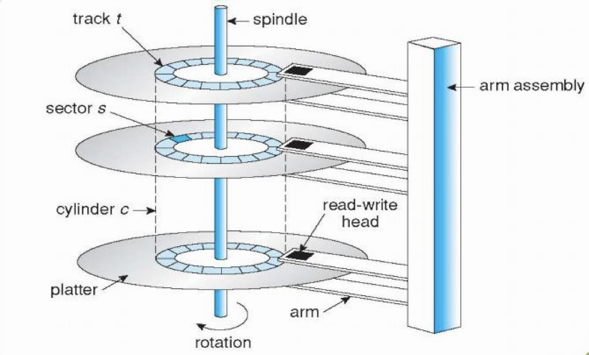

---

# 4.1.3 Disk Technologies: Magnetic Disk

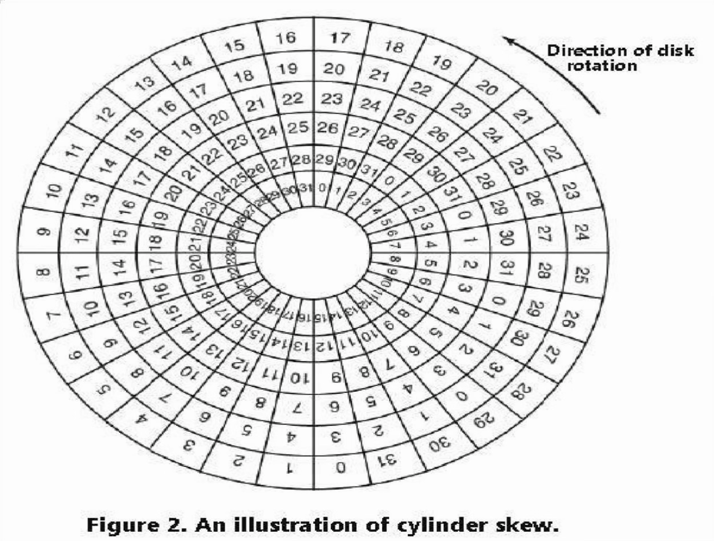

---

# 4.1.3 Disk Technologies: Magnetic Disk

**Disk Capacity:** `Capacity = Surfaces × Tracks/surface × Sectors/track × Bytes/sector`.

**Disk Access Time:** `Total = Seek time + Rotational latency + Transfer time`.

Seek time (moving heads to desired track) dominates and is typically 3–15 ms. Rotational latency averages half a rotation (4.17 ms at 7200 RPM). Transfer rates: 100–200 MB/s for modern HDDs.

---

# 4.1.3 Disk Technologies: Magnetic Disk

**Disk Formatting:**

Low-level (physical) formatting creates tracks and sectors, and this is done at the factory. It creates tracks and sectors on each disk surface. It writes the preamble, data area, and ECC for each sector. Interleaving places logical sectors with gaps between them so the controller has enough time to process one sector before the next required sector passes under the read/write head.

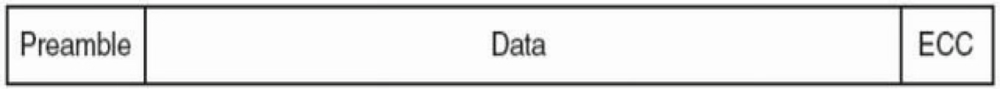

 

High-level (logical) formatting creates file system structures (boot block, superblock, free space structures, root directory. Partitioning divides the disk into logical units (MBR or GPT).

---

# 4.1.3 Disk Technologies: Magnetic Disk

**Disk Formatting:**

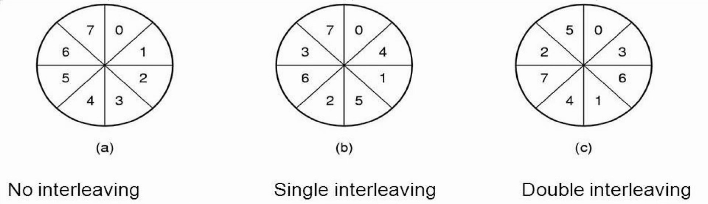

---

# 4.1.3 Disk Technologies: Disk Arm Scheduling

Disk arm scheduling determines the order in which disk requests are serviced.
The goal is to minimize total seek time and improve disk throughput.

 

**First-Come, First-Served (FCFS):**
FCFS serves requests in the order they arrive.

**Shortest Seek Time First (SSTF)**
SSTF selects the request closest to the current head position.

**SCAN (Elevator Algorithm)**
SCAN moves the disk arm in one direction, servicing requests along the way. When the arm reaches the end of the disk, it reverses direction.

---

# 4.1.3 Disk Technologies: Disk Arm Scheduling

**C-SCAN (Circular SCAN)**
The arm moves in one direction, servicing requests.
When it reaches the end of the disk, it immediately returns to the beginning.

**LOOK**
LOOK is a variant of SCAN. Instead of going to the end of the disk, it goes only as far as the last request.

**C-LOOK**
C-LOOK is a variant of C-SCAN. Instead of going to the end of the disk, it goes only as far as the last request then it returns to the beginning.

---

# 4.1.3 Disk Technologies: Disk Arm Scheduling

**First-Come, First-Serve (FCFS)**
Q. Suppose that a disk drive has 200 cylinders, numbered from 0 to 199. The drive is currently serving a request at cylinder 53. The queue of the pending requests is 98, 183, 37, 122, 14, 124, 65, 67. Starting from the current head position, what is the total distance (in cylinders) that the disk arm moves to satisfy all the pending requests if the controller is using FCFS scheduling algorithm??

 

Queue: 98, 183, 37, 122, 14, 124, 65, 67
Head Pos: 53

---

# 4.1.3 Disk Technologies: Disk Arm Scheduling

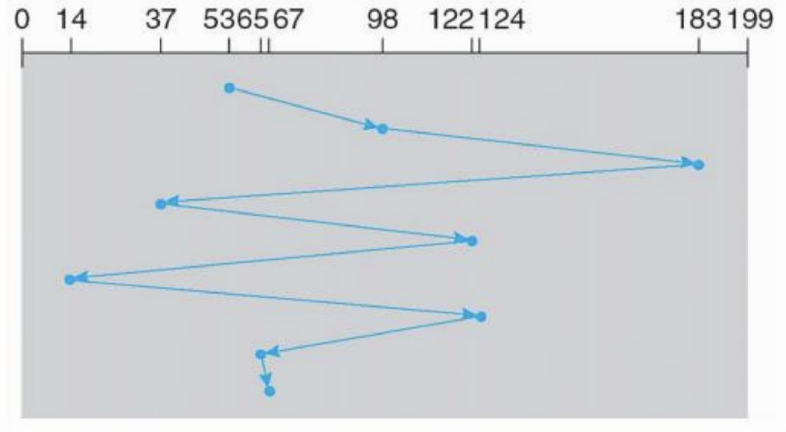

Total Distance travelled = 45+85+146+85+108+110+59+2 = 640 cylinders
Average distance travelled = 640/8 = 80 cylinders

---

# 4.1.3 Disk Technologies: Disk Arm Scheduling

**Shortest Seek Time First (SSTF)**
Q. Suppose that a disk drive has 200 cylinders, numbered from 0 to 199. The drive is currently serving a request at cylinder 53. The queue of the pending requests is 98, 183, 37, 122, 14, 124, 65, 67. Starting from the current head position, what is the total distance (in cylinders) that the disk arm moves to satisfy all the pending requests if the controller is using SSTF scheduling algorithm??

 

Queue: 98, 183, 37, 122, 14, 124, 65, 67
Head Pos: 53

---

# 4.1.3 Disk Technologies: Disk Arm Scheduling

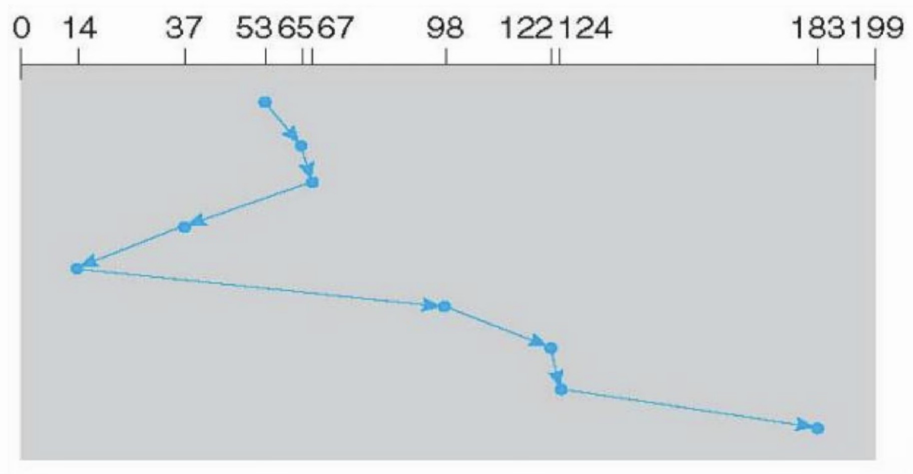

Total Distance travelled = 236 cylinders
Average distance travelled = 29.5 cylinders

---

# 4.1.3 Disk Technologies: Disk Arm Scheduling

**SCAN (Elevator Algorithm)**
Q. Suppose that a disk drive has 200 cylinders, numbered from 0 to 199. The drive is currently serving a request at cylinder 53. The queue of the pending requests is 98, 183, 37, 122, 14, 124, 65, 67. Starting from the current head position, what is the total distance (in cylinders) that the disk arm moves to satisfy all the pending requests if the controller is using SCAN scheduling algorithm??

 

Queue: 98, 183, 37, 122, 14, 124, 65, 67
Head Pos: 53

---

# 4.1.3 Disk Technologies: Disk Arm Scheduling

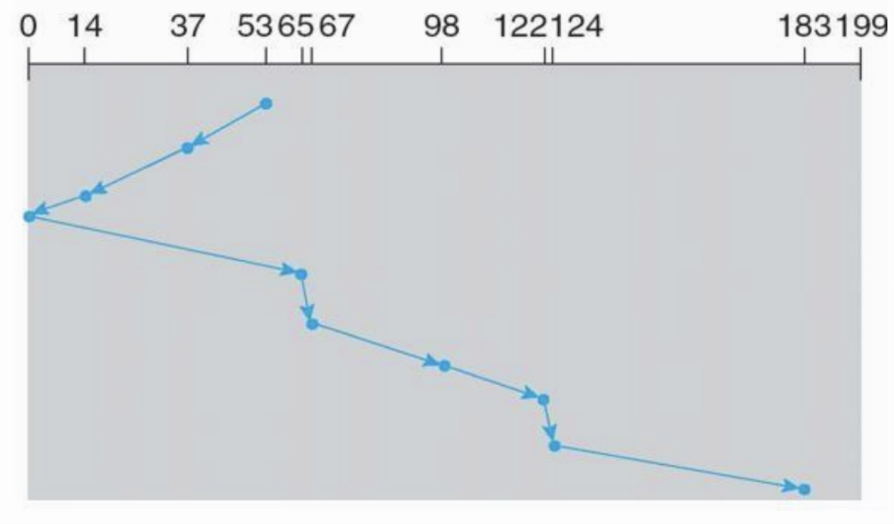

Total Distance travelled = 208 cylinders
Average distance travelled = 26 cylinders

---

# 4.1.3 Disk Technologies: Disk Arm Scheduling

**C-SCAN (Circular SCAN)**
Q. Suppose that a disk drive has 200 cylinders, numbered from 0 to 199. The drive is currently serving a request at cylinder 53. The queue of the pending requests is 98, 183, 37, 122, 14, 124, 65, 67. Starting from the current head position, what is the total distance (in cylinders) that the disk arm moves to satisfy all the pending requests if the controller is using C-SCAN scheduling algorithm??

 

Queue: 98, 183, 37, 122, 14, 124, 65, 67
Head Pos: 53

---

# 4.1.3 Disk Technologies: Disk Arm Scheduling

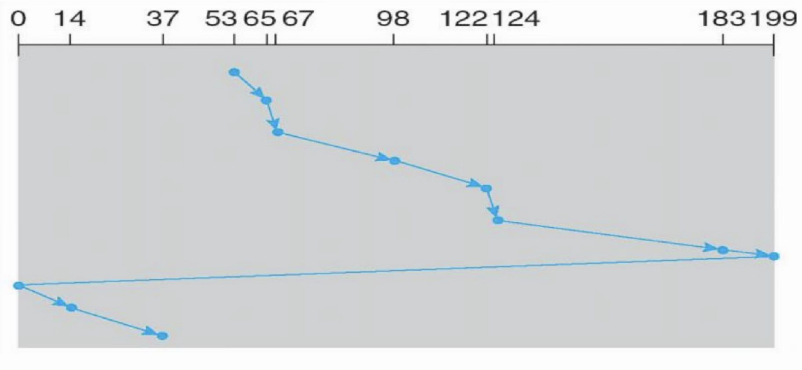

Total Distance travelled = 382 cylinders
Average distance travelled = 47.75 cylinders

---

# 4.1.3 Disk Technologies: Disk Arm Scheduling

**LOOK Algorithm**
Q. Suppose that a disk drive has 200 cylinders, numbered from 0 to 199. The drive is currently serving a request at cylinder 53. The queue of the pending requests is 98, 183, 37, 122, 14, 124, 65, 67. Starting from the current head position, what is the total distance (in cylinders) that the disk arm moves to satisfy all the pending requests if the controller is using LOOK scheduling algorithm??

 

Queue: 98, 183, 37, 122, 14, 124, 65, 67
Head Pos: 53

---

# 4.1.3 Disk Technologies: Disk Arm Scheduling

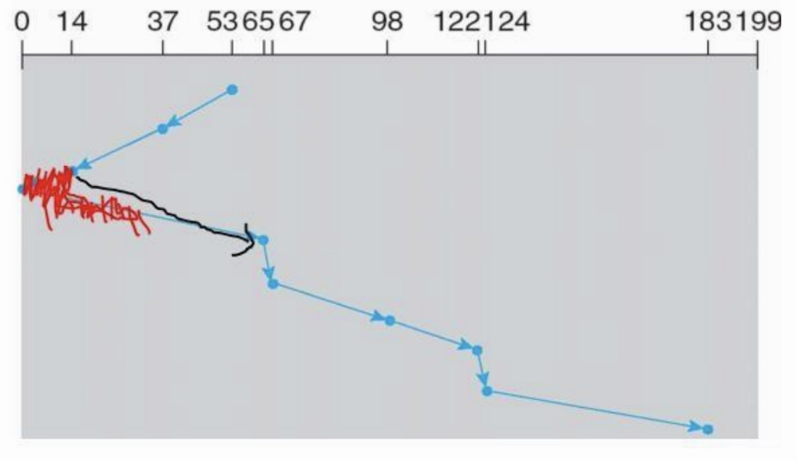

Total Distance travelled = 194 cylinders
Average distance travelled = 24.25 cylinders

---

# 4.1.3 Disk Technologies: Disk Arm Scheduling

**C-LOOK Algorithm**
Q. Suppose that a disk drive has 200 cylinders, numbered from 0 to 199. The drive is currently serving a request at cylinder 53. The queue of the pending requests is 98, 183, 37, 122, 14, 124, 65, 67. Starting from the current head position, what is the total distance (in cylinders) that the disk arm moves to satisfy all the pending requests if the controller is using C-LOOK scheduling algorithm??

 

Queue: 98, 183, 37, 122, 14, 124, 65, 67
Head Pos: 53

---

# 4.1.3 Disk Technologies: Disk Arm Scheduling

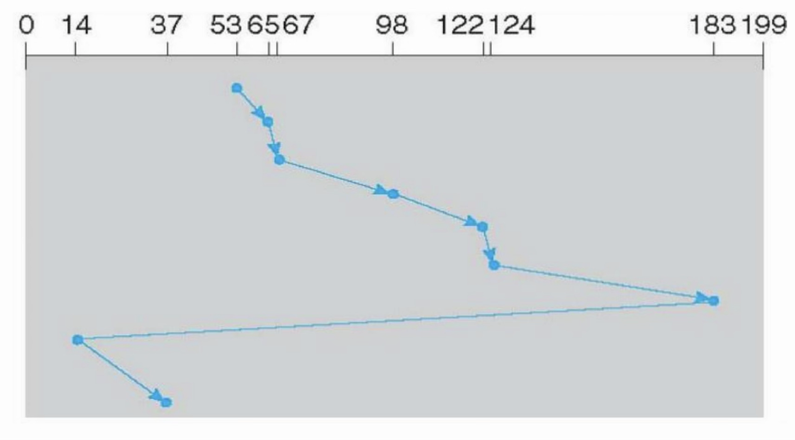

Total Distance travelled = 352 cylinders
Average distance travelled = 44 cylinders

---

# 4.1.3 Disk Technologies: SSD, NVMe Storage

**Solid State Drive (SSD, SATA):** Uses flash memory instead of spinning platters. It has no moving parts, making it faster, more durable, lower power, and silent. SATA (Serial Advanced Technology Attachment) interface limits speed to ~550 MB/s. Moderate cost per GB. Good for general-purpose use and upgrading older systems.

**NVMe SSD:** Uses flash memory connected directly via the PCIe bus, bypassing the SATA bottleneck. Speeds of 3,500–14,000+ MB/s with very low latency (<0.05 ms). Highest cost per GB but prices are falling. Ideal for OS boot drives, gaming, and high-performance workloads.

Non-Volatile Memory Express (NVMe): NVMe is a communication protocol for SSDs that connects directly to the CPU via the PCIe (Peripheral Component Interconnect Express) bus, bypassing the slower SATA interface.

---

# 4.1.3 Disk Technologies: SSD Working Principle

**NAND Flash Memory:** SSDs store data using NAND flash memory chips. The basic storage element is a floating-gate transistor. Each transistor traps electrons on a floating gate (an insulated conductor between the control gate and the channel). When electrons are trapped on the floating gate, the transistor's threshold voltage changes. By measuring whether the transistor conducts at a given voltage, the controller determines the stored value. Programming (writing) injects electrons onto the floating gate using high voltage (Fowler-Nordheim tunneling). Erasing removes electrons by applying a reverse high voltage. No mechanical movement is involved in any operation.

---

# 4.1.3 Disk Technologies: SSD Working Principle

**Cell Types:** SLC (Single-Level Cell) stores 1 bit per cell (two voltage states). MLC (Multi-Level Cell) stores 2 bits (four states). TLC (Triple-Level Cell) stores 3 bits (eight states). QLC (Quad-Level Cell) stores 4 bits (sixteen states). More bits per cell increases capacity but reduces speed, endurance, and reliability.

**Pages and Blocks:** Flash memory is organized into pages (typically 4–16 KB), which is the smallest unit that can be read or written. Pages are grouped into blocks (typically 256–512 pages, i.e., 1–4 MB per block). The smallest unit that can be erased is a block. This asymmetry (write a page, erase a block) is a fundamental constraint of flash memory.

**Erase-Before-Write:** Flash cells cannot be overwritten directly. To modify data, the SSD must erase the entire block first, then write the new data. To avoid erasing an entire block for a small update, the SSD writes modified data to a new, clean page and marks the old page as invalid (stale). This is called out-of-place writing.

---

# 4.1.3 Disk Technologies: SSD Working Principle

**Garbage Collection:** Over time, blocks accumulate stale pages. The SSD's controller runs a background garbage collection process that copies valid pages from partially-stale blocks to a clean block, then erases the old block to make it available for new writes.

**Flash Translation Layer (FTL):** The FTL is firmware inside the SSD controller that maps logical block addresses (LBAs used by the OS) to physical flash pages. It manages out-of-place writes, garbage collection, wear leveling, and bad block management. It makes the SSD appear as a simple block device to the OS despite the complexity of flash operations.

---

# 4.1.3 Disk Technologies: Magnetic Disk, SSD, NVMe Storage

| HDD                             | SATA SSD                                   | NVMe SSD                                |
| ------------------------------- | ------------------------------------------ | --------------------------------------- |
| Uses spinning magnetic platters | Uses NAND flash memory over SATA interface | Uses NAND flash memory over PCIe bus    |
| Maximum speed is ~160 MB/s      | Maximum speed is ~550 MB/s                 | Speed ranges from 3,500 to 14,000+ MB/s |
| Latency is 5–15 ms              | Latency is 0.1–0.2 ms                      | Latency is less than 0.05 ms            |
| Lowest cost per GB              | Moderate cost per GB                       | Highest cost per GB                     |

---

# 4.1.4 RAID

> **What is RAID? [1 mark] (2082 Bhadra)**

RAID (Redundant Array of Independent Disks) uses multiple disks together to provide redundancy, improved performance, or both. The OS sees the array as a single logical disk that is more reliable than individual physical disks.

**RAID 0 (Striping):** Data is split across multiple disks for performance. There is no redundancy, so if any disk fails, all data is lost. 100% usable capacity.

**RAID 1 (Mirroring):** All data is written to two or more identical disks. If one disk fails, the other has a complete copy. Excellent reliability. Read performance improves (read from either disk). Write performance slightly reduced (dual writes). 50% usable capacity.

---

# 4.1.4 RAID

**RAID 2 (Bit-level Striping + Hamming Code):** Data split at bit level. Dedicated disks for Hamming error correction. Very complex, rarely used in practice.

**RAID 3 (Byte-level Striping + Parity Disk):** Data striped at byte level with one dedicated parity disk. Can tolerate one disk failure. Good for large sequential data. Parity disk is a bottleneck. Rarely used today.

**RAID 4 (Block-level Striping + Dedicated Parity):** Data striped at block level with one dedicated parity disk. Better random reads than RAID 3. Parity disk bottleneck on writes. Largely replaced by RAID 5.

**Parity calculation using XOR:** If Disk1 = 1, Disk2 = 0, then Parity = 1 ⊕ 0 = 1. If Disk1 fails: Disk1 = Parity ⊕ Disk2 = 1 ⊕ 0 = 1 (recovered).

---

# 4.1.4 RAID

**RAID 5 (Block-level Striping + Distributed Parity):** Data and parity are spread across all disks (no dedicated parity disk, eliminating the bottleneck). Can tolerate one disk failure. Minimum 3 disks. Good balance of performance and redundancy. One disk worth of capacity used for parity.

**RAID 6 (Double Parity):** Extends RAID 5 with two independent parity blocks. Can tolerate two simultaneous disk failures. Minimum 4 disks. Write performance further reduced due to double parity calculations.

**RAID 10 (1+0):** Combination of mirroring (RAID 1) and striping (RAID 0). Minimum 4 disks. High performance + high redundancy. Can survive multiple disk failures if not in the same mirror. 50% usable capacity. Used in databases and enterprise systems.

---

# 4.1.5 Concept of Stable Storage, Cost Per Bit Comparison

> **Explain how Write Ahead Logging (WAL) helps to achieve the concept of stable storage. [2 marks] (2082 Bhadra)**
> **Explain any two approaches that helps to achieve the concept of stable storage. [4 marks] (Model Question)**

**Stable Storage:** An idealized disk that always works correctly. Once data is committed, it survives crashes. A write either completes fully or has no effect, and partial writes never leave data inconsistent. Stable storage must survive CPU crashes, power failures, and some disk failures. It provides the foundation for crash recovery in transaction processing and databases.

---

# 4.1.5 Concept of Stable Storage

**Approach 1, Redundant Disk Writes:** Implemented using two or more identical copies of each block on separate disks. Stable write writes to the first disk, verifies by reading back, retries on failure, then repeats for the second disk. Only after both disks confirm is the write complete. Stable read reads from the first disk; if it fails, reads from the second. Crash recovery reads each block from both disks and compares. If one copy is bad, it is replaced with the good copy.

---

# 4.1.5 Concept of Stable Storage

**Approach 2, Write-Ahead Logging (WAL):** Before any change is applied to the actual data, a log record describing the change is first written to stable storage. The log is append-only and sequential, making it fast to write. If the system crashes, the log is used for recovery: the redo phase replays committed transactions that may not have been fully flushed to data files, and the undo phase reverses changes from uncommitted transactions. WAL ensures atomicity and durability. No committed data is lost, and no partial writes corrupt data.

---

# Cost Per Bit Comparison

> **A NVMe SSD with capacity of 2 TB costs NPR. 15,000 and A SATA SSD with capacity of 1 TB costs NPR. 5,500. Calculate the cost of storing a 160 MB file on each device. Which is cost efficient and by how much? [4 marks] (2082 Bhadra)**

**For NVMe SSD:**

Cost/MB = 15,000 / (2 × 1024 × 1024)
= 15,000 / 2,097,152 ≈ NPR 0.00715/MB.

 

Cost for 160 MB = 0.00715 × 160 ≈ NPR 1.144.

---

# Cost Per Bit Comparison

**For SATA SSD:**

Cost/MB = 5,500 / (1 × 1024 × 1024)
= 5,500 / 1,048,576 ≈ NPR 0.005245/MB.

Cost for 160 MB = 0.005245 × 160 ≈ NPR 0.839.

 

Percentage cheaper = $\frac{\text{Cost of NVMe} - \text{Cost of SATA}}{\text{Cost of NVMe}} \times 100$

 

Percentage cheaper = $\frac{1.144 - 0.839}{1.144} \times 100 \approx 26.66\%$

 

SATA SSD is more cost efficient by approximately NPR 0.305 per 160 MB file (about 26.7% cheaper).

---

# Cost Per Bit Comparison

> **An HDD with 512 GB and an SSD with 256 GB cost NPR. 3,500 and NPR 5,600 respectively. Calculate the cost of storing a 300 MB file on each disk. Which is cost efficient? [3 marks] (Model Question)**

**For HDD:**

Cost/MB = 3,500 / (512 × 1024)
= 3,500 / 524,288 ≈ NPR 0.006676/MB.

 

Cost for 300 MB = 0.006676 × 300 ≈ NPR 2.003.

---

# Cost Per Bit Comparison

**For SSD:**

Cost/MB = 5,600 / (256 × 1024)
= 5,600 / 262,144 ≈ NPR 0.02136/MB.

Cost for 300 MB = 0.02136 × 300 ≈ NPR 6.409.

 

Percentage cheaper = $\frac{\text{Cost of HDD} - \text{Cost of SSD}}{\text{Cost of HDD}} \times 100$

 

Percentage cheaper = $\frac{6.409 - 2.003}{6.409} \times 100 \approx 68.75\%$

 

HDD is more cost efficient. Storing 300 MB costs approximately NPR 4.41 or 68.75% less than on the SSD.

## 4.2 Memory Management

### 4.2.1 Memory Address, Swapping and Managing Free Memory Space

**Memory Management** is a critical OS function that handles allocation and deallocation of main memory to accommodate multiple processes. Programs must be loaded from disk into memory to execute because the CPU can only access instructions and data from main memory and registers.

**Memory Manager:** The OS component responsible for tracking which parts of memory are in use and which are free, allocating memory to processes, deallocating it when done, managing swapping between main memory and disk, and providing protection and sharing.

**Memory Address Types:**

- **Physical Address:** The actual real address in physical memory hardware.
- **Virtual (Logical) Address:** An address relative to the start of a process's address space.
- **Memory Management Unit (MMU):** A hardware device that maps virtual addresses to physical addresses at runtime. It sits between the CPU and memory bus and uses page tables for translation.

**Address Binding:** Mapping addresses from one space to another. Can occur at three stages: **Compile time** (addresses fixed at compilation, and the program must be recompiled if location changes), **Load time** (compiler generates relocatable code, and the OS decides starting position at load; the process does not move after loading), **Execution time** (the process can move during execution and requires hardware support via MMU for runtime translation).

**Base and Limit Registers:** Ensure each process has a separate, protected memory space. The base register holds the smallest legal physical address; the limit register specifies the range size. Any access outside this range traps to the OS.

**Swapping:** Moving a process out to disk to release its memory. When active again, the OS reloads it. With static relocation, the process must return to the same position. With dynamic relocation, the OS can place it in a new position and update the base/limit registers. Idle processes are stored on disk and do not consume memory.

**Managing Free Memory:**

- **Bitmaps:** Memory is divided into allocation units. Each unit has a corresponding bit (0 = free, 1 = occupied). Simple but searching for contiguous free space can be slow.
- **Linked Lists:** A linked list of allocated and free memory segments. Each entry specifies hole (H) or process (P), starting address, length, and a pointer to the next entry. Sorted by address. When a process terminates, adjacent holes are coalesced into a larger hole.

**Multiprogramming with Fixed Partitions:** Memory is divided into several fixed-size partitions. Each holds one process. The number of partitions limits the degree of multiprogramming. Equal-size partitions are simple but wasteful; unequal-size partitions assign processes to the smallest adequate partition. Suffers from **internal fragmentation**, which is wasted space within a partition when the process is smaller than the partition.

**Multiprogramming with Variable Partitions (Dynamic Partitioning):** A process is allocated exactly the memory it needs with no fixed divisions. Eliminates internal fragmentation. However, over time, loading and unloading creates scattered free holes, causing **external fragmentation**, where enough total free memory exists but it is not contiguous.

**Memory Allocation Policies:**

- **First-Fit:** Allocates the first hole large enough. Fast but not optimal for utilization.
- **Next-Fit:** Variation of first-fit that resumes searching from where the last search ended.
- **Best-Fit:** Allocates the smallest hole that fits. Better utilization but slower (must search entire list).
- **Worst-Fit:** Allocates the largest hole, leaving the largest leftover. Sometimes better utilization but generally poor.

**Coalescing and Compaction:** Coalescing merges adjacent holes into a single larger hole when a process terminates. Compaction combines all holes into one by moving all processes together. This eliminates external fragmentation but requires significant CPU time, and the system must stop during compaction.

### 4.2.2 Virtual Memory Management, Paging, Segmentation

**Virtual Memory:** A technique that allows programs larger than physical memory to execute. It creates an illusion of a very large memory. Only the required portions of a process are loaded into main memory at any time. The logical address space can be much larger than the physical address space.

**Benefits:** Programs can be larger than physical memory. More programs can run simultaneously. Programmers are freed from memory size constraints. Memory can be shared between processes efficiently.

**Paging:** A non-contiguous memory allocation technique that solves external fragmentation. The process's logical memory is divided into fixed-size blocks called **pages**. Physical memory is divided into blocks of the same size called **frames** (frame size = page size). Common page sizes range from 512 bytes to several megabytes. Pages need not be allocated contiguously in physical memory.

**Page Table:** A per-process data structure that maps each virtual page number to a physical frame number. Stored in main memory. A page table base register (PTBR) points to the current process's page table. The MMU uses the page table to translate virtual addresses.

**Address Translation in Paging:** A virtual address is split into a **page number** (used to index the page table) and a **page offset** (position within the page). The page table gives the frame number. Physical address = frame number concatenated with the offset.

- Page number bits = log₂(number of pages)
- Offset bits = log₂(page size)
- Total logical address bits = page number bits + offset bits
- Frame number bits = log₂(number of frames)
- Total physical address bits = frame number bits + offset bits

**Example:** 8 pages of 1024 words, 32 frames. Logical address = log₂(8) + log₂(1024) = 3 + 10 = **13 bits**. Physical address = log₂(32) + log₂(1024) = 5 + 10 = **15 bits**.

**Physical Address Calculation:** Given logical address 18325, page size 8192 bytes: Page number = ⌊18325 / 8192⌋ = 2, Offset = 18325 mod 8192 = 1941. If page 2 maps to frame 11: Physical address = (11 × 8192) + 1941 = **92053**.

**Page Fault:** Occurs when a program references a page not currently in memory. The MMU detects the unmapped page and traps to the OS. The OS loads the required page from disk into an available frame, updates the page table, and restarts the faulting instruction.

**Translation Lookaside Buffer (TLB):** A small hardware cache inside the MMU that stores recently used page table entries. When a virtual address is presented, the TLB is checked first. A TLB hit provides the frame number directly without accessing the page table in memory, significantly speeding up address translation. TLB misses fall back to the normal page table lookup.

**Advantages of Paging:** Eliminates external fragmentation. Any free frame can be used. Supports virtual memory. Simplifies swapping. **Disadvantages:** Internal fragmentation in the last page. Page tables can be very large. Translation overhead on every memory access.

**Segmentation:** A program is divided into multiple segments based on logical divisions such as code, data, and stack. Each segment has a segment number and a variable length. Segments can grow or shrink independently. A logical address consists of a segment number and an offset. The OS maintains a **segment table** for each process, where each entry provides the base address and length (limit) of the segment. The segment number indexes the table; the offset is checked against the limit for protection, then added to the base to get the physical address. Different segments can have different protection levels (code = execute-only, data = read-write). Suffers from external fragmentation since segments are variable-sized.

**Paged Segmentation:** Combines both approaches. A program is divided into segments, and each segment is further divided into fixed-size pages. The OS maintains a segment table where each entry points to a page table for that segment. Address translation: segment number → segment table → page table → frame number + offset → physical address. Supports logical organization (segments) with efficient memory utilization (paging), but requires multiple table lookups and more overhead.

### 4.2.3 Page Replacement Algorithms (FIFO, LRU, LFU), Page Fault and Hit Ratio

> **Consider the following page-reference string: 7, 0, 1, 2, 0, 3, 0, 4, 2, 3, 0, 3, 2, 1, 2, 0, 1, 7, 0, 1. Assuming 3 frames, how many page faults would occur for FIFO, Optimal, LRU. [5 marks] (2082 Bhadra)**
> **Given references: 1, 2, 3, 2, 1, 5, 2, 1, 6, 2, 5, 6, 3, 1, 3, 6, 1, 2, 4, 3. With 4 frames, find page faults for LRU, FIFO, Optimal. [5 marks] (Model Question)**

**Demand Paging:** Pages are loaded only when referenced (lazy loading). Less memory per process, more processes in memory, faster startup. However, page faults cause delay due to disk I/O.

**Page Fault:** Occurs when a referenced page is not in memory. **Page Hit:** The referenced page is found in memory. **Fault ratio** = page faults / total references. **Hit ratio** = page hits / total references.

When a page fault occurs and all frames are full, the OS must choose a page to evict. The choice significantly affects performance.

**A. Optimal Page Replacement:** Replaces the page that will not be used for the longest time in the future. Produces the minimum number of page faults. Impossible to implement in practice (future references are unknown). Used as a benchmark to evaluate other algorithms.

**B. FIFO (First-In First-Out):** Replaces the page that has been in memory the longest. The OS maintains a queue where the oldest page (head) is evicted and the new page is added to the tail. Simple to implement, but the oldest page may still be heavily used. Suffers from **Belady's Anomaly**, where in some cases, increasing the number of frames can increase page faults.

**C. LRU (Least Recently Used):** Replaces the page that has not been used for the longest time. Uses past behavior to predict future behavior, since recently used pages are likely to be needed again. A good approximation of the optimal algorithm. Does not suffer from Belady's anomaly.

**D. LFU (Least Frequently Used):** Replaces the page with the smallest reference count. A counter is maintained for each page, incremented on each reference. The idea is that actively used pages have high counts.

**Worked Example (2082 Bhadra):** Reference string: 7, 0, 1, 2, 0, 3, 0, 4, 2, 3, 0, 3, 2, 1, 2, 0, 1, 7, 0, 1. Frames = 3.

**FIFO:**

| Ref | 7   | 0   | 1   | 2   | 0   | 3   | 0   | 4   | 2   | 3   | 0   | 3   | 2   | 1   | 2   | 0   | 1   | 7   | 0   | 1   |
| --- | --- | --- | --- | --- | --- | --- | --- | --- | --- | --- | --- | --- | --- | --- | --- | --- | --- | --- | --- | --- |
| F1  | 7   | 7   | 7   | 2   | 2   | 2   | 4   | 4   | 4   | 0   | 0   | 0   | 7   | 7   | 7   |     |     |     |     |     |
| F2  |     | 0   | 0   | 0   | 3   | 3   | 3   | 2   | 2   | 2   | 1   | 1   | 1   | 0   | 0   |     |     |     |     |     |
| F3  |     |     | 1   | 1   | 1   | 0   | 0   | 0   | 3   | 3   | 3   | 2   | 2   | 2   | 1   |     |     |     |     |     |
| PF? | F   | F   | F   | F   | H   | F   | F   | F   | F   | F   | F   | H   | F   | F   | F   | F   | H   | F   | F   | H   |

**FIFO page faults = 15.**

**Optimal:** At each fault, evict the page not needed for the longest future time.

**Optimal page faults = 9.**

**LRU:** At each fault, evict the page not used for the longest past time.

**LRU page faults = 12.**

### 4.2.4 Allocation of Frames

Frame allocation determines how many frames each process receives. Each process needs a minimum number of frames determined by the instruction set architecture (if an instruction can reference multiple memory locations, all those pages must be in memory). The maximum is the total available physical memory.

**Equal Allocation:** Divides frames equally among all processes. If m frames and n processes, each gets m/n frames. Simple but ignores varying process sizes.

**Proportional Allocation:** Gives more frames to larger processes. Each process receives frames in proportion to its size relative to the total size of all processes.

**Priority Allocation:** Higher-priority processes receive more frames. Lower-priority processes may lose frames to higher-priority ones.

### 4.2.5 Thrashing

> **Write a short note on Thrashing. [3 marks] (2082 Bhadra)**

Thrashing occurs when a process spends more time paging (swapping pages in and out of memory) than executing useful work. The process is constantly generating page faults, and the system's CPU utilization drops dramatically. Thrashing happens when the total memory demand of all active processes exceeds available physical memory. Each process has fewer frames than its working set requires, so loading one page evicts another that will be needed soon.

**Causes:** Too many processes in memory (high degree of multiprogramming), insufficient frames allocated per process, poor page replacement decisions.

**Working Set Model (Prevention):** Proposed by Peter Denning. A process's working set is the collection of pages it has actively referenced within a recent time window (Δ). The OS monitors working set sizes. A process should only execute if its entire working set fits in memory. If the sum of all working sets exceeds available memory, the OS suspends one or more processes to free frames for the remaining ones.

**Page Fault Frequency (PFF):** The OS monitors each process's page fault rate. If the rate exceeds an upper threshold, the process needs more frames, so additional frames are allocated. If the rate falls below a lower threshold, the process has excess frames, so some are reclaimed. This keeps page fault frequency within an acceptable range.
