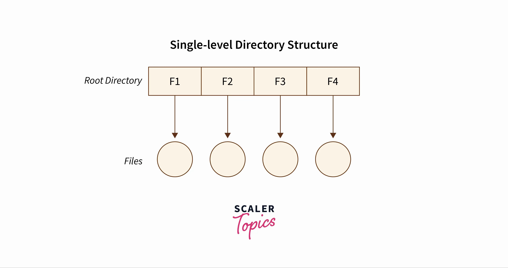
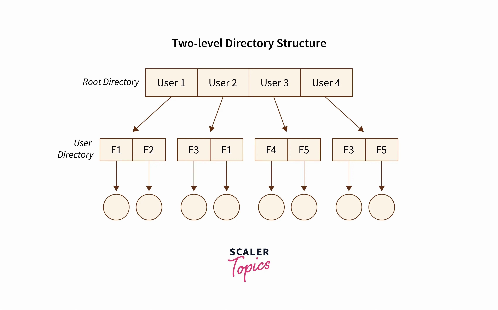
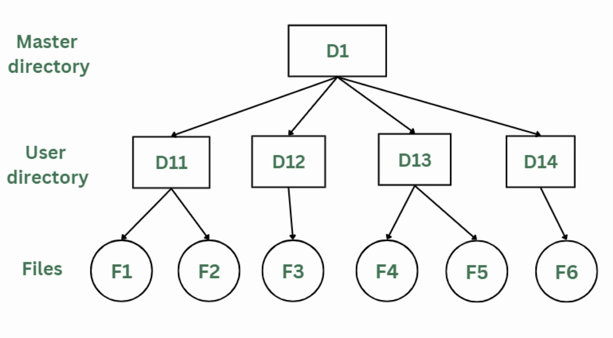
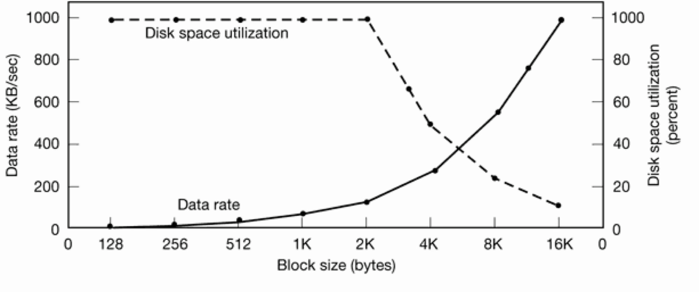
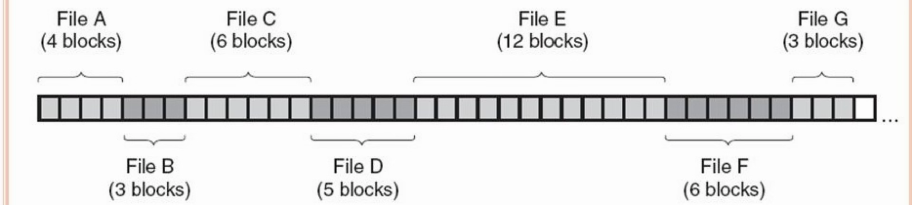
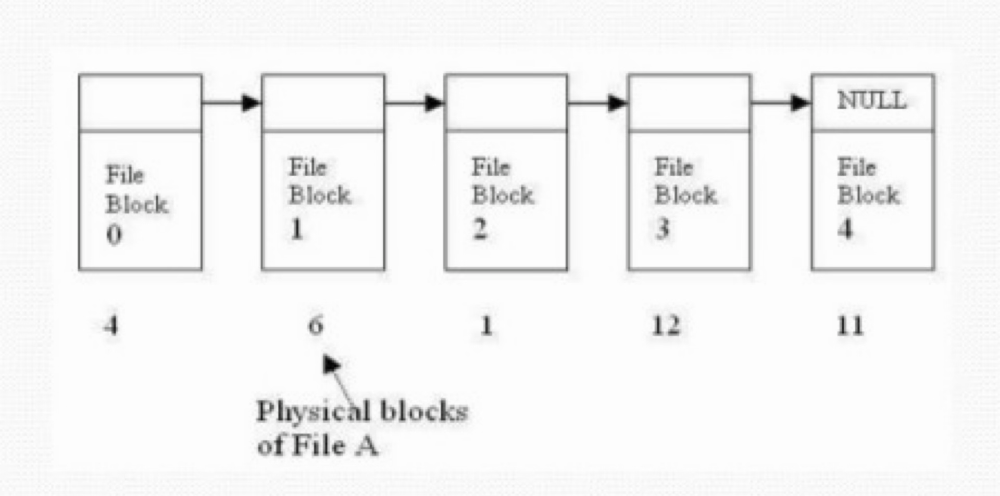
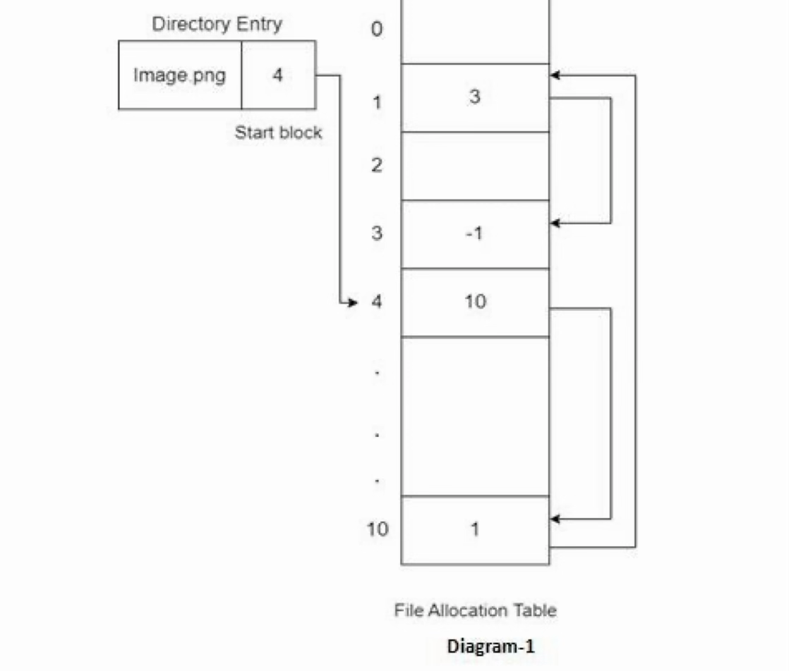
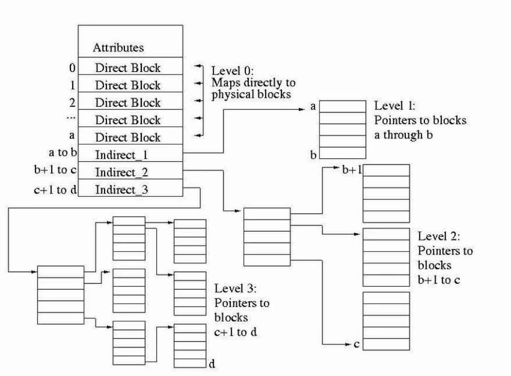

<!-- _class: title-slide -->

# 5. File Systems

(3 hours, 4 marks)
By Bidur Sapkota

---

# 5.1 File Concepts

A file is a named collection of related information recorded on secondary storage. It is the smallest allotment of logical secondary storage. Data cannot be written to secondary storage unless it is within a file. The OS abstracts from the physical properties of storage devices to define a logical storage unit called a file. From the user's perspective, a file contains either a program or data.

---

# 5.1 File Concepts

### File Naming

When a process creates a file, it gives the file a name. The file continues to exist after the process terminates and can be accessed by other processes using its name. Many file systems support names as long as 255 characters. UNIX differentiates between uppercase and lowercase letters in file names, whereas MS-DOS does not. Many operating systems support file names with two parts separated by a period. The part following the period is called the file extension (e.g., `.txt`, `.c`, `.exe`, `.html`, `.mp3`, `.pdf`), which usually indicates the type or contents of the file.

---

# 5.1 File Concepts

### File Structure

Files can be structured in several ways:

**Byte Sequence:** The file is an unstructured sequence of bytes. The OS does not know or care what is in the file. Any meaning must be imposed by user-level programs. This provides maximum flexibility. Both UNIX and Windows use this approach.

**Record Sequence:** The file is a sequence of fixed-length records, each with some internal structure. The read operation returns one record at a time, and write overwrites or appends one record at a time.

---

# 5.1 File Concepts

### File Structure

**Tree of Records:** The file consists of a tree of variable-length records, each containing a key field in a fixed position. The tree is sorted on the key field, allowing rapid searching for a particular key. Used in database systems and indexed file systems.

---

# 5.1 File Concepts

### File Types

**Regular Files:** Contain user information as ASCII text or binary data. Text files consist of lines terminated by line feed (Unix) or carriage return + line feed (Windows). Binary files have internal structure known to programs that use them.

**Directories:** System files for maintaining the structure of the file system. A directory contains the names and locations of other files or subdirectories, providing hierarchical organization.

**Character Special Files:** Related to serial I/O devices such as keyboards, mice, terminals, and printers. They transfer data one character at a time. Found in `/dev` directory in Unix-like systems.

---

# 5.1 File Concepts

### File Types

**Block Special Files:** Used to model devices that transfer data in fixed-size blocks, such as hard disks, SSDs, USB drives, and CD/DVD drives. Also found in `/dev` directory.

---

# 5.1 File Concepts

### File Access Methods

**Sequential Access:** Information is processed in order, one record after another. A read operation reads the next portion and automatically advances a file pointer. A write operation appends to the end. The file can be reset to the beginning. Based on a tape model. Suitable for applications that process files from beginning to end.

**Direct Access (Random Access):** Based on a disk model. The file is viewed as a numbered sequence of blocks. Arbitrary blocks can be read or written in any order (e.g., `read(14)`, then `read(53)`, then `write(7)`). Useful for databases and large files requiring immediate access.

---

# 5.1 File Concepts

### File Access Methods

**Indexed Sequential Access:** Built on top of direct access. An index containing pointers to various blocks is constructed (like an index in a book). To find an entry, the system first searches the index, then uses the pointer to access the file directly. For large files, a multi-level index may be used, such as a primary index pointing to a secondary index, which then points to the data. This provides both sequential and random access capabilities.

---

# 5.1 File Concepts

### File Attributes

> **What is a file attribute? [1 mark] (2082 Bhadra)**

File attributes (also called metadata) are extra information associated with each file beyond its name and data. Key attributes include:

- **Name:** Symbolic file name; the only information kept in human-readable form.
- **Identifier:** A unique number identifying the file within the file system.
- **Type:** Indicates the file type (needed for systems supporting different types).
- **Location:** Pointer to the device and location of the file on that device.
- **Size:** Current size of the file in bytes, words, or blocks.

---

# 5.1 File Concepts

### File Attributes

- **Protection:** Access control information regarding who can read, write, and execute.
- **Time and Date:** Timestamps for creation, last modification, and last access are kept, as they are useful for security and usage monitoring.
- **Owner:** The user who created and owns the file.
- **Flags:** Special attributes like hidden, system, archive, and read-only.

---

# 5.1 File Concepts

### File Operations

The most common system calls relating to files:

- **Create:** Creates a file with no data. Space is found in the file system and a directory entry is made. Initializes the file's metadata.
- **Delete:** Removes the file's directory entry and frees its disk blocks to reclaim space.
- **Open:** Fetches the file's attributes and disk addresses into main memory for rapid access. Returns a file descriptor (small integer) used in subsequent operations.
- **Close:** Frees internal table space when accesses are finished. Flushes any buffered data to disk.

---

# 5.1 File Concepts

### File Operations

- **Read:** Reads data from the current position. The file position pointer is advanced by the number of bytes read.
- **Write:** Writes data at the current position. If at the end, the file size increases; if in the middle, existing data are overwritten. The pointer advances after writing.
- **Append:** A restricted form of write that can add data only to the end of the file. Useful for log files.
- **Seek:** Repositions the file pointer to a specific place in the file for random access. Does not transfer any data.

---

# 5.1 File Concepts

### File Operations

- **Get/Set Attributes:** Read or modify the metadata associated with the file (e.g., protection mode, flags).
- **Rename:** Changes the name of an existing file. Typically changes only the directory entry without moving file data.
- **Truncate:** Removes the contents of a file without deleting it, resulting in a file of length zero. Frees the allocated disk blocks.
- **Lock:** Prevents other processes from accessing a file in a multi-process environment. Important for maintaining data integrity in concurrent access.

---

# 5.2 Directory Structures: Paths and Hierarchies

A directory is a node in the file system that contains entries for files and subdirectories. Each entry typically contains the file name along with a pointer to the file's metadata (in UNIX, the pointer points to the file's inode). Directories provide a way to organize files hierarchically and group related files together.

### Single-Level Directory

The simplest form is a single directory containing all the files, known as the root directory. Its advantage is simplicity, which means files can be located quickly. The disadvantage is that naming conflicts occur when many users or many files exist, and there is no support for grouping related files. This structure is common on early personal computers and simple embedded devices.

---

# 5.2 Directory Structures: Paths and Hierarchies

---

# 5.2 Directory Structures: Paths and Hierarchies

### Two-Level Directory

Each user gets a private directory. A root directory contains entries pointing to individual user directories. Eliminates name conflicts between users, but users still cannot create subdirectories to group their files.

### Hierarchical Directory (Directory Tree)

Users can create an arbitrary number of subdirectories to any depth. This structure is now almost universally used. For example, UNIX, Linux, Windows, and macOS all support hierarchical directories. Files with logical relationships can be grouped together.

---

# 5.2 Directory Structures: Paths and Hierarchies

---

# 5.2 Directory Structures: Paths and Hierarchies

---

# 5.2 Directory Structures: Paths and Hierarchies

### Path Names

When the file system is a directory tree, file names are specified using path names.

**Absolute Path Name:** Begins at the root of the file system. In UNIX/Linux, the root is `/` and components are separated by `/` (e.g., `/home/john/documents/report.txt`). In Windows, the root is a drive letter like `C:\` and components are separated by `\`   (e.g., `C:\Users\John\Documents\report.txt`). Works regardless of the current working directory.

---

# 5.2 Directory Structures: Paths and Hierarchies

### Path Names

**Relative Path Name:** Starts from the current (working) directory. Every process has a current directory. File names not beginning with the root are relative (e.g., if the current directory is `/home/john`, then `documents/report.txt` refers to `/home/john/documents/report.txt`). Shorter and more convenient when working within a directory subtree.

**Special Directory Entries:** `.` (dot) refers to the current directory. `..` (dot-dot) refers to the parent directory. These allow navigation using relative paths (e.g., `../../jane` goes up two levels, `../music/song.mp3` goes to a sibling directory).

---

# 5.2 Directory Structures: Paths and Hierarchies

### Path Names

**Path Name Resolution:** For absolute paths, resolution starts at root; for relative paths, at the current directory. The system follows each component, checking permissions and existence at each step. Failure results in "permission error" or "file not found" error.

---

# 5.2 Directory Structures: Paths and Hierarchies

### Directory Operations

- **Create:** Creates a new, empty directory (with only `.` and `..` entries).
- **Delete:** Removes a directory; only an empty directory can be deleted (some systems offer recursive delete).
- **Open/Close:** A directory must be opened before reading and closed afterward to free internal resources.
- **Read:** Returns the next entry in an open directory in a standard format.
- **Rename:** Changes the name of a directory without affecting its contents.

---

# 5.2 Directory Structures: Paths and Hierarchies

### Directory Operations

- **Link:** Allows a file to appear in more than one directory by creating a link from an existing file to a new path name.
- **Unlink:** Removes a directory entry. If the file has multiple links, only the specified path is removed; the file itself is deleted only when the last link to it is removed.

---

# 5.3 File System Implementation

> **Describe different file allocation methods. [3 marks] (2082 Bhadra)**
> **Explain the advantages and disadvantages of a contiguous file allocation scheme? [3 marks] (Model Question)**

File systems are stored on disks. Most disks can be divided into one or more partitions, each with an independent file system. Sector 0 of the disk is the MBR (Master Boot Record), used to boot the computer. The MBR's end contains the partition table with starting/ending addresses of each partition, one marked as active. Each partition starts with a boot block. The super block contains file system metadata (type, block size, etc.). The free space management block tracks available space using bitmaps or linked lists.

---

# 5.3 File System Implementation

### Block Size

The block is the fundamental unit of disk space allocation (also called an allocation unit or cluster). It is typically a power of 2, and is commonly 4 KB, which is the default for both ext4 and NTFS.

**Space Utilization vs. Performance Trade-off:**

- **Large blocks:** Using large blocks wastes space due to internal fragmentation (unused space in the last block). A 1-byte file in a 4 KB block wastes 4095 bytes.
- **Small blocks:** Using small blocks causes files to span many blocks, requiring more disk I/O operations and seeks, which reduces performance.

---

# 5.3 File System Implementation

### Block Size

**Space Utilization vs. Performance Trade-off:**

- **Large blocks:** Large blocks require fewer I/O operations, which results in a higher effective data rate and better performance.

---

# 5.3 File System Implementation

---

# 5.3 File System Implementation

### Inodes (Index Nodes)

An inode is a data structure associated with each file that lists the file's attributes and disk addresses of the file's blocks. Used by UNIX/Linux.

 

An inode contains: file type, permissions (rwx for owner/group/others), number of links, user ID, group ID, file size, timestamps (last access, last modification, last inode change), direct pointers to data blocks (typically 10–15), a single indirect pointer, a double indirect pointer, and a triple indirect pointer.

---

# 5.3 File System Implementation

### Inodes (Index Nodes)

Pointer structure (with 4 KB blocks and 4-byte pointers, each indirect block holds 1024 pointers):

- 12 direct pointers can address files up to 48 KB.
- 1 single indirect block can address an additional 4 MB.
- 1 double indirect block can address an additional 4 GB.
- 1 triple indirect block can address an additional 4 TB.

---

# 5.3 File System Implementation

### Inodes (Index Nodes)

**Advantages:** Very efficient for small files (block addresses stored directly in inode, no extra disk accesses). Good support for both sequential and random access (any block located with at most 3 disk accesses). Unlike FAT, the inode needs to be in memory only when the file is open.

---

# 5.3 File System Implementation

### Allocation Methods

**A. Contiguous Allocation:**
Each file is stored as a contiguous run of disk blocks. Only two numbers need to be stored: the disk address of the first block and the number of blocks.

- **Advantages:** It is simple to implement and provides excellent read performance. The entire file can be read in a single operation with only one seek.

---

# 5.3 File System Implementation

### Allocation Methods

**A. Contiguous Allocation:**

- **Disadvantages:** It suffers from external fragmentation. As files are deleted, gaps form that may be too small for new files, wasting space even though total free space may be sufficient. Compaction can fix this but is extremely time-consuming. File size must be known at creation time; if too little space is allocated, the file cannot grow; if too much, space is wasted.
- **Use case:** CD-ROMs/DVDs (written once, read-only) and real-time systems where file sizes are known in advance.

---

# 5.3 File System Implementation

### Allocation Methods

**A. Contiguous Allocation:**

---

# 5.3 File System Implementation

### Allocation Methods

**B. Linked List Allocation:**
Each file is a linked list of disk blocks. The first word of each block is a pointer to the next block; the rest is for data. The directory entry stores only the first block's address.

- **Advantages:** There is no external fragmentation, as any free block can be used. Files can grow easily.

---

# 5.3 File System Implementation

### Allocation Methods

**B. Linked List Allocation:**

- **Disadvantages:** Random access is extremely slow, as it must follow the chain from the beginning to reach block n. The pointer in each block reduces usable data space, meaning it is no longer a power of two. It is vulnerable to disk errors. If one pointer is corrupted, the rest of the file is lost.

---

# 5.3 File System Implementation

### Allocation Methods

**B. Linked List Allocation:**

---

# 5.3 File System Implementation

### Allocation Methods

**C. Linked List Allocation Using a Table in Memory (FAT):**
The pointer from each disk block is stored in a File Allocation Table (FAT) in main memory. The FAT has one entry per disk block; each entry contains the number of the next block in the file (with a special end-of-file value). The directory entry stores only the starting block number.

- **Advantages:** The entire block is available for data (no embedded pointers). The chain can be followed quickly in memory without disk references.
- **Disadvantages:** The entire FAT must be in memory at all times. For a 200 GB disk with 1 KB blocks, the table needs 200 million entries (600–800 MB of RAM).

---

# 5.3 File System Implementation

---

# 5.3 File System Implementation

### Allocation Methods

**D. Inode-based Allocation:**
Each file has an inode containing attributes and block pointers (direct, single/double/triple indirect). Described in detail above.

---

# 5.3 File System Implementation

**D. Inode-based Allocation:**

---

# 5.3 File System Implementation

### Implementing Directories

A directory maps file names to storage information. Two approaches: storing file attributes and disk addresses directly in fixed-size directory entries, or storing only file names with inode numbers that reference separate attribute structures. Variable-length file names are handled by allocating a fixed maximum space per name, using variable-size entries with length headers, or storing names in a separate heap. Directories are searched using linear scans for small directories, or hash tables/B-trees for large directories.

---

# 5.3 File System Implementation

### Impact of Allocation Policy on Fragmentation

- **Contiguous:** Avoids internal fragmentation but suffers heavily from external fragmentation after multiple deletes, often requiring disk compaction.
- **Linked List:** Eliminates external fragmentation; internal fragmentation occurs only in the last block. Pointers introduce overhead.
- **FAT:** Removes external fragmentation; internal fragmentation limited to the last block. Additional memory overhead from the FAT table.
- **Inode:** Prevents external fragmentation; internal fragmentation only in the last block. Inodes and indirect blocks contribute storage overhead.

---

# 5.4 File System Performance

File system performance is crucial for overall system responsiveness since disk I/O is often the bottleneck. Key techniques to improve performance:

**Caching (Buffer Cache):** The OS maintains a buffer cache in main memory to store frequently accessed disk blocks. When a process requests data, the OS checks the cache first. A cache hit avoids a slow disk I/O operation. Cache replacement algorithms like LRU and LFU determine which blocks to evict. Write-back (delayed write) allows writes to happen in cache first, with disk writes happening later (typically every 5–30 seconds), aggregating and optimizing multiple write requests.

---

# 5.4 File System Performance

**Read-Ahead (Prefetching):** The OS proactively loads subsequent data blocks into the cache before the application requests them, based on the assumption of sequential access. This minimizes application wait time for I/O. However, incorrect prefetching wastes I/O bandwidth and memory.

**Reducing Disk Arm Motion:** Related blocks should be placed close together on disk. Consecutive blocks of a file should ideally be on the same track, or on adjacent tracks on the same cylinder. The file system cooperates with the disk scheduler (FCFS, SSTF, SCAN, C-SCAN, LOOK) to optimize access.

---

# 5.4 File System Performance

**Block Interleaving and Cylinder Skewing:** Interleaving spaces blocks so the controller has time to process each block before the next one arrives. Cylinder skewing offsets blocks on adjacent cylinders to account for seek time when switching between cylinders.

**Block Size Optimization:** Choosing an appropriate block size (commonly 4 KB) balances space utilization and I/O performance, as discussed in Section 5.3.

---

# 5.5 Example File Systems

**FAT32 (File Allocation Table 32):** This is a legacy file system designed for compatibility. It uses a file allocation table with linked-list-style allocation to track block order. It offers extremely high cross-platform compatibility, as it is readable by almost every OS including Windows, macOS, Linux, game consoles, and cameras. Its limitations include no journaling, which makes it prone to corruption, no file-level security or permissions, a strict 4 GB maximum file size, and a 2 TB maximum volume size. It is suitable for removable media like USB drives and memory cards, but not for modern system drives.

---

# 5.5 Example File Systems

**NTFS (New Technology File System):** The default, high-performance file system for Windows. Supports very large files (up to 16 EB theoretical) and volumes. Features journaling for crash recovery, file-level security through Access Control Lists (ACLs), encryption (EFS), compression, and disk quotas. Uses a Master File Table (MFT) that stores metadata for every file and directory. Default block size is 4 KB. Primarily optimized for Windows; Linux and macOS can read NTFS but full write support may require third-party drivers.

---

# 5.5 Example File Systems

**EXT4 (Fourth Extended File System):** This is the standard, high-performance file system for Linux distributions. It uses an inode-based file structure where directories map file names to inode numbers. It supports files up to 16 TB and volumes up to 1 EB. It features journaling for data integrity, extents for contiguous block ranges to reduce fragmentation, delayed allocation, and backward compatibility with ext2 and ext3. The default block size is 4 KB. It is designed for efficient random and sequential access. It has limited native compatibility with Windows and macOS.

---

# 5.5 Example File Systems

**NFS (Network File System):** Unlike the others, NFS is not a local file system but a distributed file system protocol developed by Sun Microsystems. It allows a client computer to access files over a network as if they were stored on its own local disk. Key features include transparency (remote files accessed seamlessly), centralization (files on a central server simplify backups and administration), and cross-platform support (ideal for heterogeneous environments with Linux, Windows, and UNIX). Performance depends on network stability (latency/bandwidth). NFS sits on top of the underlying local file system (like ext4 or NTFS) on the server.
