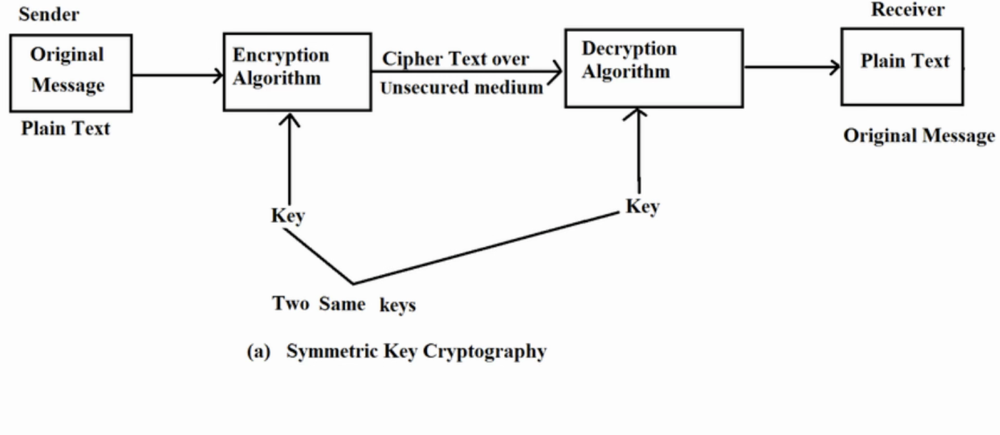
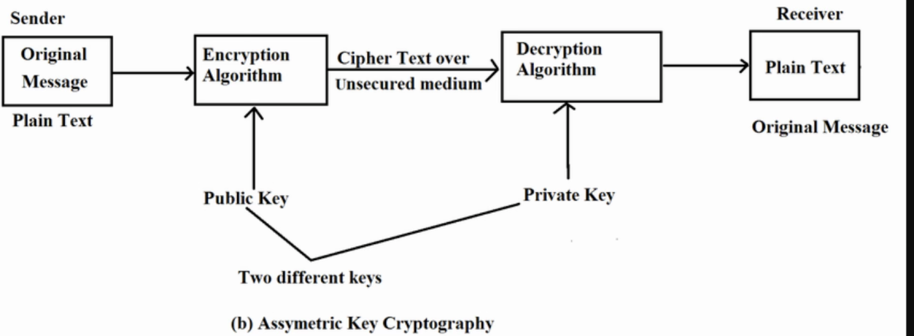
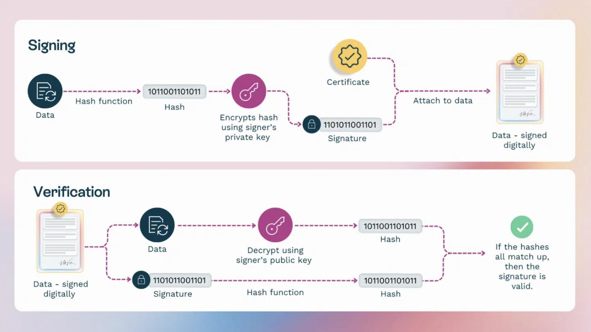
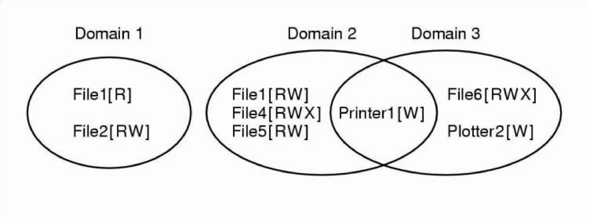
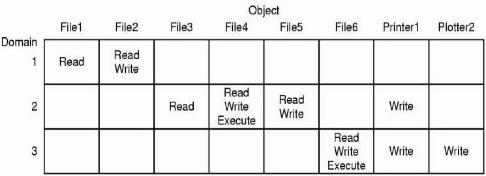
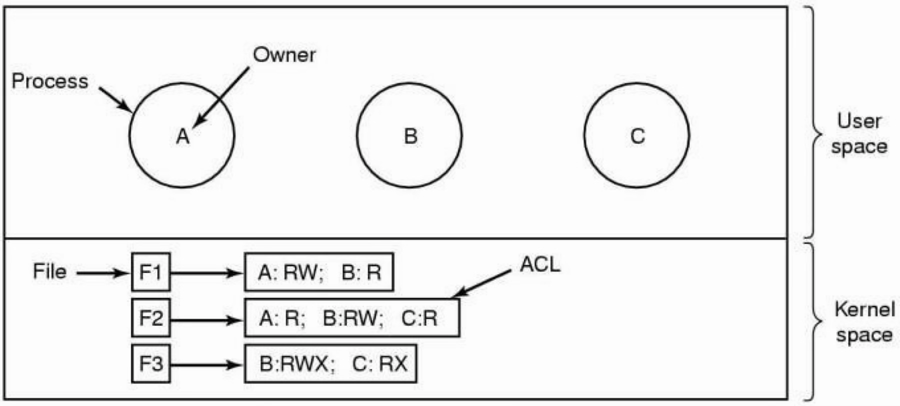
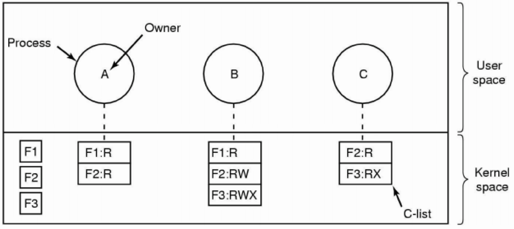

<!-- _class: title-slide -->

# 6. Security and System Administration

(3 hours, 4 marks)
By Bidur Sapkota

---

# 6.1 OS Security

Computer security refers to protecting computer systems (hardware and software) and data from unauthorized access, threats, and attacks. The goal of operating system security is to ensure confidentiality, integrity, and availability of system resources while providing legitimate users with seamless access.

### CIA Triad

The three fundamental goals of information security are:

1. **Confidentiality:** Preventing disclosure of sensitive information to unauthorized people, resources, or processes.
2. **Integrity:** Protecting system information or processes from intentional or accidental modification.

---

# 6.1 OS Security

### CIA Triad

3. **Availability:** Ensuring that systems and data are accessible by authorized users when needed.

<br>

A security breach occurs when an intruder successfully bypasses security mechanisms. Breach of confidentiality involves unauthorized reading of data (e.g., theft of credit card information). Breach of integrity involves unauthorized modification of data (e.g., tampering with financial records). Breach of availability involves unauthorized disruption of access (e.g., DoS attacks, ransomware encrypting files).

---

# Cryptography

> **Explain private and public key cryptography with examples. [4 marks] (Model Question)**

Cryptography is the practice of converting readable data (plaintext) into an unreadable format (ciphertext) using encryption algorithms. It ensures data security during storage and transmission.

Plaintext is the original readable message before encryption. Ciphertext is the scrambled, unreadable output after encryption. Encryption converts plaintext into ciphertext using a cryptographic algorithm and a key. Decryption is the reverse process, converting ciphertext back into plaintext. A key is a piece of information (typically a string of bits) that controls the encryption and decryption process.

---

# Symmetric Encryption (Secret Key Cryptography)

Symmetric encryption uses a single shared key for both encryption and decryption. It is fast and efficient, making it ideal for bulk data encryption (e.g., full-disk encryption, file storage). The primary challenge is securely distributing the shared key between parties. If the key is compromised, all encrypted data becomes vulnerable. An example of this is the Advanced Encryption Standard (AES) used in Wi-Fi security (WPA2).

The sender encrypts the plaintext using a secret key, the ciphertext is transmitted, the receiver decrypts the ciphertext using the same secret key, and the original plaintext is recovered.

---

# Symmetric Encryption (Secret Key Cryptography)



---

# Asymmetric Encryption (Public Key Cryptography)

Asymmetric encryption uses two mathematically related keys: a public key (shared with everyone, used to encrypt data) and a private key (kept secret, used to decrypt data). It is more secure than symmetric encryption because the private key never needs to be shared, but it is slower. It solves the key distribution problem inherent in symmetric encryption. An example is RSA encryption used in secure email communication (PGP) and end-to-end encryption in messaging apps like WhatsApp.

The sender encrypts the plaintext using the receiver's public key, the ciphertext is transmitted, the receiver decrypts the ciphertext using their private key, and the original plaintext is recovered. Only the holder of the corresponding private key can decrypt data encrypted with the public key.

---

# Asymmetric Encryption (Public Key Cryptography)



---

# Hash Functions

A hash function is a mathematical algorithm that takes an input of any size and produces a fixed-size output called a hash value or digest. Hash functions are one-way (computationally infeasible to reverse), deterministic (same input always produces the same hash), and exhibit the avalanche effect (a single-bit change in input produces a completely different hash). Examples: SHA-256, MD5. Hash functions are used for password storage, data integrity verification, and digital signatures.

---

# Digital Signature

A digital signature is an electronic equivalent of a handwritten signature that ensures authenticity (the sender is genuine), integrity (the message has not been altered), and non-repudiation (the sender cannot deny sending it).

**Signing Process:** A hash function (e.g., SHA-256) is applied to the message, generating a fixed-length hash value. The hash is then encrypted using the sender's private key, creating the digital signature. The signature is attached to the message and sent to the recipient.

---

# Digital Signature

**Verification Process:** The recipient uses the sender's public key to decrypt the signature, retrieving the original hash. The recipient also computes the hash of the received message independently. If the two hashes match, the message is authentic and untampered. If they do not match, the message has been altered or did not come from the claimed sender.

**Example:** Verifying the authenticity of software downloads (e.g., Windows updates, Linux package managers use GPG signatures).

---

# Digital Signature



---

# Classification of Attacks

> **Explain the types of attacks with suitable examples. [3 marks] (2082 Bhadra)**

### A. Passive Attacks

Passive attacks involve monitoring or eavesdropping on transmissions without altering the data or system operation. The goal is to obtain information being transmitted between parties. Passive attacks are difficult to detect because they do not alter data or system behavior.

1. **Eavesdropping:** An attacker intercepts and listens to communications between two parties. It can occur on network traffic, phone conversations, or any form of electronic communication.

---

# Classification of Attacks

### A. Passive Attacks

2. **Traffic Analysis:** An attacker studies the pattern and flow of communication rather than its content. By analyzing traffic patterns, attackers can determine communication frequency, message lengths, and the identity of communicating parties.

### B. Active Attacks

Active attacks involve modification of the data stream or creation of a false stream, actively interfering with system operation. They are easier to detect than passive attacks because they cause observable changes, but can cause significant damage before being identified.

---

# Classification of Attacks

### B. Active Attacks

1. **Masquerade Attack:** One entity pretends to be a different entity to gain unauthorized access. An attacker may use stolen usernames and passwords, forged credentials, or compromised authentication tokens. A solution to this is Multi-Factor Authentication (MFA).
2. **Replay Attack:** This attack involves capturing data transmissions and retransmitting them later to produce unauthorized effects. An example is capturing an encrypted authentication message and replaying it to gain access without knowing the password. A solution to this is using One-Time Passwords (OTP).

---

# Classification of Attacks

### B. Active Attacks

3. **Modification of Messages:** This involves capturing messages, altering their content, and transmitting the modified messages. Examples include changing the amount in a financial transaction or altering the destination address of a message. A solution to this is using Digital Signatures.
4. **Denial of Service (DoS) Attack:** This attack aims to make a system or network resource unavailable to intended users by overwhelming systems with traffic, exploiting vulnerabilities to crash systems, or consuming resources to prevent legitimate access.

---

# Malware

Malware (malicious software) is any software intentionally designed to cause damage to computers, servers, or networks.

1. **Virus:** A virus attaches to files and spreads when the file is executed. It requires user action to propagate. An example is the "ILOVEYOU" virus that spread via email attachments.
2. **Worm:** A worm is a self-replicating malware that spreads through networks without user intervention. An example is the "WannaCry" ransomware that spread through the internet by exploiting a Windows vulnerability.
3. **Trojan Horse:** This malware is disguised as a useful program but carries malicious functions such as creating backdoors or stealing data. An example is a fake antivirus software stealing user data.

---

# Malware

4. **Spyware:** Spyware secretly collects user data such as keystrokes and browsing history. An example includes keyloggers capturing login credentials.
5. **Ransomware:** Ransomware encrypts user files and demands a ransom to decrypt them. An example is "CryptoLocker," which demanded Bitcoin payments for decryption keys.

---

# Authentication and Multi-Factor Authentication (MFA)

Authentication is the process of verifying the identity of a user, process, or device attempting to access a system. Authentication factors include:

1. **Something you know:** This includes passwords, PINs, and security questions.
2. **Something you have:** This includes smartphones, security tokens, and smart cards.
3. **Something you are:** This involves biometrics such as fingerprints, retina scans, and facial recognition.

---

# Authentication and Multi-Factor Authentication (MFA)

**Multi-Factor Authentication (MFA)** requires two or more verification factors from different categories to gain access. It adds an extra layer of security beyond traditional password-based login. Even if a password is stolen, an attacker cannot bypass the secondary factors. MFA minimizes risk from password theft or phishing attacks.

**Implementation Examples:** Windows Hello (biometric MFA), Linux PAM (Pluggable Authentication Modules) can integrate OTP-based MFA.

---

# Secure Boot

> **Write a short note on Secure Boot. [2 marks] (Model Question)**

Secure Boot is a firmware-level security mechanism that ensures only trusted software is loaded during the system startup process. It is part of the UEFI specification.

When a device starts, the UEFI firmware checks the digital signature of each piece of boot software (bootloader, OS kernel, critical system files) against a database of trusted keys stored in firmware. Only software with a valid signature from a trusted certificate authority is allowed to boot. Each component in the boot chain verifies the digital signature of the next component before loading it.

---

# Secure Boot

The chain of trust starts from hardware-embedded keys that cannot be modified. If any component fails signature verification, the boot process is halted. Secure Boot prevents boot-time malware such as rootkits and bootkits from loading before the operating system. It maintains system integrity from power-on to OS load.

**Examples:** Windows uses Microsoft-signed bootloaders. Linux distributions support Secure Boot via shim + GRUB signed by Microsoft or a distro-specific authority.

---

# Sandboxing

> **Write a short note on Sandboxing. [3 marks] (2082 Bhadra, Model Question)**

Sandboxing is a security mechanism that isolates running programs in a restricted environment with limited access to system resources. A sandbox provides a controlled execution environment where untrusted code can run without affecting the rest of the system. It limits what actions a program can perform, even if the program attempts malicious operations.

Isolate potentially harmful programs or processes, and prevent applications from modifying system files or accessing sensitive data.

---

# Sandboxing

**OS Use Cases:** Running web browsers, PDFs, or unknown executables in sandboxes. Mobile operating systems (Android/iOS) sandbox every app by default, restricting each app to its own environment. Containers (e.g., Docker) act as sandboxed environments at the OS level.

**Techniques used:** Access control (MAC, DAC), virtual machines or containers, capability-based security.

**Examples:** Windows Sandbox provides a temporary virtualized environment for testing apps. AppArmor and SELinux enforce mandatory access control in Linux to implement sandboxing policies.

---

# Firewall

A firewall is a network security device or software that filters and controls traffic between networks based on predefined security rules.

1. **Packet Filtering Firewall:** This firewall inspects individual data packets based on rules such as IP address, port number, or protocol. It operates at the network layer. An example is a router blocking access to certain websites.
2. **Proxy Firewall:** This acts as an intermediary between internal and external networks, hiding internal network details. It inspects traffic at the application layer. An example is corporate networks using a proxy to filter internet access.

---

# Firewall

3. **Stateful Inspection Firewall:** This firewall tracks active connections and allows only trusted packets that are part of an established session. It reduces rule-checking overhead for ongoing connections and blocks unauthorized access, TCP SYN floods, and other connection-based attacks.

---

# 6.2 Access Control: Policies, Lists, and OS Support

Access control is a security technique that regulates who or what can view or use resources in a computing environment. It is one of the most fundamental security mechanisms in any operating system.

### Principles of Access Control

- **Principle of Least Privilege:** Users should be granted only the minimum access rights necessary to perform their job functions.
- **Separation of Duties:** No single individual should have enough access to misuse the system alone.

---

# 6.2 Access Control: Policies, Lists, and OS Support

### Principles of Access Control

- **Need-to-Know:** Access to sensitive information is restricted to only those who require it for their specific duties.
- **Defense in Depth:** Multiple layers of access controls are implemented so that if one layer fails, others continue to provide protection.

---

# Access Control Models

**Discretionary Access Control (DAC):** The owner of a resource determines who can access it. The owner can grant or revoke permissions at their discretion. It is flexible but less secure because users can inadvertently share access. An example is Linux file permissions (rwx for user, group, and others).

**Mandatory Access Control (MAC):** A central authority (typically the OS) controls access based on security classification levels. MAC assigns security labels to both subjects (users or processes) and objects (files or resources). Users cannot change these permissions, which is why it is used in high-security environments. Examples include SELinux and AppArmor.

---

# Access Control Models

**Role-Based Access Control (RBAC):** Permissions are assigned to roles (e.g., Administrator, Editor, Viewer) rather than to individual users, and users are assigned to appropriate roles. This simplifies management in large organizations. An example is Windows group policies.

**Attribute-Based Access Control (ABAC):** This makes access decisions based on attributes of users, resources, and environmental conditions such as time of day, location, or device type.

**Rule-Based Access Control:** This uses rules defined by the system administrator to determine access. The rules are applied uniformly regardless of identity.

---

# Protection Domain

A protection domain specifies the resources that a process can access and the operations it can perform. Each process operates within a protection domain that defines its access rights. A domain can be thought of as a collection of access rights, where each right is an ordered pair (object, rights-set). Objects can be hardware resources (CPU, memory, printers) or software resources (files, programs, semaphores). Subjects are the active entities that access objects, including users, processes, and procedures.

---

# Protection Domain



---

# Access Control Mechanisms

**Access Control Matrix:** A theoretical concept that represents all access permissions as a matrix with subjects as rows and objects as columns. Each cell contains the access rights that the subject has for the object. It is rarely implemented directly due to its large size but serves as a conceptual model. ACLs and capability lists are different ways of sparsely representing this matrix.

**Access Control Lists (ACLs):** Lists associated with objects that specify which subjects can access them and what operations they can perform. ACLs store permissions with each resource, listing all users and their allowed actions. They are easy to manage for systems with many users and few resources. However, finding all resources a particular user can access requires checking ACLs on all resources.

---

# Access Control Matrix



---

# Access Control List



---

# Access Control Mechanisms

**Capability Lists (C-Lists):** Lists associated with subjects that specify which objects they can access. Capability lists store permissions with each user, listing all resources they can access. They make it easy to see all resources a particular user can access. However, finding all users who can access a particular resource requires checking all capability lists.

---

# Capability List



---

# OS Support for Access Control

**Linux/Unix:** It uses DAC via user, group, and other permission bits (rwx). It supports ACLs for fine-grained access control. It can also implement MAC using SELinux or AppArmor.

**Windows:** It uses ACLs extensively. It uses DACLs (Discretionary ACLs) for allowing or denying access and SACLs (System ACLs) for auditing. It supports RBAC via user roles and group policies. It enforces capability-like security tokens during process execution.

**Android:** It uses sandboxing and UID-based permissions. It supports permissions per app, combining both DAC and MAC.

---

# 6.3 System Administration: User Management, Environment Setup and Tools

System administration involves the management of computer systems including hardware, software, networks, and users within an organization. A system administrator's responsibilities include applying OS updates and patches, installing and configuring hardware/software, managing user accounts, performance tuning, maintaining documentation, ensuring security, performing backups, analyzing system logs, and troubleshooting problems.

---

# User Account Management

Operating systems provide a method for creating multiple user accounts on a single installation. Each account can be configured and customized based on individual needs. User-specific data such as desktop settings, application preferences, shortcuts, and data files are stored separately for each account.

## User Account Types

**Standard User Account:** This is the default type of account that provides basic permissions for common daily tasks. Standard users can launch applications, create documents, modify basic system settings, change personal settings like passwords and wallpapers, access removable media, connect to networks, and personalize display settings. They cannot install system-wide software or modify other users' accounts.

---

# User Account Management

## User Account Types

**Administrator Account:** This account has full permissions on the system, including all standard user permissions plus the ability to install new software and hardware, modify system-wide configurations, access files in secure locations, configure the firewall, perform complete system backups and restores, and create, remove, or modify other user accounts.

---

# User Account Management

## User Account Types

**Guest Account:** This account is designed for users who require temporary access to a computer. Guest users have a very limited set of permissions and cannot access other users' files or perform system-wide tasks. The built-in Guest account is disabled by default for security reasons.

<br>

Each user account includes a user profile (OS preferences like wallpaper and shortcuts), application settings, a user data folder, security privileges, and file system permissions that define what actions the user can take on which files.

---

# User Account Management

### Account Management Operations

Administrators can change passwords, change account names, remove passwords, change account pictures, set up parental controls, change account types, and delete accounts.

---

# User Account Management

## Environment Setup for New Users

Setting up an operational environment for a new user involves ensuring the OS and minimum usable application packages and utilities are installed. The required user accounts are created so new users can log in with their username and password. User-friendly modules like user-setup can be created to enable users to change their environment easily so applications can be added or removed without the user having to learn editors or shell languages. New applications can be installed and made accessible to users via such setup utilities.

---

# Shell Scripting

Shell scripting refers to writing a series of commands in a file, intended to be executed by a command-line interpreter (shell) such as Bash, sh, or zsh. It enables users to automate repetitive tasks and system administration processes. A shell script can include variables, conditional statements, loops, and functions, making it a powerful tool for OS interaction. It is widely used in Unix/Linux for administrative automation including software installation, log monitoring, file manipulation, and system backups.

Shell scripts support input/output redirection and piping, allowing complex workflows by chaining multiple commands. Scripts typically begin with a shebang line (e.g., `#!/bin/bash`) to indicate the interpreter. They are saved with `.sh` extension and made executable with `chmod +x script.sh`.

---

# AWK (Text Processing)

AWK is a domain-specific language designed for text processing, typically used as a data extraction and reporting tool. It operates on a per-line basis, dividing each line into fields based on a specified delimiter (default is whitespace) and then executing user-defined actions based on patterns and conditions.

AWK supports variables, control flow statements (loops and conditionals), functions, and built-in arithmetic and string operations. It maintains built-in variables like the current record (line), number of fields, current field values, and line number. `$1` refers to the first field, `$2` to the second, and so on. `$0` represents the entire line.

**Syntax:** `awk 'pattern { action }' filename`

---

# AWK (Text Processing)

```bash
$ echo -e "Alice 90\nBob 85\nCharlie 78" > scores.txt

$ awk '{print $1}' scores.txt        # print first field (names)
Alice
Bob
Charlie

$ awk '{print $1, $2+10}' scores.txt # print name and score+10
Alice 100
Bob 95
Charlie 88

$ awk '$2 >= 85 {print $1, $2}' scores.txt  # filter rows where score >= 85
Alice 90
Bob 85

$ awk -F":" '{print $1}' /etc/passwd  # use colon as delimiter, print usernames
root
student
...
```

The `-F":"` option sets the field separator to colon instead of the default whitespace. A condition before `{...}` like `$2 >= 85` filters which lines to process.

---

# Make

Make is a build automation tool commonly used in software development to manage project compilation and linking. It uses a configuration file called a Makefile that defines rules specifying how to build targets from their dependencies.

Make uses timestamp-based dependency checking to determine whether a file needs to be regenerated. When `make` is run, it compares the timestamps of targets and their prerequisites. If any prerequisite has been modified more recently than the target, or if the target does not exist, make executes the recipe (shell commands) to rebuild it. This ensures only modified parts of a project are recompiled, saving time and resources.

---

# Make

Makefiles support macros (variables), automatic variables (for referring to targets and dependencies), and pattern rules. Although traditionally used for compiling C/C++ code, Make can be used for any task involving dependency management and automation, such as document generation or data processing.

---

# CRON Jobs

CRON is a time-based job scheduling daemon in Unix-like operating systems. It enables users and system administrators to schedule commands or scripts to run automatically at specified times and intervals.

CRON uses a configuration file known as the crontab (cron table), which contains timing specifications and corresponding commands. The timing is defined using five fields: minute, hour, day of month, month, and day of week. Each user, including the system, can have their own crontab. CRON runs in the background and regularly checks these crontabs to execute scheduled tasks. It is commonly used for tasks like backups, system maintenance, sending emails, and periodic reporting.

---

# CRON Jobs

**Crontab syntax:** `m h dom mon dow command`

Example: `0 2 * * * /usr/local/bin/backup_script.sh` runs a backup script every day at 2:00 AM.

The `crontab -e` command allows editing the personal or system-wide job schedule.
